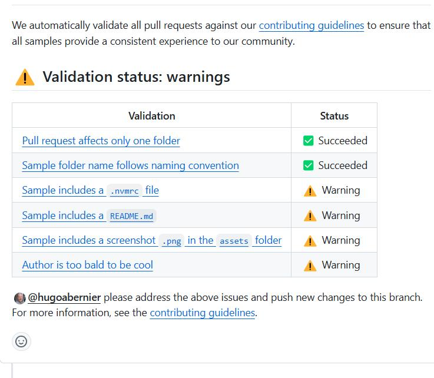

# @pnp/validate-sample-pr

Does a first pass validation of pull requests to eliminate back and forth between authors and maintainers on PnP sample repositories.

## Usage

### Input

```yaml
 -  name: Run Validate SPFx Sample PR Action
    uses: ./.github/actions/validate-sample-pr
    with:
        # JSON pointer to the pull request event
        # Use ${{ toJson(github.event.pull_request) }}
        # Required
        pr: 

        # The path to the rules JSON file
        # Optional. Default is:  .github/validate-sample-pr-rules.json
        validationRuleFile:
    env:
        GITHUB_TOKEN: ${{ secrets.GITHUB_TOKEN }}
```

### Outputs

Produces a message within the pull request with validation results. Message content is customizable.



### Configuration

The first thing to to is to create a `CONTRIBUTING.md` file (if you haven't done so yet) and list out the rules, with details on each rule. Make sure that each rule has a bookmark so it can be refered to within the sample validation rules `.json`.

#### Example
Here is the rules configuration for the sp-dev-fx-webparts repo:

```json
{
    "contributionsFolder": "samples",
    "messageTemplate": {
        "warningMessage": "\n@{author} please address the above issues and push new changes to this branch.\nFor more information, see the [contribution guidance](https://github.com/pnp/sp-dev-fx-webparts/blob/main/CONTRIBUTING.md).\n",
        "intro": "We automatically validate all pull requests against our [contribution guidance](https://github.com/pnp/sp-dev-fx-webparts/blob/main/CONTRIBUTING.md) to ensure that all samples provide a consistent experience to our community.\n",
        "issuesSummary": "In order to merge this PR in a timely manner, the following criteria must be met:\n\n",
        "title": "Sample PR validation for #{prNumber}\n",
        "validationSuccessSummary":"## ✅ Validation status: success\n",
        "validationWarningSummary": "## ⚠️ Validation status: warnings\n"
    },
    "limitToSingleFolder": {
        "ruleText": "Pull request affects only one folder",
        "ruleLink": "https://github.com/pnp/sp-dev-fx-webparts/blob/main/CONTRIBUTING.md#typos-issues-bugs-and-contributions"
    },
    "requireVisitorStats": {
        "ruleText": "`README.md` contains visitor stat image",
        "ruleLink": "https://github.com/pnp/sp-dev-fx-webparts/blob/main/CONTRIBUTING.md#visitor-stats-image"
    },
    "folderName": {
        "ruleText": "Sample folder name follows naming convention",
        "ruleLink": "https://github.com/pnp/sp-dev-fx-webparts/blob/main/CONTRIBUTING.md#sample-folder",
        "acceptedPrefixes": [
            "react-", 
            "angular-", 
            "handlebarsjs-", 
            "jquery-", 
            "js-", 
            "knockout-", 
            "vue-", 
            "vuejs-"
        ]
    },
    "fileRules": [
        {
            "filePath": ".nvmrc",
            "ruleText": "Sample includes a `.nvmrc` file",
            "ruleLink": "https://github.com/pnp/sp-dev-fx-webparts/blob/main/CONTRIBUTING.md#nvmrc"
        },
        {
            "filePath": "README.md",
            "ruleText": "Sample includes a `README.md`",
            "ruleLink": "https://github.com/pnp/sp-dev-fx-webparts/blob/main/CONTRIBUTING.md#readmemd"
        },
        {
            "filePath": "assets/*.png",
            "ruleText": "Sample includes a screenshot `.png` in the `assets` folder",
            "ruleLink": "https://github.com/pnp/sp-dev-fx-webparts/blob/main/CONTRIBUTING.md#assets"
        }
    ]
}
```

You can place it in the `.github` folder and name it `validate-sample-pr-rules.json` or anywhere else in your repo and specify the path with the `validationRuleFile` parameter when calling the workflow action.

TODO: Provide schema and explain the JSON structure.

## Future considerations

- [] Accept an array of glob filters for `contributionsFolder`
- [] Add `order` parameter to rules to control the order in which rules are listed.
- [] Add ability to create "forbidden" files or folder based on a glob filter (e.g.: `**\node_modules`)
- [] Add deep-dive validation of `README.md` files