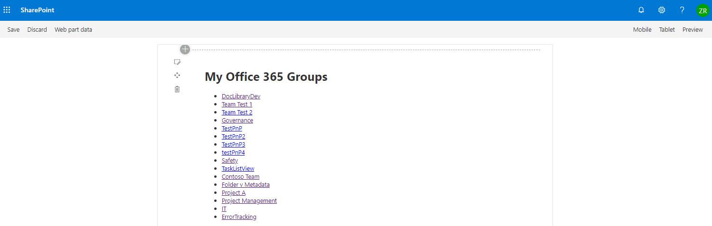

# react-my-groups

## Summary

Using Microsoft Graph this webpart grabs the Office 365 groups and links to the SharePoint sites and outputs them to a list.

## Used SharePoint Framework Version

## Applies to

* [SharePoint Framework](https:/dev.office.com/sharepoint)

## Prerequisites

> Any special pre-requisites?

## Solution

Solution|Author(s)
--------|---------
react-my-groups | Zach Roberts

## Version history

Version|Date|Comments
-------|----|--------
1.0|September 13, 2019|Initial release

## Disclaimer

**THIS CODE IS PROVIDED *AS IS* WITHOUT WARRANTY OF ANY KIND, EITHER EXPRESS OR IMPLIED, INCLUDING ANY IMPLIED WARRANTIES OF FITNESS FOR A PARTICULAR PURPOSE, MERCHANTABILITY, OR NON-INFRINGEMENT.**

---

## Minimal Path to Awesome

* Clone this repository
* in the command line run:
  * `npm install`
  * `gulp serve --nobrowser`

Browse to SharePoint Online workbench (https://tenant.sharepoint.com/_layouts/15/workbench.aspx)

## Features

This web part lists the current user's Office 365 groups with links to the groups SharePoint site.

