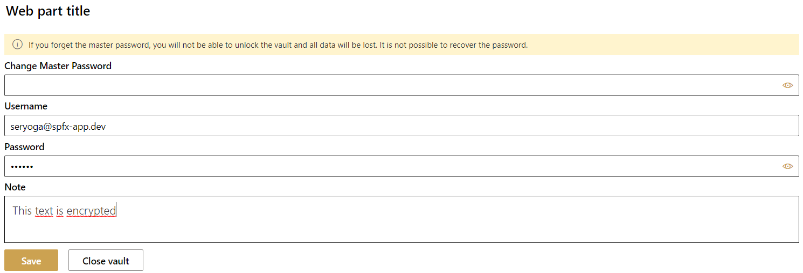
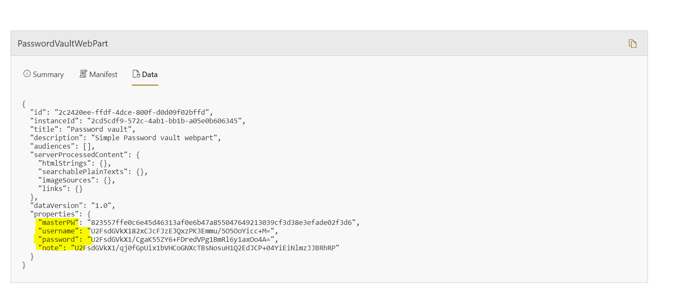

# SPFx Password Vault Webpart

## Summary

This webpart allows you to protect your data, such as the username, password or even just a text note (rich text). This data is protected with a master password that you can choose yourself. 
The data is encrypted and stored in the properties of the webpart. This means that the data is not in plain text and can only be decrypted by entering the master password. You can also use this web part in SharePoint and Microsoft Teams (as a tab)

### Display Mode

### Edit Mode

### Maintenance Mode

## Download

You can download the solution from here: https://github.com/SPFxAppDev/sp-passwordvault-webpart/releases

## Used SharePoint Framework Version

SPFx: 1.12.1 

## 

## Solution

Solution|Author(s)
--------|---------
spfxappdev-simple-password-vault.sppkg | Seryoga https://spfx-app.dev/ 

## Version history

Version|Date|Comments
-------|----|--------
1.0.0| March 22, 2022| Initial release

---
