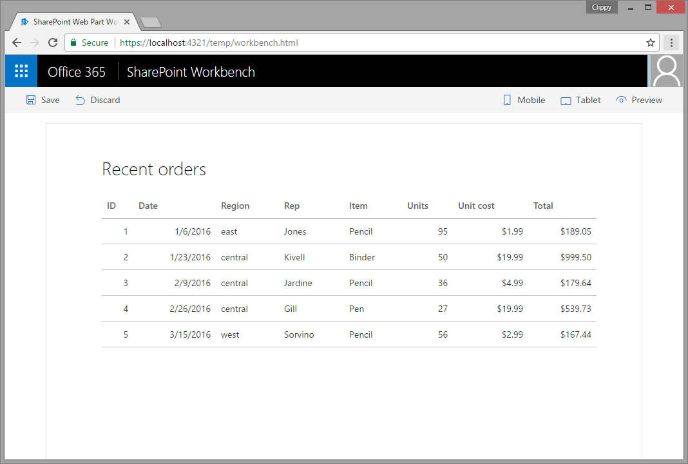
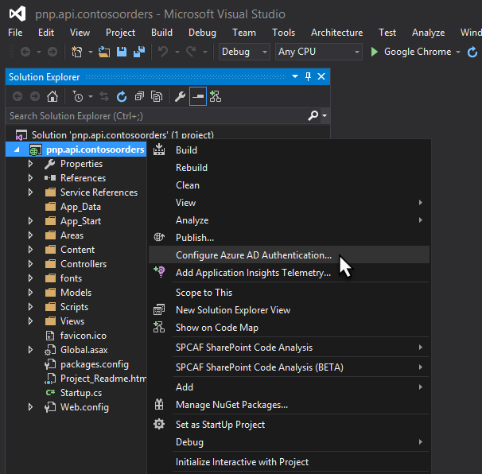
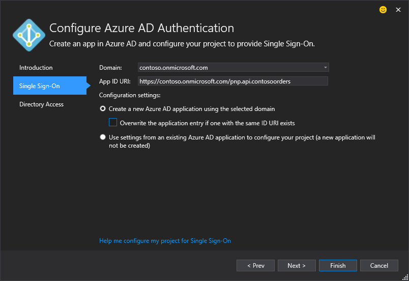
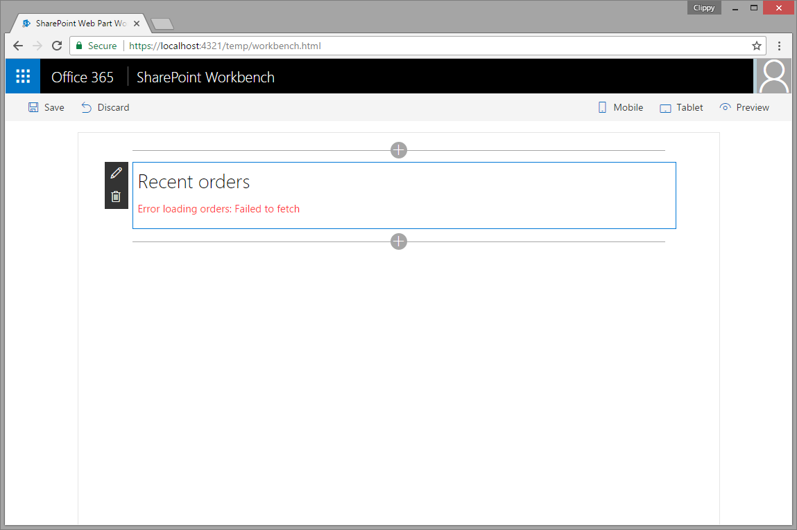
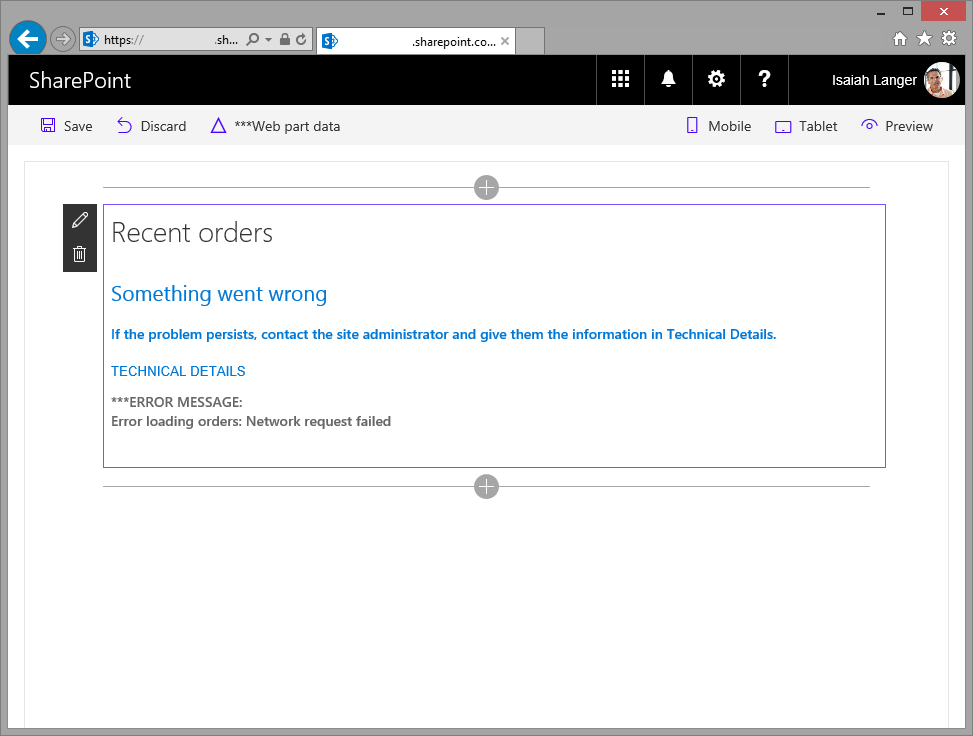
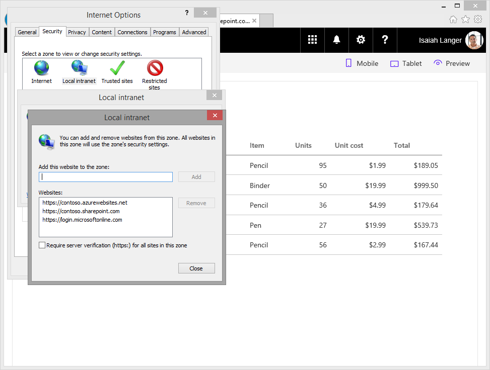

# Call custom APIs secured with Azure Active Directory without ADAL JS

## Summary

Sample SharePoint Framework client-side web part showing how to access a custom API secured with Azure Active Directory (AAD) without using ADAL JS.

### Recent orders

Sample web part showing the list of latest orders retrieved from a custom API secured with AAD.



## Used SharePoint Framework Version
 


## Applies to

* [SharePoint Framework](https://docs.microsoft.com/sharepoint/dev/spfx/sharepoint-framework-overview)
* [Office 365 developer tenant](https://docs.microsoft.com/sharepoint/dev/spfx/set-up-your-developer-tenant)

## Solution

Solution|Author(s)
--------|---------
aad-api-spo-cookie|[Waldek Mastykarz](https://github.com/waldekmastykarz) (MVP, Rencore, @waldekm)

## Version history

Version|Date|Comments
-------|----|--------
1.0.0|May 5, 2017|Initial release

## Minimal Path to Awesome

### Create custom API secured with AAD

- create an API and secure it with AAD
    - in the API enable receiving credentials from cross-domain origins
    - if you want to test the API from the local workbench, add **https://localhost:4321** as valid origin
- the API should return the following data (JSON):

```json
[{
    id: 1,
    orderDate: new Date(2016, 0, 6),
    region: "east",
    rep: "Jones",
    item: "Pencil",
    units: 95,
    unitCost: 1.99,
    total: 189.05
},
{
    id: 2,
    orderDate: new Date(2016, 0, 23),
    region: "central",
    rep: "Kivell",
    item: "Binder",
    units: 50,
    unitCost: 19.99,
    total: 999.50
},
{
    id: 3,
    orderDate: new Date(2016, 1, 9),
    region: "central",
    rep: "Jardine",
    item: "Pencil",
    units: 36,
    unitCost: 4.99,
    total: 179.64
},
{
    id: 4,
    orderDate: new Date(2016, 1, 26),
    region: "central",
    rep: "Gill",
    item: "Pen",
    units: 27,
    unitCost: 19.99,
    total: 539.73
},
{
    id: 5,
    orderDate: new Date(2016, 2, 15),
    region: "west",
    rep: "Sorvino",
    item: "Pencil",
    units: 56,
    unitCost: 2.99,
    total: 167.44
}]
```
Here is the complete code if you want to implement this API using a Node.js Azure Function:

```js
module.exports = function (context, req) {
    context.res = {
        body: [
            {
              id: 1,
              orderDate: new Date(2016, 0, 6),
              region: "east",
              rep: "Jones",
              item: "Pencil",
              units: 95,
              unitCost: 1.99,
              total: 189.05
            },
            {
              id: 2,
              orderDate: new Date(2016, 0, 23),
              region: "central",
              rep: "Kivell",
              item: "Binder",
              units: 50,
              unitCost: 19.99,
              total: 999.50
            },
            {
              id: 3,
              orderDate: new Date(2016, 1, 9),
              region: "central",
              rep: "Jardine",
              item: "Pencil",
              units: 36,
              unitCost: 4.99,
              total: 179.64
            },
            {
              id: 4,
              orderDate: new Date(2016, 1, 26),
              region: "central",
              rep: "Gill",
              item: "Pen",
              units: 27,
              unitCost: 19.99,
              total: 539.73
            },
            {
              id: 5,
              orderDate: new Date(2016, 2, 15),
              region: "west",
              rep: "Sorvino",
              item: "Pencil",
              units: 56,
              unitCost: 2.99,
              total: 167.44
            }],
        headers: {
            "Access-Control-Allow-Credentials" : "true",
            "Access-Control-Allow-Origin" : "https://contoso.sharepoint.com"
        }
    };
    context.done();
};
```

> **Important:** The **Access-Control-Allow-Origin** header specifies the origin that is allowed to call the API. If you want to test the web part in the hosted workbench, this URL should be set to the URL of your SharePoint tenant. For testing the web part in the local workbench this URL should be set to **https://localhost:4321**.

You can also build the API using the project in the **./api** folder.
- open the solution in Visual Studio
- restore solution NuGet packages
  
- on the API project, start the Azure AD Authentication wizard
  
- in the Azure AD Authentication configuration wizard select your Azure AD and create a new AAD application to secure the API
  
- start the project, after navigating to the home page of the web project you should be prompted to sign in with your organizational account

### Update web part

- in the **./src/webparts/latestOrders/LatestOrdersWebPart.ts** file:
  - in line 21, update the value of the **src** attribute with the URL where your API is hosted. Navigating to that URL in the browser should trigger Azure Active Directory sign in page
  - in line 51, update the URL to call your custom API secured with AAD and returning orders

### Run web part

- in the command line run `npm i` to restore project dependencies
- to test web part in local workbench
  - in the command line run `gulp serve`
  - if after adding the web part you get an error similar to the following:
    
    you should navigate to the URL you entered in the main web part file in line 21 to sign in to Azure AD with your organizational account. After signing in, the web part should display orders as expected.
- to test web part in hosted workbench
  - in the command line run `gulp serve --nobrowser`
  - in the web browser navigate to **https://contoso.sharepoint.com/_layouts/workbench.aspx**

If you're testing the web part in Internet Explorer and get an error similar to following:



it means that the page where the web part is hosted and the Azure Active Directory sign in page are in different security zones. Update the security settings in Internet Explorer and add to the **Local intranet** zone the URL of your SharePoint tenant, the URL where your custom API is hosted and **https://login.microsoftonline.com**.



## Features

This project contains sample client-side web part built on the SharePoint Framework illustrating how to access a custom API secured with AAD without using ADAL JS.

This sample illustrates the following concepts on top of the SharePoint Framework:

- using iframe to seamlessly authenticate to with Azure AD using the SharePoint Online authentication cookie
- executing cross-domain web requests with passing credentials
- communicating errors to users with the standard SharePoint Framework indicator
- communicating progress to users with the standard SharePoint Framework indicator
- manipulating DOM without using JavaScript libraries
- chaining promises

## Help

We do not support samples, but this community is always willing to help, and we want to improve these samples. We use GitHub to track issues, which makes it easy for  community members to volunteer their time and help resolve issues.

If you're having issues building the solution, please run [spfx doctor](https://pnp.github.io/cli-microsoft365/cmd/spfx/spfx-doctor/) from within the solution folder to diagnose incompatibility issues with your environment.

You can try looking at [issues related to this sample](https://github.com/pnp/sp-dev-fx-webparts/issues?q=label%3A"sample%3A%20aad-api-spo-cookie" ) to see if anybody else is having the same issues.

You can also try looking at [discussions related to this sample](https://github.com/pnp/sp-dev-fx-webparts/discussions?discussions_q=aad-api-spo-cookie) and see what the community is saying.

If you encounter any issues while using this sample, [create a new issue](https://github.com/pnp/sp-dev-fx-webparts/issues/new?assignees=&labels=Needs%3A+Triage+%3Amag%3A%2Ctype%3Abug-suspected%2Csample%3A%20aad-api-spo-cookie&template=bug-report.yml&sample=aad-api-spo-cookie&authors=@waldekmastykarz&title=aad-api-spo-cookie%20-%20).

For questions regarding this sample, [create a new question](https://github.com/pnp/sp-dev-fx-webparts/issues/new?assignees=&labels=Needs%3A+Triage+%3Amag%3A%2Ctype%3Aquestion%2Csample%3A%20aad-api-spo-cookie&template=question.yml&sample=aad-api-spo-cookie&authors=@waldekmastykarz&title=aad-api-spo-cookie%20-%20).

Finally, if you have an idea for improvement, [make a suggestion](https://github.com/pnp/sp-dev-fx-webparts/issues/new?assignees=&labels=Needs%3A+Triage+%3Amag%3A%2Ctype%3Aenhancement%2Csample%3A%20aad-api-spo-cookie&template=question.yml&sample=aad-api-spo-cookie&authors=@waldekmastykarz&title=aad-api-spo-cookie%20-%20).

## Disclaimer

**THIS CODE IS PROVIDED *AS IS* WITHOUT WARRANTY OF ANY KIND, EITHER EXPRESS OR IMPLIED, INCLUDING ANY IMPLIED WARRANTIES OF FITNESS FOR A PARTICULAR PURPOSE, MERCHANTABILITY, OR NON-INFRINGEMENT.**


