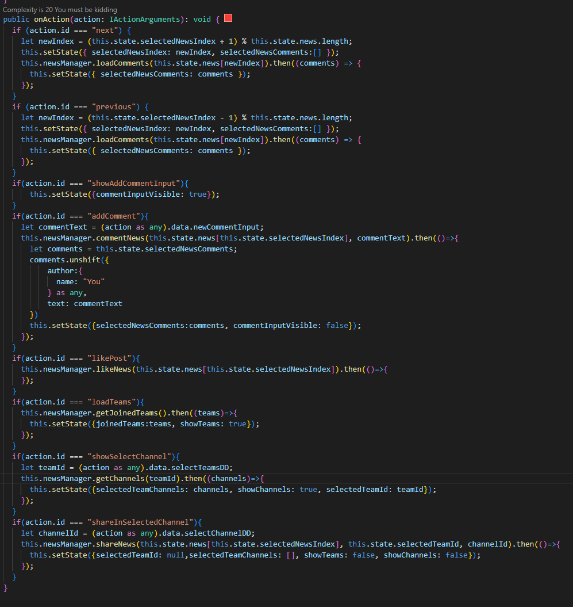
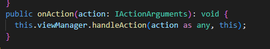

# ace-strategy-pattern

## Summary

This sample shows how to avoid conditions hell in quick view actions.

With more complex cards it can get extremely difficult to handle all the actions as adding more and more conditions to target action id impacts code readability.

In this sample we are exposing organization news in adaptive card.
To start we introduce Next and Previous action to navigate between loaded news.
We also want to add possibility to like and comment displayed news.
Commenting is actually a two-action operation as first- we have to show the input and then submit value provided in the input.
Finally we add support for posting this news in a Teams channel - this requires calls to get Teams, then Channels for selected Team and finally post the news in selected channel. This is how it would look like.

Note we are already abstracting all the logic in a NewsManager, which hides away significant chunk of the code.

With few simple tricks we can refactor to this

With a better isolation and testability of our actions.

## Compatibility

 

-Incompatible-red.svg "SharePoint Server 2016 Feature Pack 2 requires SPFx 1.1")

## Applies to

- [SharePoint Framework](https://aka.ms/spfx)
- [Microsoft 365 tenant](https://learn.microsoft.com/sharepoint/dev/spfx/set-up-your-developer-tenant)

## Prerequisites

None

## Solution

Solution|Author(s)
--------|---------
ace-strategy-pattern | [Marcin Wojciechowski](https://github.com/mgwojciech) [@mgwojciech](https://twitter.com/mgwojciech)

## Version history

Version|Date|Comments
-------|----|--------
1.0|May 27, 2022|Initial commit

## Disclaimer

**THIS CODE IS PROVIDED *AS IS* WITHOUT WARRANTY OF ANY KIND, EITHER EXPRESS OR IMPLIED, INCLUDING ANY IMPLIED WARRANTIES OF FITNESS FOR A PARTICULAR PURPOSE, MERCHANTABILITY, OR NON-INFRINGEMENT.**

---

## Minimal Path to Awesome

* Clone this repository (or [download this solution as a .ZIP file](https://pnp.github.io/download-partial/?url=https://github.com/pnp/sp-dev-fx-webparts/tree/main/samples/ace-strategy-pattern) then unzip it)
* From your command line, change your current directory to the directory containing this sample (`ace-strategy-pattern`, located under `samples`)
* in the command line run:
  * `npm install`
  * `gulp serve`

- Add Graph Auto Batching

To run tests
* Clone this repository (or [download this solution as a .ZIP file](https://pnp.github.io/download-partial/?url=https://github.com/pnp/sp-dev-fx-webparts/tree/main/samples/ace-strategy-pattern) then unzip it)
* From your command line, change your current directory to the directory containing this sample (`ace-strategy-pattern`, located under `samples`)
* in the command line run:
  * `npm install`
  * `npx jest`

## Features

To understand this sample we need to understand the root problem. First of all, I hope we can all agree, multiple if statements have negative impact on code readability and extensibility. At some point if You need to extend such method You cannot be sure where to put new if statement and it's difficult to controls state changes. Additionally - as it's very difficult to correctly mock objects from SPFx, we hit our test coverage, making actions almost impossible to test, or making our tests performing heavy mocking on SPFx objects (such as QuickView).

To address this we need an interface that can abstract our operations. To perform any action we effectively need only action object, current state and setState method.
We can pass all of this as a method arguments, which we do in src\manager\viewManager\viewActions\IViewActionHandler.ts.

To avoid SPFx objects reference let's create new interface which will represent a contract we have with SPFx Quick view:
src\manager\viewManager\IView.ts

With that in place we can implement a specific ActionHandlers such as 
src\manager\viewManager\viewActions\NavigateAction.ts and src\manager\viewManager\viewActions\PostInTeamsAction.ts

Finally we bring it together in src\manager\viewManager\viewActions\ViewActionExecutor.ts where we register actions we want to support in our view.
Everything is handled by src\manager\viewManager\NewsQuickViewManager.ts

Note how now, we can test in isolation sharing news in Teams without any dependency on SPFx
tests\manager\viewManager\viewActions\PostInTeamsAction.test.ts

Hope You'll enjoy it.

> Notice that better pictures and documentation will increase the sample usage and the value you are providing for others. Thanks for your submissions advance.

> Share your web part with others through Microsoft 365 Patterns and Practices program to get visibility and exposure. More details on the community, open-source projects and other activities from http://aka.ms/m365pnp.

## References

- [Getting started with SharePoint Framework](https://learn.microsoft.com/sharepoint/dev/spfx/set-up-your-developer-tenant)
- [Building for Microsoft teams](https://learn.microsoft.com/sharepoint/dev/spfx/build-for-teams-overview)
- [Use Microsoft Graph in your solution](https://learn.microsoft.com/sharepoint/dev/spfx/web-parts/get-started/using-microsoft-graph-apis)
- [Publish SharePoint Framework applications to the Marketplace](https://learn.microsoft.com/en-us/sharepoint/dev/spfx/publish-to-marketplace-overview)
- [Microsoft 365 Patterns and Practices](https://aka.ms/m365pnp) - Guidance, tooling, samples and open-source controls for your Microsoft 365 development