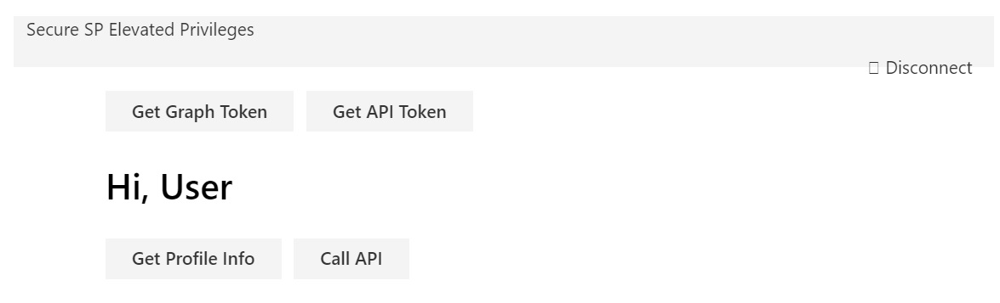

# Call custom Web API secured with AAD from SharePoint Framework client-side web part using Angular v1.x

## Summary

Sample SharePoint Framework client-side web part illustrating communication with a custom Web API secured with Azue Active Directory using Angular v1.x

## Used SharePoint Framework Version 

## Applies to

* [SharePoint Framework Developer Preview](https://docs.microsoft.com/sharepoint/dev/spfx/sharepoint-framework-overview)
* [Office 365 developer tenant](https://docs.microsoft.com/sharepoint/dev/spfx/set-up-your-developer-tenant)

## Solution

Solution|Author(s)
--------|---------
angular-aad-webapi|David Hartman ([Slalom](https://slalom.com))

## Version history

Version|Date|Comments
-------|----|--------
1.1|March 21, 2017|Updated to GA
1.0|December 21, 2016|Initial release

## Disclaimer
**THIS CODE IS PROVIDED *AS IS* WITHOUT WARRANTY OF ANY KIND, EITHER EXPRESS OR IMPLIED, INCLUDING ANY IMPLIED WARRANTIES OF FITNESS FOR A PARTICULAR PURPOSE, MERCHANTABILITY, OR NON-INFRINGEMENT.**

---

## Configuration Bliss
- clone this repo

### Create custom Web API site

- in the Azure Management Portal at https://portal.azure.com create a new API App

### Secure custom Web API with AAD
- in the Azure Management Portal at https://manage.windowsazure.com navigate to Azure Active Directory and register a new web application:
  - as the name use anything you want
  - as the sign-in URL use the URL of the previously created API App 
- from the **api** folder, in Visual Studio open the **api.securecall.sln** file
- update the web.config file with your tenant name i.e. **contoso.onmicrosoft.com** and the audience with the application uri i.e. **https://contoso.onmicrosoft.com/WebPAPI**
- build the solution
- deploy the **api.securecall.sln** project to the newly created API App
- confirm that the API is secured with AAD by in your web browser navigating to **https://your-api-app.azurewebsites.net/api/item**. You should be not be allowed access to the endpoint
- in the Azure Management Portal at https://manage.windowsazure.com navigate to Azure Active Directory and register a new web application
  - as the name use anything you want
  - as the sign-in URL use **https://your-sharepoint-tenant/sites/my-team-site/documents/workbench.aspx** 
  - add permissions to other applications
    - add Graph API
        - in the list of **Delegated Permissions** add **Read users full-profile**
    - change the filter to show all applications
    - from the list of applications select **Your Custom Web API**
    -   in the list of **Delegated Permissions** select **Access You Custom Web API**
  - copy the application ID
 
 ### Configure the web part

- in the command line change the working directory to the **webpart** folder
- in the command line run `npm i`
- in your code editor open the **webpart** folder
- in the **./src/webparts/angularSecureCall/app.module.ts** file
  - replace the tenant with your tenant name
  - replace the GUID in the **clientId** property with the application ID of the Client Application you registered with AAD
  - in the **endpoints** property, replace the URL of the API with the URL of your API App
- in the **./src/webparts/angularSecureCall/app/webAPIService.ts** file
  - in line 13 replace the url with url endpoint of you Web API Application **https://your-api-app.azurewesites.net/api/item**
- in the **./src/weparts/angularSecureCall/app/elevatedprivileges/elevatedprivilegesController.ts** file
  - in lines 41 and 50 replace the application url with the application url of your Web API Application
- in the command line execute `gulp serve`
- add the web part to SharePoint workbench
- in the web part sign in with your organizational account
- you will need to click the acquire token buttons before you can make the calls to the Graph API and You Custom API

> Note: When you first login, the screen will refresh several times. I tried using the popUp feature with adal,
> however, this caused a infinite digest loop. Also ideally you should be able to make the calls to both the Graph
> API and your custom Web API without having to acquire the bearer tokens first, however, what happens is the app
> aquires the bearer token and then never finishes the call, I believe that is because the app is reloading, not quite
> sure how to fix that yet. There is definitely room to improved the user experience but the main logic and functionality
> is here. Thanks!

