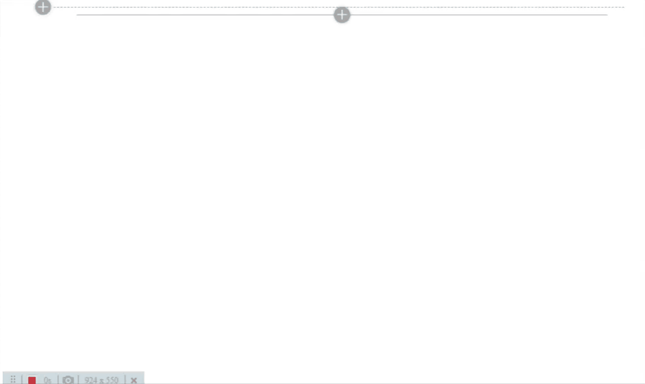

# AngularJS Greeting

## Summary

This sample Web Part illustrating using AngularJS with the SharePoint Framework. This is Greeting web part which shows greeting to the current logged in user.

Final outcome:

## Used SharePoint Framework Version 

## Applies to

* [SharePoint Framework](https://docs.microsoft.com/sharepoint/dev/spfx/sharepoint-framework-overview)
* [Office 365 developer tenant](https://docs.microsoft.com/sharepoint/dev/spfx/set-up-your-developer-tenant)

## Solution

Solution|Author(s)
--------|---------
angular-todo|[Gaurav Goyal](https://github.com/gauravgoyal5) (MCSD, BizPortals Solutions, @gauravgoyal_5)

## Version history

Version|Date|Comments
-------|----|--------
1.0|Feb 15, 2020|Initial release submission

## Disclaimer

**THIS CODE IS PROVIDED *AS IS* WITHOUT WARRANTY OF ANY KIND, EITHER EXPRESS OR IMPLIED, INCLUDING ANY IMPLIED WARRANTIES OF FITNESS FOR A PARTICULAR PURPOSE, MERCHANTABILITY, OR NON-INFRINGEMENT.**

---

## Minimal Path to Awesome

* clone this repo
* in the command line run:
  * `npm i`
  * `gulp serve`

## Features

The Greetings web part is a sample client-side web part built on the SharePoint Framework built using AngularJS.

This web part illustrates the following concepts on top of the SharePoint Framework:

* using Angular v1.x with TypeScript for building SharePoint Framework client-side web parts
* loading AngularJS from CDN
* using Bootstrap CSS styles in a SharePoint Framework client-side web part
* using non-reactive web part property pane
* using conditional rendering for one-time web part setup
* passing web part configuration to AngularJS and reacting to configuration changes

## Support

We do not support samples, but we do use GitHub to track issues and constantly want to improve these samples.

If you encounter any issues while using this sample, [create a new issue](https://github.com/pnp/sp-dev-fx-webparts/issues/new?assignees=&labels=Needs%3A+Triage+%3Amag%3A%2Ctype%3Abug-suspected&template=bug-report.yml&sample=angular-greeting&authors=@gauravgoyal5&title=angular-greeting%20-%20).

For questions regarding this sample, [create a new question](https://github.com/pnp/sp-dev-fx-webparts/issues/new?assignees=&labels=Needs%3A+Triage+%3Amag%3A%2Ctype%3Abug-suspected&template=question.yml&sample=angular-greeting&authors=@gauravgoyal5&title=angular-greeting%20-%20).

Finally, if you have an idea for improvement, [make a suggestion](https://github.com/pnp/sp-dev-fx-webparts/issues/new?assignees=&labels=Needs%3A+Triage+%3Amag%3A%2Ctype%3Abug-suspected&template=suggestion.yml&sample=angular-greeting&authors=@gauravgoyal5&title=angular-greeting%20-%20).

