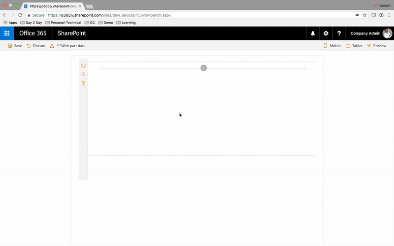
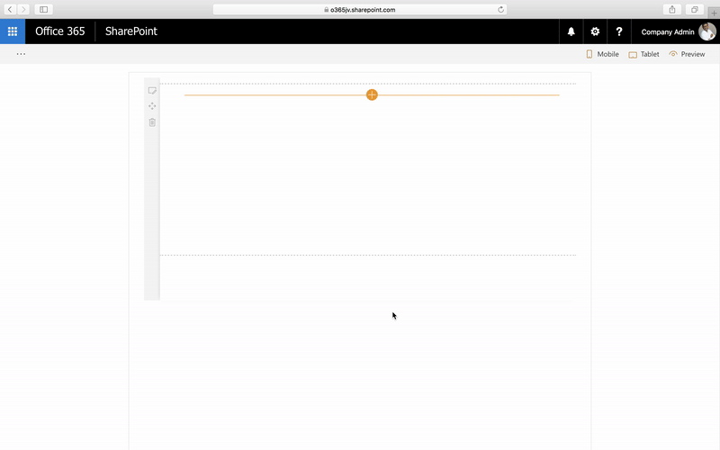

# Media Recorder

## Summary

Sample SharePoint Framework client-side web part illustrating Video Recording using [MediaRecorder Web API](https://developer.mozilla.org/en-US/docs/Web/API/MediaRecorder). 

This is an experimental web part. Because this technology's specification has not stabilized, check the compatibility table for usage in various browsers. Also note that the syntax and behavior of an experimental technology is subject to change in future versions of browsers as the specification changes

## Browser with MediaRecorder API support

## Browser without MediaRecorder API support 

## Applies to

* [SharePoint Framework Developer](https://dev.office.com/sharepoint/docs/spfx/sharepoint-framework-overview)
* [Office 365 developer tenant](https://dev.office.com/sharepoint/docs/spfx/set-up-your-developer-tenant)

## Solution

Solution|Author(s)
--------|---------
angular-media-recorder|Joseph Velliah (SPRIDER, @sprider)

## Version history

Version|Date|Comments
-------|----|--------
1.0|September 04, 2017|Initial release

## Disclaimer
**THIS CODE IS PROVIDED *AS IS* WITHOUT WARRANTY OF ANY KIND, EITHER EXPRESS OR IMPLIED, INCLUDING ANY IMPLIED WARRANTIES OF FITNESS FOR A PARTICULAR PURPOSE, MERCHANTABILITY, OR NON-INFRINGEMENT.**

---

## Minimal Path to Awesome

- clone this repo
- go to the working directory of the webpart folder in the command line run:
  - npm and typings install 
    - npm install @types/microsoft-ajax --save-dev
    - npm install @types/sharepoint --save-dev
    - npm install @types/angular --save-dev 
  - gulp serve
- Open the workbench page in a sharepoint site (https://{yoursiteurl}/_layouts/15/workbench.aspx)
- add Media Recorder webpart and edit it 
  - configure the library name where you would like to save the recording/input file.
  - start recording 
  - allow camera and mic
  - stop recording 
  - replay video
  - retry or upload the recorded video

## Features

This project illustrates the following concepts:
- Front/Back camera selection
- Video recording using the supported browsers   
- File uploading option for the unsupported browsers  
- Playback recording  
- Upload files to document library 

