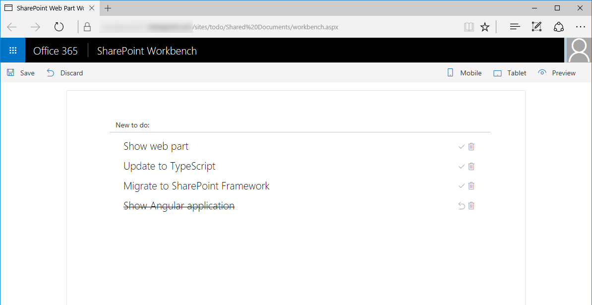

# SharePoint Framework todo web part built with Angular

## Summary

Sample SharePoint Framework client-side web part for managing tasks stored in a SharePoint list, built using Angular.

## Used SharePoint Framework Version 

## Applies to

* [SharePoint Framework Developer Preview](http://dev.office.com/sharepoint/docs/spfx/sharepoint-framework-overview)
* [Office 365 developer tenant](http://dev.office.com/sharepoint/docs/spfx/set-up-your-developer-tenant)

## Solution

Solution|Author(s)
--------|---------
angular-todo-webpart|Waldek Mastykarz (MVP, Rencore, @waldekm)

## Version history

Version|Date|Comments
-------|----|--------
1.0.0|October 21, 2016|Initial release

## Disclaimer
**THIS CODE IS PROVIDED *AS IS* WITHOUT WARRANTY OF ANY KIND, EITHER EXPRESS OR IMPLIED, INCLUDING ANY IMPLIED WARRANTIES OF FITNESS FOR A PARTICULAR PURPOSE, MERCHANTABILITY, OR NON-INFRINGEMENT.**

---

## Minimal Path to Awesome

- create **Todo** list
  - in SharePoint site create a new list called `Todo`
  - in the **Todo** list add a new choice column called `Status`
    - as available choices enter (each value in new line): `Not started`, `In progress`, `Completed`
- deploy web part
  - clone this repo
  - in the command line execute:
    - `npm i`
    - `gulp serve --nobrowser`
  - create a copy of the **./temp/workbench.html** file and change its extension to **.aspx**
  - in the **workbench.aspx** file, change the value of the **webAbsoluteUrl** property to the absolute URL of your SharePoint site
  - upload the **workbench.aspx** file to a document library in your site
- in the web browser navigate to the **workbench.aspx** page

## Features

Sample web part in this solution illustrates the following concepts on top of the SharePoint Framework:

- building SharePoint Framework client-side web parts with Angular
- building Angular applications with TypeScript
- communicating with the SharePoint REST API in Angular applications
- passing web part properties values into Angular application

