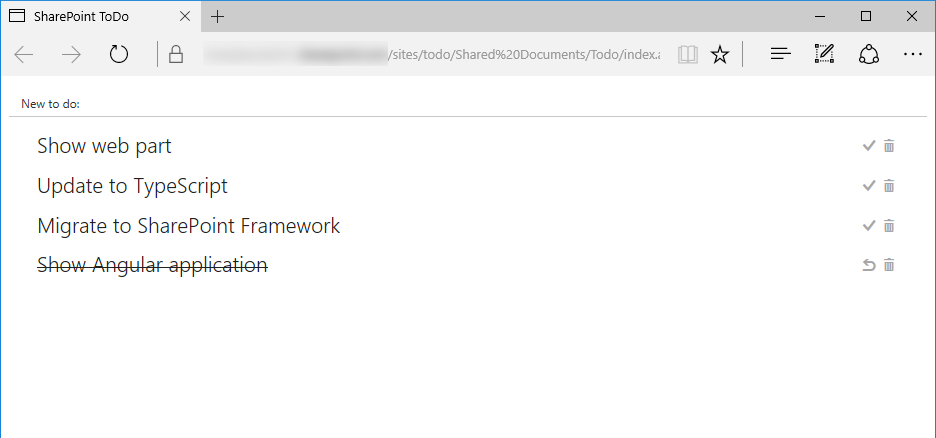

# Angular todo application

## Summary

Sample Angular application for managing tasks stored in a SharePoint list.

## Solution

Solution|Author(s)
--------|---------
angular-todo|Waldek Mastykarz (MVP, Rencore, @waldekm)

## Version history

Version|Date|Comments
-------|----|--------
1.0.0|October 21, 2016|Initial release

## Disclaimer
**THIS CODE IS PROVIDED *AS IS* WITHOUT WARRANTY OF ANY KIND, EITHER EXPRESS OR IMPLIED, INCLUDING ANY IMPLIED WARRANTIES OF FITNESS FOR A PARTICULAR PURPOSE, MERCHANTABILITY, OR NON-INFRINGEMENT.**

---

## Minimal Path to Awesome

- create **Todo** list
  - in SharePoint site create a new list called `Todo`
  - in the **Todo** list add a new choice column called `Status`
    - as available choices enter (each value in new line): `Not started`, `In progress`, `Completed`
- configure application
  - in the **./app/app.config.js** file in the **sharepointApi** constant, update the URL of the site to match the server-relative URL of your site
- upload application
  - in SharePoint site open the **Shared Documents** library and create new folder called `Todo`
  - upload all application files and folders to the newly created **Todo** folder
- in the web browser navigate to the **index.aspx** page   

## Features

This sample application illustrates the following concepts in Angular:

- building Angular applications in plain JavaScript
- styling Angular applications using ngOfficeUIFabric
- communicating with the SharePoint REST API in Angular applications
- using application constants for storing configuration values and using them across the application

