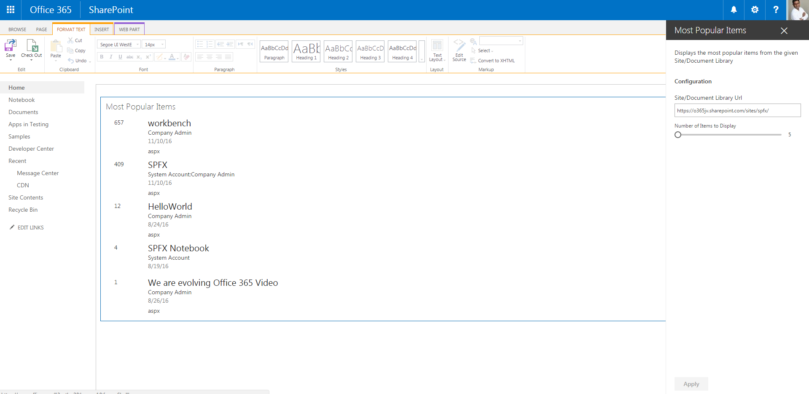

# Most Popular Items WebPart using Angular & ngOfficeUIFabric

## Summary

This web part displays the most popular items from a given site and document library URL using the SahrePoint search API.

## Used SharePoint Framework Version 

## Applies to

* [SharePoint Framework Developer Preview](https://github.com/SharePoint/sp-dev-docs/wiki)
* [Office 365 developer tenant](https://github.com/SharePoint/sp-dev-docs/wiki/Setup-SharePoint-Tenant)

## Solution

Solution|Author(s)
--------|---------
angular-mostpopularitems|Joseph Velliah (SPRIDER, @sprider)

## Version history

Version|Date|Comments
-------|----|--------
1.0|November 10, 2016|Initial release

## Disclaimer
**THIS CODE IS PROVIDED *AS IS* WITHOUT WARRANTY OF ANY KIND, EITHER EXPRESS OR IMPLIED, INCLUDING ANY IMPLIED WARRANTIES OF FITNESS FOR A PARTICULAR PURPOSE, MERCHANTABILITY, OR NON-INFRINGEMENT.**

---

## Minimal Path to Awesome

- clone this repo
- in the command line run:
  - `npm i`
  - `tsd install`
  - `gulp serve`

## Features

The Most Popular Items web part is a sample client-side web part built on the SharePoint Framework built using Angular and ngOfficeUIFabric.

This web part illustrates the following concepts on top of the SharePoint Framework:

- using Angular for building SharePoint Framework client-side web parts
- using ngOfficeUIFabric for styling Angular client-side web parts
- including Angular and ngOfficeUIFabric in the web part bundle
- using a newer version of ngOfficeUIFabric for styling client-side web parts
- using non-reactive web part property pane and custom properties
- using conditional rendering for one-time web part setup
- passing web part configuration to Angular and reacting to configuration changes

