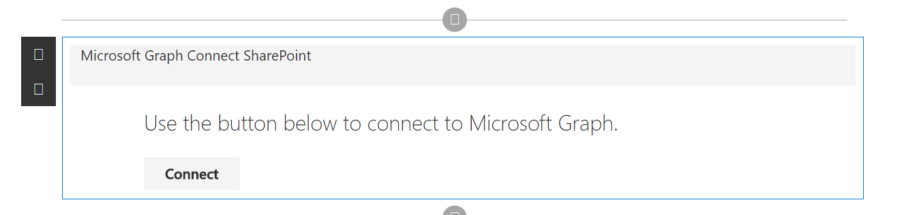
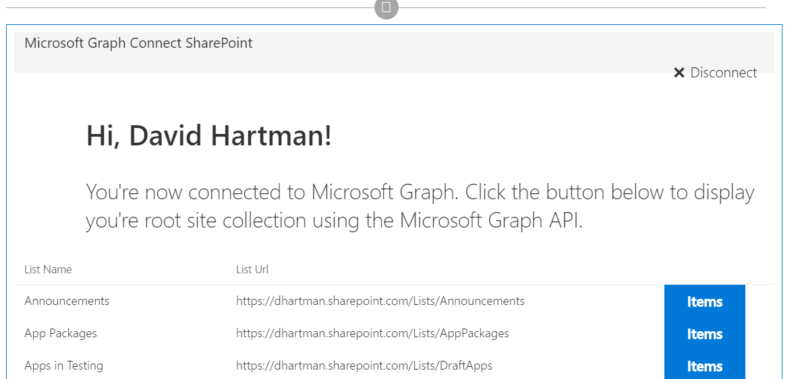

# Angular MS Graph Web Part Built with Angular v1.x

## Summary

This is a sample MS Graph web part that connects to Microsoft Graph and pulls SharePoint information from your
tenant. It will first pull the root site collection (currently a limitation by Microsoft Graph), then it will
display all the lists associated with the site followed by all the items inside the list.

> Note: I currently only have models developed for the Announcements list. All other lists will currently generate errors.

## Used SharePoint Framework Version 

## Applies to

* [SharePoint Framework Developer Preview](https://docs.microsoft.com/sharepoint/dev/spfx/sharepoint-framework-overview)
* [Office 365 developer tenant](https://docs.microsoft.com/sharepoint/dev/spfx/set-up-your-developer-tenant)

## Solution

Solution|Author(s)
--------|---------
angular-msgraph|[David Hartman](https://github.com/davidhartman) ([Slalom](https://slalom.com))

## Version history

Version|Date|Comments
-------|----|--------
2.0|April 19th, 2017|GA Release
1.0|February 6th, 2017|Initial release

## Disclaimer

**THIS CODE IS PROVIDED *AS IS* WITHOUT WARRANTY OF ANY KIND, EITHER EXPRESS OR IMPLIED, INCLUDING ANY IMPLIED WARRANTIES OF FITNESS FOR A PARTICULAR PURPOSE, MERCHANTABILITY, OR NON-INFRINGEMENT.**

---

## Configuration Bliss
- clone this repo
- in the command line run:
 - `npm i typings -g`
 - `npm i`
 - `gulp serve

## Register the application

1. Sign into the [App Registration Portal](https://apps.dev.microsoft.com/) using either your personal or work or school account.

2. Choose **Add an app**.

3. Enter a name for the app, and choose **Create application**.

   The registration page displays, listing the properties of your app.

4. Copy the Application Id. This is the unique identifier for your app.

5. Under **Platforms**, choose **Add Platform**.

6. Choose **Web**.

7. Make sure the **Allow Implicit Flow** check box is selected, and enter *http://{Location of SP Workbench}* as the Redirect URI.

8. Choose **Save**.

## Configuring the App

1. Replace the **aad** and **redirect_uri** placeholder values with the application ID and redirect url of your registered Azure application in the GraphHelper.ts file Under
src -> angularMsGraph -> GraphHelper.ts

## Support

We do not support samples, but we do use GitHub to track issues and constantly want to improve these samples.

If you encounter any issues while using this sample, [create a new issue](https://github.com/pnp/sp-dev-fx-webparts/issues/new?assignees=&labels=Needs%3A+Triage+%3Amag%3A%2Ctype%3Abug-suspected&template=bug-report.yml&sample=angular-msgraph&authors=@davidhartman&title=angular-msgraph%20-%20).

For questions regarding this sample, [create a new question](https://github.com/pnp/sp-dev-fx-webparts/issues/new?assignees=&labels=Needs%3A+Triage+%3Amag%3A%2Ctype%3Abug-suspected&template=question.yml&sample=angular-msgraph&authors=@davidhartman&title=angular-msgraph%20-%20).

Finally, if you have an idea for improvement, [make a suggestion](https://github.com/pnp/sp-dev-fx-webparts/issues/new?assignees=&labels=Needs%3A+Triage+%3Amag%3A%2Ctype%3Abug-suspected&template=suggestion.yml&sample=angular-msgraph&authors=@davidhartman&title=angular-msgraph%20-%20).

 
