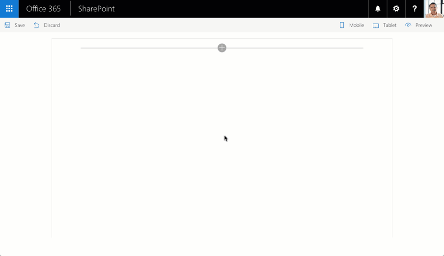

# Angular multi-page client-side web part

## Summary

This is a sample SharePoint Framework client-side web part built using Angular, illustrating building multi-page web parts.

### Poll

This sample contains a poll web part allowing users to vote and view the results.

## Used SharePoint Framework Version 

## Applies to

* [SharePoint Framework Developer Preview](https://docs.microsoft.com/sharepoint/dev/spfx/sharepoint-framework-overview)
* [Office 365 developer tenant](https://docs.microsoft.com/sharepoint/dev/spfx/set-up-your-developer-tenant)

## Solution

Solution|Author(s)
--------|---------
angular-multipage|Waldek Mastykarz (MVP, Rencore, @waldekm)

## Version history

Version|Date|Comments
-------|----|--------
1.0.0|November 1, 2016|Initial release

## Disclaimer
**THIS CODE IS PROVIDED *AS IS* WITHOUT WARRANTY OF ANY KIND, EITHER EXPRESS OR IMPLIED, INCLUDING ANY IMPLIED WARRANTIES OF FITNESS FOR A PARTICULAR PURPOSE, MERCHANTABILITY, OR NON-INFRINGEMENT.**

---

## Prerequisites

- Site Collection created under the **/sites/** Managed Path

## Minimal Path to Awesome

### Poll web part

- create list for the poll
  - in SharePoint create a new list
  - in the list add new column called `NumVotes` of type **Number** (you can change the name later if you want)
  - in the list add a few items - each representing one of the vote options in your poll (for example for a poll about favorite JavaScript frameworks you would add items like _Angular_, _React_, _jQuery_, etc.)
- deploy SharePoint workbench
  - clone this repo
  - in the command line run
    - `npm i`
    - `gulp serve --nobrowser`
  - from the **./temp** directory create a copy of the **workbench.html** file and rename it to **workbench.aspx**
  - in the **workbench.aspx** file change the value of the **webAbsoluteUrl** property to the absolute URL of your SharePoint site
  - upload the **workbench.aspx** file to a document library in your site
- use the web part
  - in your web browser navigate to the **workbench.aspx** page uploaded in your SharePoint site
  - add the Poll web part to the canvas
  - in the configuration specify the **Poll title** and optionally the **Poll description**. Also specify the title of your poll list
  - confirm the changes by clicking the **Apply** button
  - select one of the vote options and click the **Vote** button to submit your vote

## Features

This project contains sample client-side web parts built on the SharePoint Framework using Angular illustrating working with multi-page web parts.

This sample illustrates the following concepts on top of the SharePoint Framework:

- using Angular v1.x with TypeScript for building SharePoint Framework client-side web parts
- using Angular UI Router for building multi-page web parts
- navigating between the different pages without changing the URL
- building parent and child states with Angular UI Router
- passing web part configuration into an Angular application
- reacting to Angular events in a SharePoint Framework client-side web part
- styling Angular applications using Office UI Fabric
- using non-reactive web part property pane
- using conditional rendering for one-time web part setup
- chaining multiple Angular promises
- reading and updating SharePoint list items using Angular
- showing charts using [Chart.js](http://www.chartjs.org) and [Angular Chart directives](https://jtblin.github.io/angular-chart.js/)

