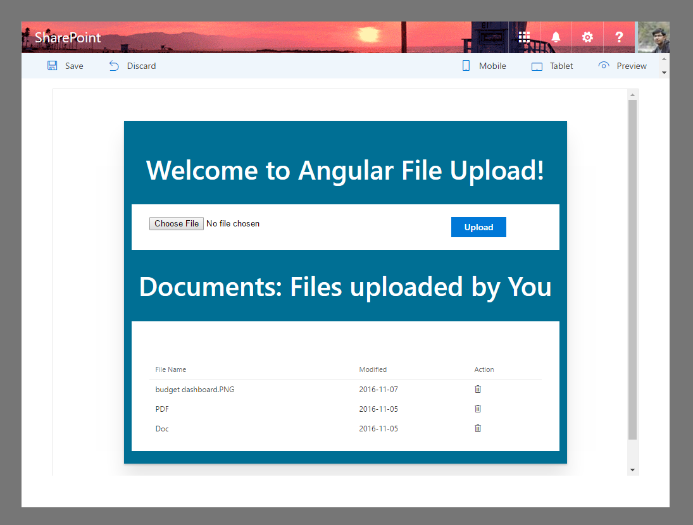

# File Upload using AngularJs

## Summary
File Update/Delete webpart using AngularJs and ngOfficeUIFabric with the SharePoint Framework.

Edit webpart properties to set Document library Name. Initially, It has been set to `Documents`.
## Applies to

* [SharePoint Framework Developer Preview](http://dev.office.com/sharepoint/docs/spfx/sharepoint-framework-overview)
* [Office 365 developer tenant](http://dev.office.com/sharepoint/docs/spfx/set-up-your-developer-tenant)

## Solution

Solution|Author(s)
--------|---------
angular-ngofficeuifabric-file-upload | Atish Kumar Dipongkor (MVP, Office Development)

## Version history

Version|Date|Comments
-------|----|--------
1.0|November 07, 2016|Initial release

## Disclaimer
**THIS CODE IS PROVIDED *AS IS* WITHOUT WARRANTY OF ANY KIND, EITHER EXPRESS OR IMPLIED, INCLUDING ANY IMPLIED WARRANTIES OF FITNESS FOR A PARTICULAR PURPOSE, MERCHANTABILITY, OR NON-INFRINGEMENT.**

---

## Minimal Path to Awesome

- Clone this repository
- in the command line run:
  - `npm install`
  - `tsd install`
  - `gulp serve --nobrowser`

## Features
This Web Part illustrates the following concepts on top of the SharePoint Framework & AngularJs:

- `BaseService`: By injecting this Angular Service, GET, POST, UPDATE & DELETE requests can be made easily. It's a resuable service. Please check how it has been used in `FileUploadService`
- `CustomFileChange`: It's a custom Angular directive. It binds the file with model on file change event.
- `IsoToDateString`: It's a custom Angular filter. It formats ISO date string to `{0:yyyy}-{0:MM}-{0:dd}` format.

