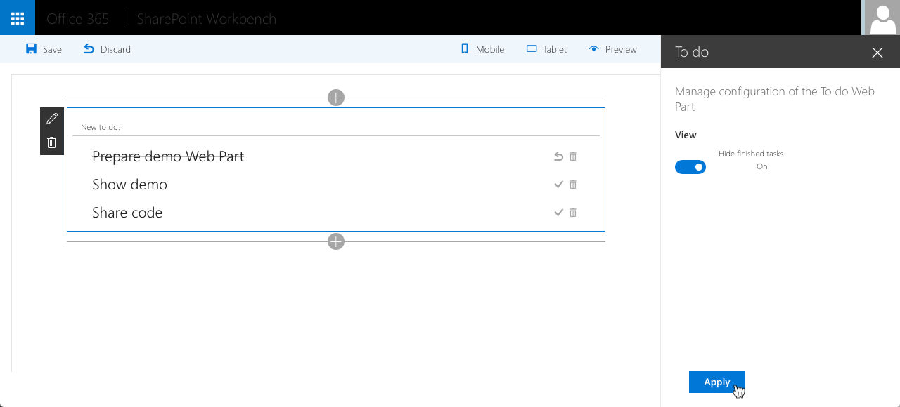

# Angular & ngOfficeUIFabric Client-Side Web Part

## Summary

this is a sample web part that illustrates the use of Angular and [ngOfficeUIFabric](https://github.com/ngOfficeUIFabric) with the SharePoint Framework.
You can find a video recording walk-through this sample from [SharePoint PnP YouTube channel](https://www.youtube.com/watch?v=FS-_0KENJkI).

## Used SharePoint Framework Version
 

## Applies to

* [SharePoint Framework Developer Preview](https://docs.microsoft.com/sharepoint/dev/spfx/sharepoint-framework-overview)
* [Office 365 developer tenant](https://docs.microsoft.com/sharepoint/dev/spfx/set-up-your-developer-tenant)

## Solution

Solution|Author(s)
--------|---------
angular-ngofficeuifabric-todo|[Waldek Mastykarz](https://github.com/waldekmastykarz) (MVP, Rencore, @waldekm)

## Version history

Version|Date|Comments
-------|----|--------
1.1|September 9, 2016|Updated sample to SPFx v0.2.0 and changed to loading Angular and ngOfficeUIFabric from CDN
1.0|August 29, 2016|Initial release

## Minimal Path to Awesome

- clone this repo
- in the command line run:
  - `npm i`
  - `tsd install`
  - `gulp serve`

## Features

The To Do web part is a sample client-side web part built on the SharePoint Framework built using Angular and ngOfficeUIFabric.

This web part illustrates the following concepts on top of the SharePoint Framework:

- using Angular v1.x with TypeScript for building SharePoint Framework client-side web parts
- using ngOfficeUIFabric for styling Angular v1.x client-side web parts
- including Angular and ngOfficeUIFabric in the web part bundle
- using a newer version of Office UI Fabric for styling client-side web parts
- loading CSS stylesheets from a CDN
- using non-reactive web part property pane
- using conditional rendering for one-time web part setup
- passing web part configuration to Angular and reacting to configuration changes

## Help

We do not support samples, but this community is always willing to help, and we want to improve these samples. We use GitHub to track issues, which makes it easy for  community members to volunteer their time and help resolve issues.

If you're having issues building the solution, please run [spfx doctor](https://pnp.github.io/cli-microsoft365/cmd/spfx/spfx-doctor/) from within the solution folder to diagnose incompatibility issues with your environment.

You can try looking at [issues related to this sample](https://github.com/pnp/sp-dev-fx-webparts/issues?q=label%3A"sample%3A%20angular-ngofficeuifabric-todo" ) to see if anybody else is having the same issues.

You can also try looking at [discussions related to this sample](https://github.com/pnp/sp-dev-fx-webparts/discussions?discussions_q=angular-ngofficeuifabric-todo) and see what the community is saying.

If you encounter any issues while using this sample, [create a new issue](https://github.com/pnp/sp-dev-fx-webparts/issues/new?assignees=&labels=Needs%3A+Triage+%3Amag%3A%2Ctype%3Abug-suspected%2Csample%3A%20angular-ngofficeuifabric-todo&template=bug-report.yml&sample=angular-ngofficeuifabric-todo&authors=@waldekmastykarz&title=angular-ngofficeuifabric-todo%20-%20).

For questions regarding this sample, [create a new question](https://github.com/pnp/sp-dev-fx-webparts/issues/new?assignees=&labels=Needs%3A+Triage+%3Amag%3A%2Ctype%3Aquestion%2Csample%3A%20angular-ngofficeuifabric-todo&template=question.yml&sample=angular-ngofficeuifabric-todo&authors=@waldekmastykarz&title=angular-ngofficeuifabric-todo%20-%20).

Finally, if you have an idea for improvement, [make a suggestion](https://github.com/pnp/sp-dev-fx-webparts/issues/new?assignees=&labels=Needs%3A+Triage+%3Amag%3A%2Ctype%3Aenhancement%2Csample%3A%20angular-ngofficeuifabric-todo&template=question.yml&sample=angular-ngofficeuifabric-todo&authors=@waldekmastykarz&title=angular-ngofficeuifabric-todo%20-%20).

## Disclaimer

**THIS CODE IS PROVIDED *AS IS* WITHOUT WARRANTY OF ANY KIND, EITHER EXPRESS OR IMPLIED, INCLUDING ANY IMPLIED WARRANTIES OF FITNESS FOR A PARTICULAR PURPOSE, MERCHANTABILITY, OR NON-INFRINGEMENT.**

