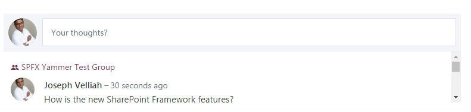
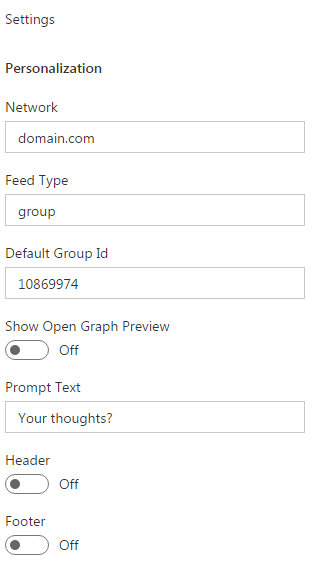

# Yammer Feed WebPart using Angular

## Summary

This Web Part displays the feeds from yammer using https://c64.assets-yammer.com/assets/platform_embed.js.

## Used SharePoint Framework Version 

## Applies to

* [SharePoint Framework](https://dev.office.com/sharepoint/docs/spfx/sharepoint-framework-overview)
* [SharePoint Online Tenant](https://dev.office.com/sharepoint/docs/spfx/set-up-your-developer-tenant)

## Solution

Solution|Author(s)
--------|---------
angular-yammer|Joseph Velliah (SPRIDER, @sprider)

## Version history

Version|Date|Comments
-------|----|--------
1.0|March 03, 2017|Initial release

## Disclaimer
**THIS CODE IS PROVIDED *AS IS* WITHOUT WARRANTY OF ANY KIND, EITHER EXPRESS OR IMPLIED, INCLUDING ANY IMPLIED WARRANTIES OF FITNESS FOR A PARTICULAR PURPOSE, MERCHANTABILITY, OR NON-INFRINGEMENT.**

---

## Minimal Path to Awesome

- clone this repo
- in the command line run:
  - `npm i`
  - `tsd install`
  - `gulp serve`

## Features

The Yammer Feed is a sample Client-Side Web Part built on the SharePoint Framework using Angular.

This Web Part illustrates the following concepts on top of the SharePoint Framework:

- using Angular for building SharePoint Framework Client-Side Web Parts
- including Angular in the Web Part bundle
- using non-reactive Web Part Property Pane and custom Properties
- using conditional rendering for one-time Web Part setup
- passing Web Part configuration to Angular and reacting to configuration changes
- display the yammer feed based on configuration changes
