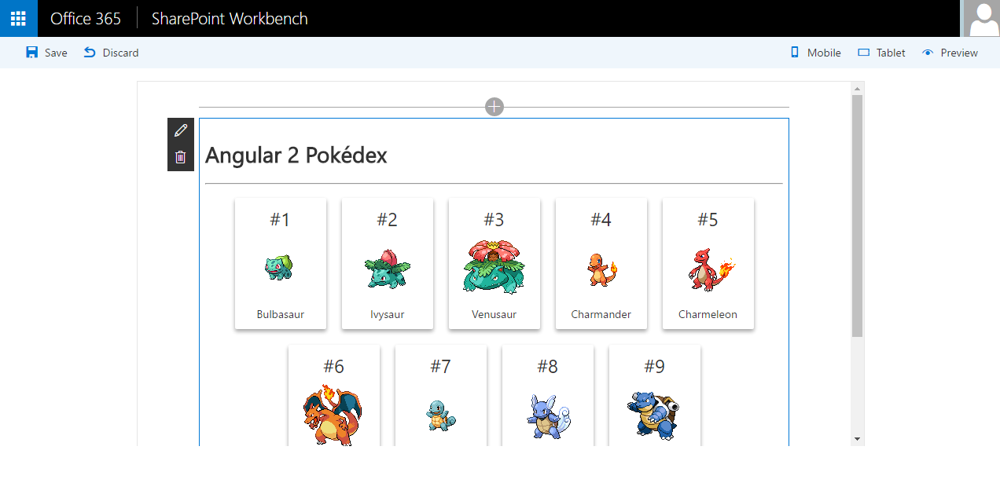

# Pokemon Angular 2

## Summary
Sample Web Part illustrating using Angular 2  with the SharePoint Framework. You can find the explanation of how to use this example in the next [post](http://blogs.encamina.com/desarrollandosobresharepoint/2016/09/13/sharepoint-framework-utilizar-angular-2/).

## Applies to

* [SharePoint Framework Developer Preview](http://dev.office.com/sharepoint/docs/spfx/sharepoint-framework-overview)
* [Office 365 developer tenant](http://dev.office.com/sharepoint/docs/spfx/set-up-your-developer-tenant)

## Solution

Solution|Author(s)
--------|---------
angular-pokemon2 | Adrian Diaz Cervera (MVP, Encamina, @AdrianDiaz81)

## Version history

Version|Date|Comments
-------|----|--------
1.0|October 7, 2016|Initial release

## Disclaimer
**THIS CODE IS PROVIDED *AS IS* WITHOUT WARRANTY OF ANY KIND, EITHER EXPRESS OR IMPLIED, INCLUDING ANY IMPLIED WARRANTIES OF FITNESS FOR A PARTICULAR PURPOSE, MERCHANTABILITY, OR NON-INFRINGEMENT.**

---

## Minimal Path to Awesome

- Clone this repository
- in the command line run:
  - `npm install`
  - `tsd install`
  - `npm install typings`
  - `gulp serve`

## Features
The Pokemon GO Web Part is a sample Client-Side Web Part built on the SharePoint Framework built using Angular 2. 
This Web Part illustrates the following concepts on top of the SharePoint Framework:

- using Angular 2 with TypeScript for building SharePoint Framework Client-Side Web Parts
- including Angular in the Web Part bundle
- use third-party API's with de SharePoint Framework

