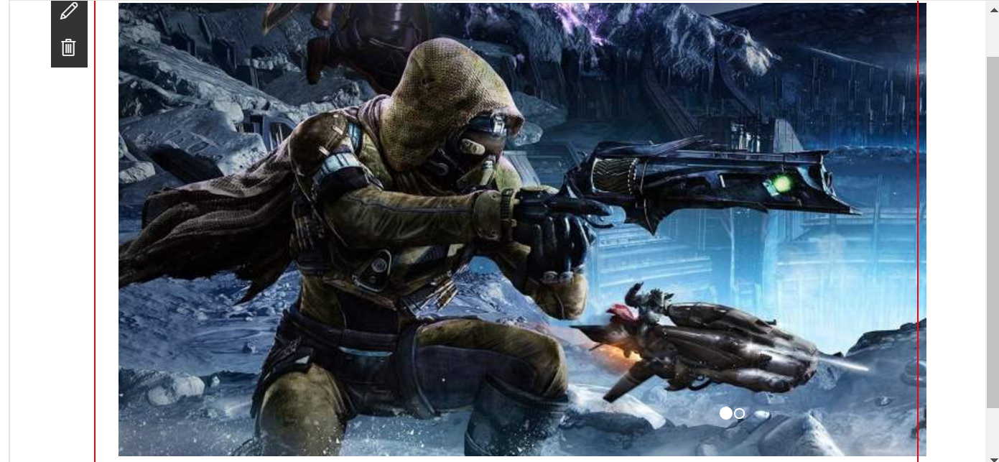
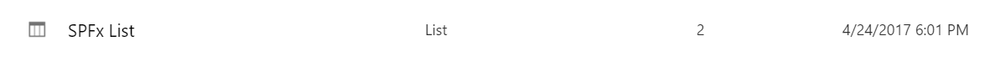

# Bootstrap Slider Built with jQuery v1.x and Boostrap v3.x

## Summary

Sample bootstrap slider which pulls the slides from a list inside the SharePoint site. The list is automatically deployed once the app is installed in the SharePoint site.

## Compatibility

 

-Compatible-green.svg)

## Applies to

* [SharePoint Framework Developer GA](https://docs.microsoft.com/sharepoint/dev/spfx/sharepoint-framework-overview)
* [Office 365 developer tenant](https://docs.microsoft.com/sharepoint/dev/spfx/set-up-your-developer-tenant)

## Solution

Solution|Author(s)
--------|---------
bootstrap-slider|[David Hartman](https://github.com/davidhartman) ([Slalom](https://slalom.com))

## Version History

Version|Date|Comments
-------|----|--------
1.0|April 25th, 2017|Initial Release

## Configuration Bliss

- clone this repo
- in write-manifests.json
 - fill in the correct CDN path
- in the command line run:
 - `npm i`
 - `gulp bundle --ship`
 - `gulp package-solution --ship`
- in your SharePoint Online tenant app store install the app
- add your assets to the specified path in the write-manifests.json
 - the assets are found in the **temp/deploy** folder
- add the app to your SharePoint Online site
 - When the app is finished installing you should see a **SPFx List** in the **Site Contents** of the site
 
- Add items to the **SPFx List** in order for slides to display in the web part

## Help

We do not support samples, but this community is always willing to help, and we want to improve these samples. We use GitHub to track issues, which makes it easy for  community members to volunteer their time and help resolve issues.

If you're having issues building the solution, please run [spfx doctor](https://pnp.github.io/cli-microsoft365/cmd/spfx/spfx-doctor/) from within the solution folder to diagnose incompatibility issues with your environment.

You can try looking at [issues related to this sample](https://github.com/pnp/sp-dev-fx-webparts/issues?q=label%3A"sample%3A%20bootstrap-slider=@davidhartman" ) to see if anybody else is having the same issues.

You can also try looking at [discussions related to this sample](https://github.com/pnp/sp-dev-fx-webparts/discussions?discussions_q=bootstrap-slider=@davidhartman) and see what the community is saying.

If you encounter any issues while using this sample, [create a new issue](https://github.com/pnp/sp-dev-fx-webparts/issues/new?assignees=&labels=Needs%3A+Triage+%3Amag%3A%2Ctype%3Abug-suspected%2Csample%3A%20bootstrap-slider=@davidhartman&template=bug-report.yml&sample=bootstrap-slider=@davidhartman&title=angular-todo%20-%20).

For questions regarding this sample, [create a new question](https://github.com/pnp/sp-dev-fx-webparts/issues/new?assignees=&labels=Needs%3A+Triage+%3Amag%3A%2Ctype%3Aquestion%2Csample%3A%20bootstrap-slider=@davidhartman&template=question.yml&sample=bootstrap-slider=@davidhartman&title=angular-todo%20-%20).

Finally, if you have an idea for improvement, [make a suggestion](https://github.com/pnp/sp-dev-fx-webparts/issues/new?assignees=&labels=Needs%3A+Triage+%3Amag%3A%2Ctype%3Aenhancement%2Csample%3A%20bootstrap-slider=@davidhartman&template=question.yml&sample=bootstrap-slider=@davidhartman&title=angular-todo%20-%20).

## Disclaimer

**THIS CODE IS PROVIDED *AS IS* WITHOUT WARRANTY OF ANY KIND, EITHER EXPRESS OR IMPLIED, INCLUDING ANY IMPLIED WARRANTIES OF FITNESS FOR A PARTICULAR PURPOSE, MERCHANTABILITY, OR NON-INFRINGEMENT.**

