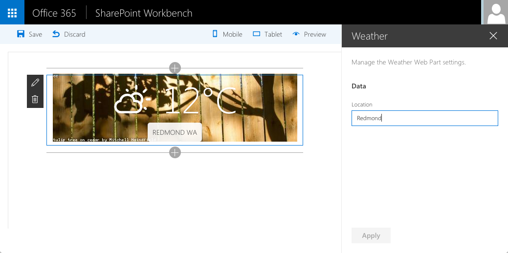

# Using jQuery loaded from CDN

## Summary

This is a sample web Part that illustrates the use of jQuery and its plugins loaded from CDN for building SharePoint Framework client-side web parts.

## Compatibility

 

-Compatible-green.svg)

## Applies to

* [SharePoint Framework Developer Preview](https://docs.microsoft.com/sharepoint/dev/spfx/sharepoint-framework-overview)
* [Office 365 developer tenant](https://docs.microsoft.com/sharepoint/dev/spfx/set-up-your-developer-tenant)

## Solution

Solution|Author(s)
--------|---------
jquery-cdn|[Waldek Mastykarz](https://github.com/waldekmastykarz) (MVP, Rencore, @waldekm)

## Version history

Version|Date|Comments
-------|----|--------
1.0|September 16, 2016|Initial release

## Minimal Path to Awesome

- clone this repo
- in the command line run:
  - `npm i`
  - `gulp serve`

>  This sample can also be opened with [VS Code Remote Development](https://code.visualstudio.com/docs/remote/remote-overview). Visit https://aka.ms/spfx-devcontainer for further instructions.

## Features

This project contains sample client-side web parts built on the SharePoint Framework illustrating how to use jQuery and its plugins loaded from CDN for building SharePoint Framework client-side web parts.

This web part illustrates the following concepts on top of the SharePoint Framework:
- loading jQuery from CDN
- loading non-AMD jQuery plugins with configured dependency on jQuery
- using non-reactive web part Property Pane
- using conditional rendering for one-time web part setup

## Help

We do not support samples, but this community is always willing to help, and we want to improve these samples. We use GitHub to track issues, which makes it easy for  community members to volunteer their time and help resolve issues.

If you're having issues building the solution, please run [spfx doctor](https://pnp.github.io/cli-microsoft365/cmd/spfx/spfx-doctor/) from within the solution folder to diagnose incompatibility issues with your environment.

You can try looking at [issues related to this sample](https://github.com/pnp/sp-dev-fx-webparts/issues?q=label%3A%22sample%3A%20jquery-cdn%22) to see if anybody else is having the same issues.

You can also try looking at [discussions related to this sample](https://github.com/pnp/sp-dev-fx-webparts/discussions?discussions_q=jquery-cdn) and see what the community is saying.

If you encounter any issues while using this sample, [create a new issue](https://github.com/pnp/sp-dev-fx-webparts/issues/new?assignees=&labels=Needs%3A+Triage+%3Amag%3A%2Ctype%3Abug-suspected%2Csample%3A%20jquery-cdn&template=bug-report.yml&sample=jquery-cdn&authors=@waldekmastykarz&title=jquery-cdn%20-%20).

For questions regarding this sample, [create a new question](https://github.com/pnp/sp-dev-fx-webparts/issues/new?assignees=&labels=Needs%3A+Triage+%3Amag%3A%2Ctype%3Aquestion%2Csample%3A%20jquery-cdn&template=question.yml&sample=jquery-cdn&authors=@waldekmastykarz&title=jquery-cdn%20-%20).

Finally, if you have an idea for improvement, [make a suggestion](https://github.com/pnp/sp-dev-fx-webparts/issues/new?assignees=&labels=Needs%3A+Triage+%3Amag%3A%2Ctype%3Aenhancement%2Csample%3A%20jquery-cdn&template=suggestion.yml&sample=jquery-cdn&authors=@waldekmastykarz&title=jquery-cdn%20-%20).

## Disclaimer

**THIS CODE IS PROVIDED *AS IS* WITHOUT WARRANTY OF ANY KIND, EITHER EXPRESS OR IMPLIED, INCLUDING ANY IMPLIED WARRANTIES OF FITNESS FOR A PARTICULAR PURPOSE, MERCHANTABILITY, OR NON-INFRINGEMENT.**

