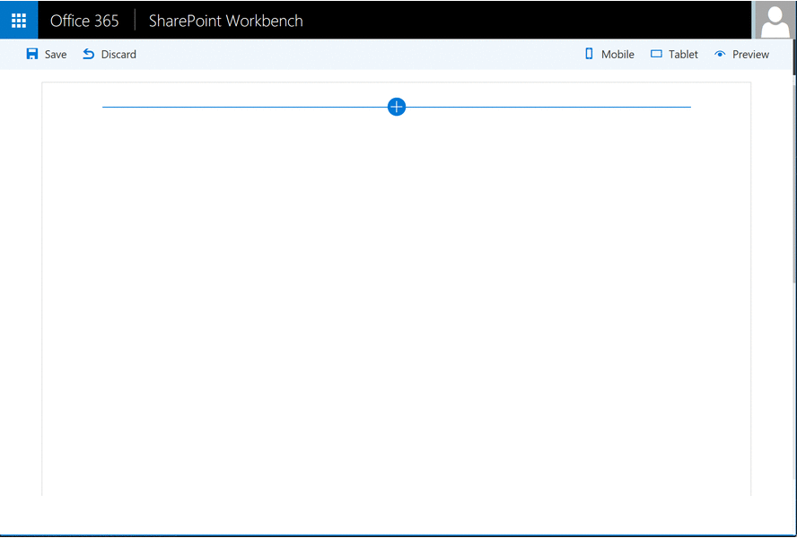

# JQuery, Photopile.JS & Office UI Fabric Client-Side Web Part

## Summary

Sample Web Part illustrating using JQuery and  [Photopile.Js](https://github.com/bigbhowell/Photopile-JS)
with the SharePoint Framework.

With it, you can display the photos contained in a SharePoint Pictures Library and it
simulates a pile of photos scattered about on a surface. Thumbnail clicks remove photos from the pile,
(enlarging them as if being picked up by the user), and once in  view a secondary click returns the photo to the pile.

## Applies to

* [SharePoint Framework Developer Preview](http://dev.office.com/sharepoint/docs/spfx/sharepoint-framework-overview)
* [Office 365 developer tenant](http://dev.office.com/sharepoint/docs/spfx/set-up-your-developer-tenant)

## Solution

Solution|Author(s)
--------|---------
jquery-photopile|Olivier Carpentier (@olivierc)

## Version history

Version|Date|Comments
-------|----|--------
1.0|September 9, 2016|Initial release

## Disclaimer
**THIS CODE IS PROVIDED *AS IS* WITHOUT WARRANTY OF ANY KIND, EITHER EXPRESS OR IMPLIED, INCLUDING ANY IMPLIED WARRANTIES OF FITNESS FOR A PARTICULAR PURPOSE, MERCHANTABILITY, OR NON-INFRINGEMENT.**

---

## Minimal Path to Awesome

- clone this repo
- in the command line run:
  - `npm install`
  - `tsd install`
  - `gulp serve`

## Features

This web part uses React, Office UI Fabric, JQuery, JQuery UI and Photopile.js. This web part is available in English (en-us)
and French (fr-fr).

It is able to:
* List Picture Libs contained in the current SharePoint web site
* List all the pictures in the selected List
* Render the pics as a cool photopile
* Personalize the layout thanks to editable settings

This Web Part illustrates the following concepts on top of the SharePoint Framework:
* Include JQuery and external framework in your solution
* Implement rich web part properties panel with controls like DropDown, Sliders, Toggle, etc.
* Load dynamic data from SharePoint as web part properties
* Load dynamic data from SharePoint REST Services, as lists or items
* Implement mock system to test your solution in the local workbench or on a SharePoint site
* Include Office UI Fabric controls in your project
* Render content with React
* Etc.

