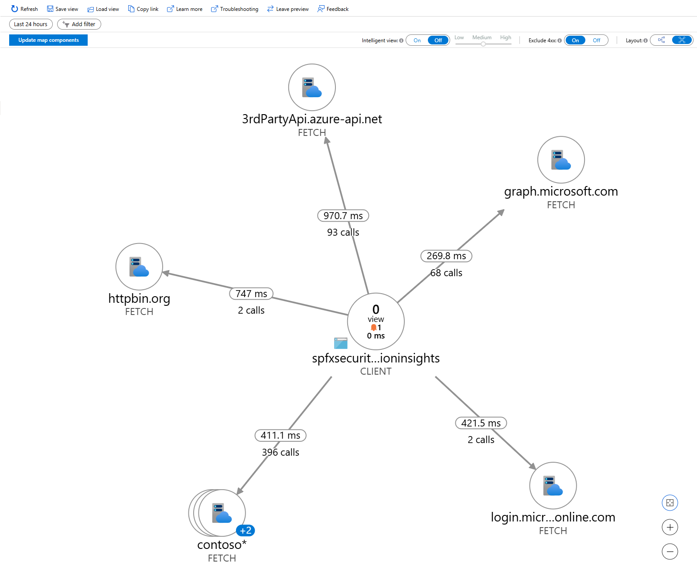
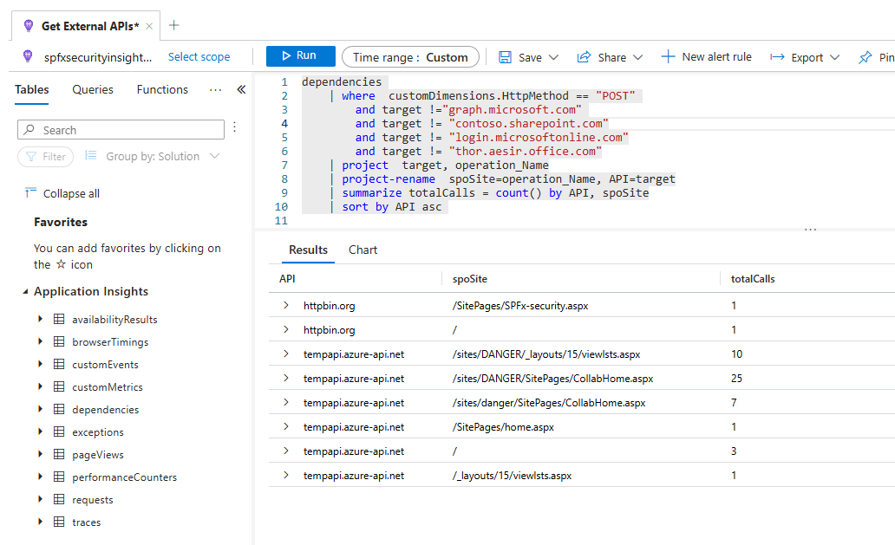
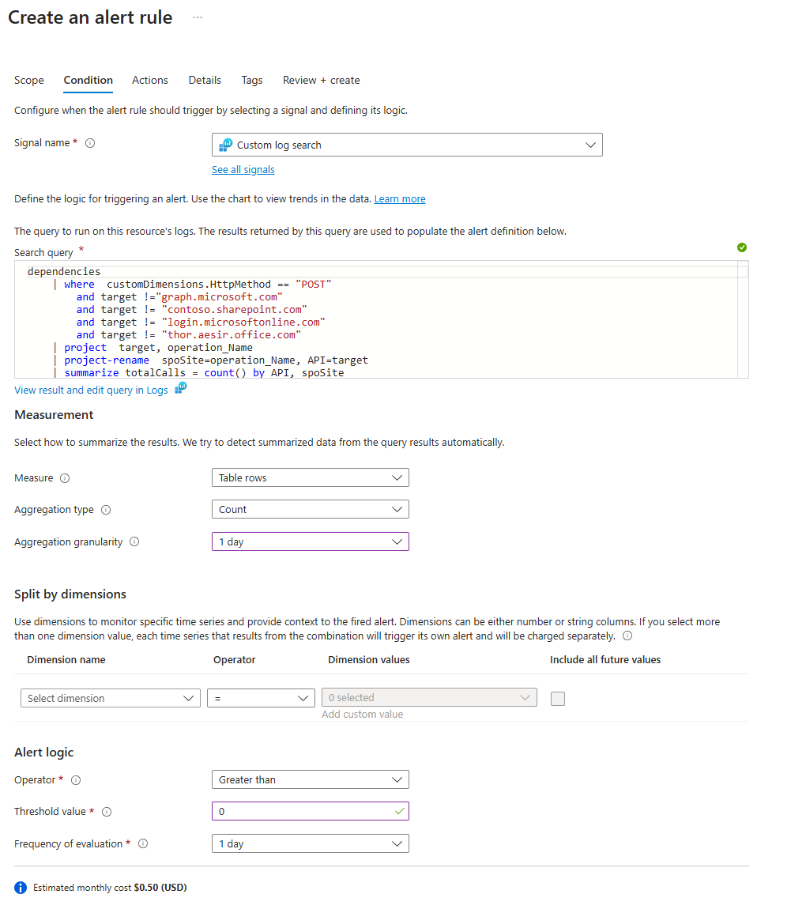

# External API calls tracking with Application Insights

> This SPFx solution is part of [SharePoint solutions as a spyware](https://pnp.github.io/blog/post/spfx-solutions-as-spyware/) series, focusing on improving security posture your Microsoft 365 environment.

## Summary

This SPFx solution is designed to monitor and track **API calls** executed within any SharePoint Online (SPO) site.



SPFx solutions are essentially functioning as **full-trust code within the SharePoint environment**. They may access SharePoint REST API, public APIs, and APIs secured by Azure AD (such as Microsoft Graph and Azure services).

**Public APIs and SharePoint REST API do not require consent and cannot be blocked.**
Although usage of **Microsoft Graph and other APIs secured with Azure AD** require administrator's approval, they **apply universally to all SPFx solutions within the tenant**. This introduces a potential security risk, as even malicious or unauthorized solutions may access sensitive APIs without requesting individual permissions.

Unfortunately, **it is impossible to fully review the code of SPFx solutions** to ensure that all API requests are legitimate. TypeScript code is transpiled to JavaScript, which often becomes unreadable, making it challenging to identify malicious activity. Additionally, malicious code may be hidden within dependencies, either intentionally or unknowingly by the developer. This can also occur as part of a supply chain attack, where compromised dependencies are introduced into the solution.

Given these risks, the best (if not only) way to **ensure that sensitive data is not stolen is to monitor the traffic generated by these solutions**. This can be achieved using a SPFx Application Customizer deployed tenant-wide to all sites, that tracks all API requests and sends them to Application Insights.

To optimize data gathering, **known endpoints may be whitelisted, reducing the amount of data logged**. Additionally, this solution allows for **temporarily disabling** logging to facilitate randomized "hunting" without continuously generating large volumes of data.

The logs collected include the called endpoints, methods (GET/POST), the originating page, and the user's geographic location based on the Client IP. neither user ID, not user's IP are captured.

Results can be reviewed using the **Application Map** in Application Insights or by executing **KUSTO query** against the Application Insights logs, offering powerful tools for analyzing and understanding API usage patterns.


For a more proactive approach, you may set up an alert that automatically triggers when a new external API call is detected.


This mechanism allows you to get informed whenever an unfamiliar API request occurs. If the alert conditions are met, an email notification will be sent to designated administrators or security personnel.

This proactive approach ensures that potential threats or unauthorized activities are quickly identified, allowing for prompt investigation and response before any damage can occur.

## Compatibility

| :warning: Important          |
|:---------------------------|
| Every SPFx version is optimally compatible with specific versions of Node.js. In order to be able to build this sample, you need to ensure that the version of Node on your workstation matches one of the versions listed in this section. This sample will not work on a different version of Node.|
|Refer to <https://aka.ms/spfx-matrix> for more information on SPFx compatibility.   |

This sample is optimally compatible with the following environment configuration:


-Incompatible-red.svg "SharePoint Server 2016 Feature Pack 2 requires SPFx 1.1")


## Applies to

- [SharePoint Framework](https://aka.ms/spfx)
- [Microsoft 365 tenant](https://docs.microsoft.com/en-us/sharepoint/dev/spfx/set-up-your-developer-tenant)

> Get your own free development tenant by subscribing to [Microsoft 365 developer program](http://aka.ms/o365devprogram)

## Prerequisites

- Azure tenant
- [Application Insights](https://learn.microsoft.com/en-us/azure/azure-monitor/app/app-insights-overview)
- SharePoint Administrator or Global Administrator to install the solution

## Contributors

- [Kinga Kazala](https://github.com/kkazala)

## Version history

| Version | Date            | Comments        |
| ------- | --------------- | --------------- |
| 1.0     | August 10, 2024 | Initial release |


## Minimal Path to Awesome

- Clone this repository (or [download this solution as a .ZIP file](https://pnp.github.io/download-partial/?url=https://github.com/pnp/sp-dev-fx-webparts/tree/main/samples/js-applicationinsights-api-calls-tracking) then unzip it)
- From your command line, change your current directory to the directory containing this sample (`js-applicationinsights-api-calls-tracking`, located under `samples`)
- in the command line run:
  - `npm install`
  - `gulp serve`

> This sample can also be opened with [VS Code Remote Development](https://code.visualstudio.com/docs/remote/remote-overview). Visit <https://aka.ms/spfx-devcontainer> for further instructions.

### Install and configure

In order to deploy the solution:

- in the command-line run:
    - `gulp bundle --ship`
    - `gulp package-solution --ship`
    - you will find your newly created `\*.sppkg` file in the `sharepoint/solution`folder.
- Upload or drag and drop the newly created client-side solution package to the **app catalog in your tenant**.
- By default, the **Enable this app and add it to all sites check box** is selected. Click **Enable app** to add this application customizer to all modern SPO sites in your tenant.

After deploying the solution, configure its properties:

- Navigate to the **app catalog in your tenant** and open the **Tenant Wide Extensions** list. You will find it under the **https://{yourorg}.sharepoint.com/sites/appcatalog/Lists/TenantWideExtensions/** URL
- Select the \*\*Application Insights" item and click edit.
- Update the **connectionString** parameter with the [connection string](https://learn.microsoft.com/en-us/azure/azure-monitor/app/sdk-connection-string?tabs=dotnet5#find-your-connection-string) to the Application Insights instance you want to use
- Update the **whitelist** parameter to exclude any additional endpoints you want to ignore. This list is semicolon-delimited: `url1;url2`
- If you want to temporarily disable tracking, set **enabled** to `false`

### Example Component Properties

```json
{
 "connectionString": "InstrumentationKey=xxxxxxxxx-xxxx-xxxx-xxxx-xxxxxxxxxxxx;IngestionEndpoint=https://switzerlandnorth-0.in.applicationinsights.azure.com/;LiveEndpoint=https://switzerlandnorth.livediagnostics.monitor.azure.com/;ApplicationId=xxxxxxxxx-xxxx-xxxx-xxxx-xxxxxxxxxxxx",
 "whitelist": "",
 "enabled": true
}
```

The **following endpoints are ignored** by default:

- "browser.pipe.aria.microsoft.com",
- "business.bing.com",
- "measure.office.com",
- "officeapps.live.com",
- "outlook.office365.com",
- "outlook.office.com",
- "nleditor.osi.office.net",
- "js.monitor.azure.com",
- "thor.aesir.office.com",

## References

- [Application Insights overview](https://learn.microsoft.com//azure/azure-monitor/app/app-insights-overview)
- [Application Insights API for custom events and metrics](https://learn.microsoft.com/en-us/azure/azure-monitor/app/api-custom-events-metrics)
- [Dynamic instrumentation key](https://learn.microsoft.com/en-us/azure/azure-monitor/app/api-custom-events-metrics)

- [Getting started with SharePoint Framework](https://docs.microsoft.com/en-us/sharepoint/dev/spfx/set-up-your-developer-tenant)
- [Building for Microsoft teams](https://docs.microsoft.com/en-us/sharepoint/dev/spfx/build-for-teams-overview)
- [Use Microsoft Graph in your solution](https://docs.microsoft.com/en-us/sharepoint/dev/spfx/web-parts/get-started/using-microsoft-graph-apis)
- [Publish SharePoint Framework applications to the Marketplace](https://docs.microsoft.com/en-us/sharepoint/dev/spfx/publish-to-marketplace-overview)
- [Microsoft 365 Patterns and Practices](https://aka.ms/m365pnp) - Guidance, tooling, samples and open-source controls for your Microsoft 365 development

## Help

We do not support samples, but this community is always willing to help, and we want to improve these samples. We use GitHub to track issues, which makes it easy for  community members to volunteer their time and help resolve issues.

If you're having issues building the solution, please run [spfx doctor](https://pnp.github.io/cli-microsoft365/cmd/spfx/spfx-doctor/) from within the solution folder to diagnose incompatibility issues with your environment.

You can try looking at [issues related to this sample](https://github.com/pnp/sp-dev-fx-webparts/issues?q=label%3A%22sample%3A%20js-applicationinsights-api-calls-tracking%22) to see if anybody else is having the same issues.

You can also try looking at [discussions related to this sample](https://github.com/pnp/sp-dev-fx-webparts/discussions?discussions_q=js-applicationinsights-api-calls-tracking) and see what the community is saying.

If you encounter any issues using this sample, [create a new issue](https://github.com/pnp/sp-dev-fx-webparts/issues/new?assignees=&labels=Needs%3A+Triage+%3Amag%3A%2Ctype%3Abug-suspected%2Csample%3A%20js-applicationinsights-api-calls-tracking&template=bug-report.yml&sample=js-applicationinsights-api-calls-tracking&authors=@kkazala&title=js-applicationinsights-api-calls-tracking%20-%20).

For questions regarding this sample, [create a new question](https://github.com/pnp/sp-dev-fx-webparts/issues/new?assignees=&labels=Needs%3A+Triage+%3Amag%3A%2Ctype%3Aquestion%2Csample%3A%20js-applicationinsights-api-calls-tracking&template=question.yml&sample=js-applicationinsights-api-calls-tracking&authors=@kkazala&title=js-applicationinsights-api-calls-tracking%20-%20).

Finally, if you have an idea for improvement, [make a suggestion](https://github.com/pnp/sp-dev-fx-webparts/issues/new?assignees=&labels=Needs%3A+Triage+%3Amag%3A%2Ctype%3Aenhancement%2Csample%3A%20js-applicationinsights-api-calls-tracking&template=suggestion.yml&sample=js-applicationinsights-api-calls-tracking&authors=@kkazala&title=js-applicationinsights-api-calls-tracking%20-%20).

## Disclaimer

**THIS CODE IS PROVIDED *AS IS* WITHOUT WARRANTY OF ANY KIND, EITHER EXPRESS OR IMPLIED, INCLUDING ANY IMPLIED WARRANTIES OF FITNESS FOR A PARTICULAR PURPOSE, MERCHANTABILITY, OR NON-INFRINGEMENT.**


