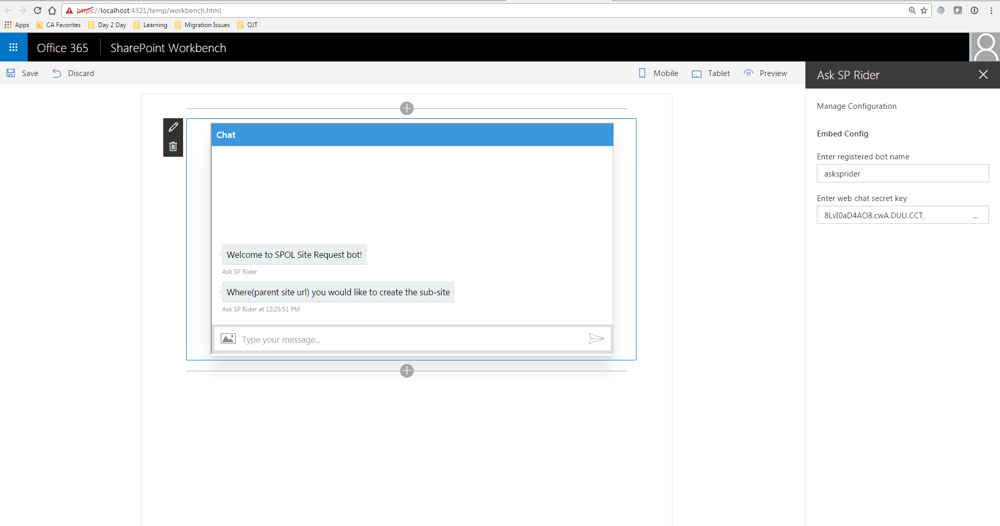
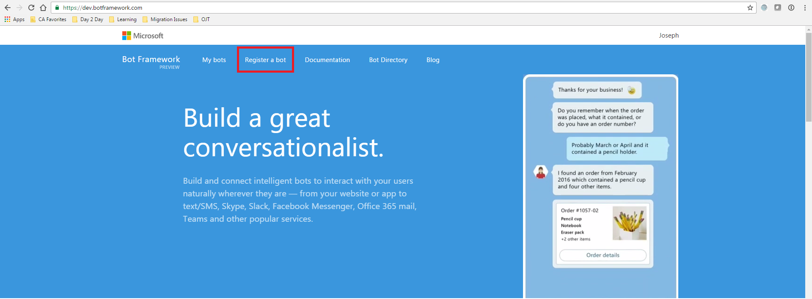
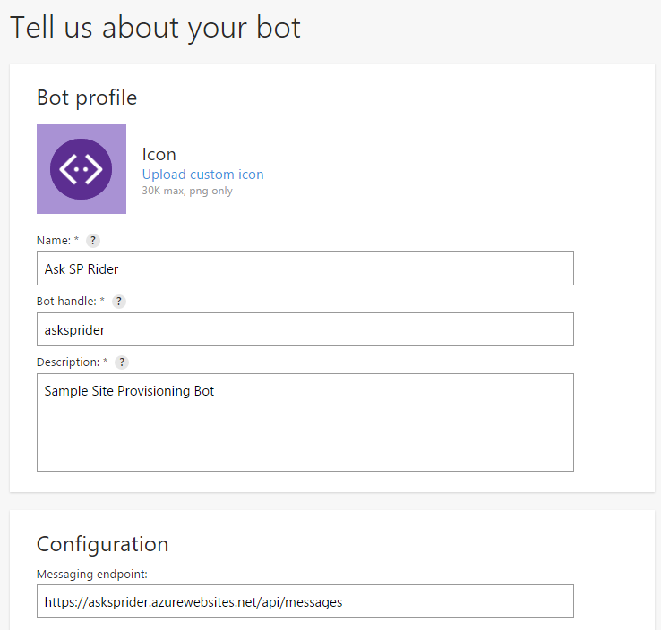
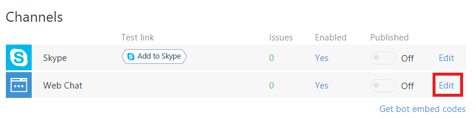
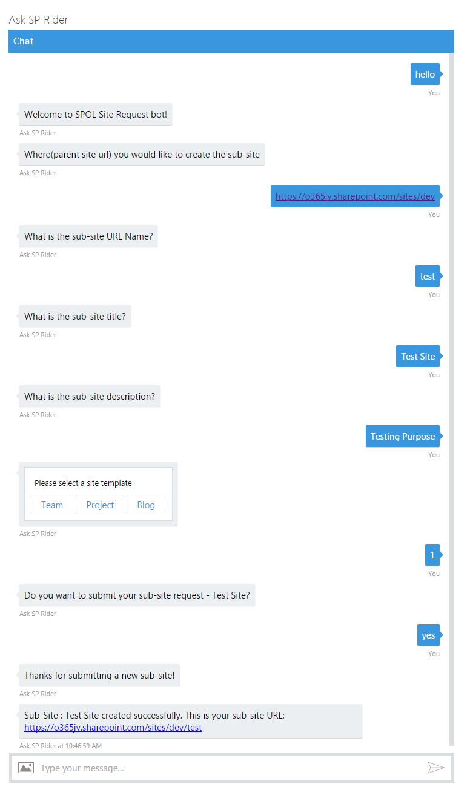

# Basic Site Provisioning using SharePoint Framework client-side web part and Microsoft Bot Framework 

## Summary

Sample SharePoint Framework client-side web part illustrating Site Provisioning using Microsoft Bot Framework.

## Applies to

* [SharePoint Framework Developer Preview](http://dev.office.com/sharepoint/docs/spfx/sharepoint-framework-overview)
* [Office 365 developer tenant](http://dev.office.com/sharepoint/docs/spfx/set-up-your-developer-tenant)

## Solution

Solution|Author(s)
--------|---------
js-bot-framework|Joseph Velliah (SPRIDER, @sprider)

## Version history

Version|Date|Comments
-------|----|--------
1.0|December 13, 2016|Initial release

## Disclaimer
**THIS CODE IS PROVIDED *AS IS* WITHOUT WARRANTY OF ANY KIND, EITHER EXPRESS OR IMPLIED, INCLUDING ANY IMPLIED WARRANTIES OF FITNESS FOR A PARTICULAR PURPOSE, MERCHANTABILITY, OR NON-INFRINGEMENT.**

---

## Minimal Path to Awesome

- clone this repo

### Register Bot

- go to https://dev.botframework.com/ and sign in with your Microsoft account 
- click on Register a bot link at the top 

- fill all the details like Name, Bot handle, Description and Messaging endpoint

- generate a new App ID and password by clicking Create Microsoft App ID and password button. Save this value somewhere as we will use in this next step 
- accept the terms and click Register
- your bot is now registered
- click edit link under Web Chat channel and notedown the Secret key to configure the client web part 

- you can test your connection here by typing hello message and click Send. Try this step after completing "Publish Bot in Azure Web App" step

### Publish Bot in Azure Web App

- in the Azure Management Portal at https://portal.azure.com create a new Web App(example: https://asksprider.azurewebsites.net/)
- download the publishing profile from the web app we just created. This will be used to publish the Bot in Azure using Visual Studio
- Open the web.config file in AskSPRider.sln and update the MicrosoftAppId, MicrosoftAppPassword, O365AdminId and O365AdminPassword
  - MicrosoftAppId - App ID generated from Bot Registration Process
  - MicrosoftAppPassword - App Secret generated from Bot Registration Process
  - O365AdminId - SharePoint Online Admin User Id(example: user@tenant.onmicrosoft.com)
  - O365AdminPassword - SharePoint Online Admin Password
- save the web.config file
- right click on the project and publish the bot in Azure using the publishing profile downloaded

### Configure web part

- go to the working directory to the webpart folder in the command line run:
  - npm i 
  - tsd install 
  - gulp serve
- add Ask SP Rider webpart and edit it 
  - configure bot name and web chat secret key

  - type hello and proceed with site creation process 
- final output

## Features

This project illustrates the following concepts:
- connecting SharePoint Framework client-side web part to a custom bot
- showing how to embed bot within client-side web part  
- how to create a sub-site by posting set of questions to the user via bot 
- bot form field validations 

