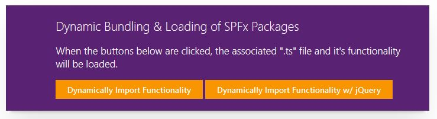
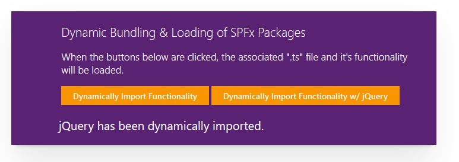
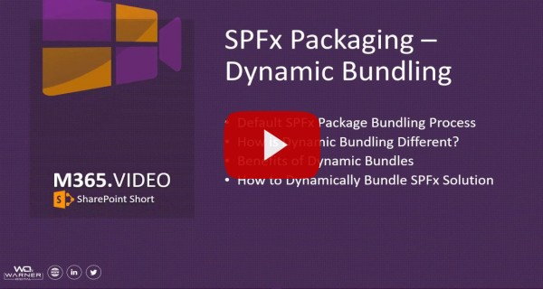

# Dynamics Bundling & Loading of SPFx Packages

## Summary
This sample illustrates how SPFx functionality and packages can be bundled in multiple '.js' files then be dynamically & asynchronously loaded into the page at execution time, such as with a button click.

Pre Button Click:

Post Button Click that imports jQuery and additional functionality:

## Compatibility

 
 

-Incompatible-red.svg "SharePoint Server 2016 Feature Pack 2 requires SPFx 1.1")

## Applies to

* [SharePoint Framework](https://docs.microsoft.com/sharepoint/dev/spfx/sharepoint-framework-overview)
* [Office 365 tenant](https://docs.microsoft.com/sharepoint/dev/spfx/set-up-your-development-environment)

## Solution

Solution|Author(s)
--------|---------
js-dynamic-bundling-libaries | [David Warner II](https://github.com/PopWarner) ([@DavidWarnerII](https://twitter.com/davidwarnerii) / [Warner Digital](http://warner.digital))

## Version history

Version|Date|Comments
-------|----|--------
1.0|September 21, 2018|Initial release
1.1|December 3, 2018|Updated for SPFx 1.7.0

## Minimal Path to Awesome

- Clone this repository
- From your command line, change your current directory to the directory containing this sample (`js-dynamic-bundling-libraries`, located under `samples`)
- in the command line run:
  - `npm install`
  - `gulp serve`

>  This sample can also be opened with [VS Code Remote Development](https://code.visualstudio.com/docs/remote/remote-overview). Visit https://aka.ms/spfx-devcontainer for further instructions.

## Features
This Web Part illustrates the following concepts on top of the SharePoint Framework:

- How to separate SPFx functionality into multiple bundled files
- How to asynchronously load the seperate bundled files at execution time
- Including a library in the separate bundled file.

## Additional Information:
- [Dynamic loading of packages in SharePoint Framework](https://docs.microsoft.com/sharepoint/dev/spfx/dynamic-loading)

## Video

## Help

We do not support samples, but this community is always willing to help, and we want to improve these samples. We use GitHub to track issues, which makes it easy for  community members to volunteer their time and help resolve issues.

If you're having issues building the solution, please run [spfx doctor](https://pnp.github.io/cli-microsoft365/cmd/spfx/spfx-doctor/) from within the solution folder to diagnose incompatibility issues with your environment.

You can try looking at [issues related to this sample](https://github.com/pnp/sp-dev-fx-webparts/issues?q=label%3A%22sample%3A%20js-dynamic-bundling-libraries") to see if anybody else is having the same issues.

You can also try looking at [discussions related to this sample](https://github.com/pnp/sp-dev-fx-webparts/discussions?discussions_q=js-dynamic-bundling-libraries) and see what the community is saying.

If you encounter any issues while using this sample, [create a new issue](https://github.com/pnp/sp-dev-fx-webparts/issues/new?assignees=&labels=Needs%3A+Triage+%3Amag%3A%2Ctype%3Abug-suspected%2Csample%3A%20js-dynamic-bundling-libraries&template=bug-report.yml&sample=js-dynamic-bundling-libraries&authors=@PopWarner&title=js-dynamic-bundling-libraries%20-%20).

For questions regarding this sample, [create a new question](https://github.com/pnp/sp-dev-fx-webparts/issues/new?assignees=&labels=Needs%3A+Triage+%3Amag%3A%2Ctype%3Aquestion%2Csample%3A%20js-dynamic-bundling-libraries&template=question.yml&sample=js-dynamic-bundling-libraries&authors=@PopWarner&title=js-dynamic-bundling-libraries%20-%20).

Finally, if you have an idea for improvement, [make a suggestion](https://github.com/pnp/sp-dev-fx-webparts/issues/new?assignees=&labels=Needs%3A+Triage+%3Amag%3A%2Ctype%3Aenhancement%2Csample%3A%20js-dynamic-bundling-libraries&template=question.yml&sample=js-dynamic-bundling-libraries&authors=@PopWarner&title=js-dynamic-bundling-libraries%20-%20).

## Disclaimer

**THIS CODE IS PROVIDED *AS IS* WITHOUT WARRANTY OF ANY KIND, EITHER EXPRESS OR IMPLIED, INCLUDING ANY IMPLIED WARRANTIES OF FITNESS FOR A PARTICULAR PURPOSE, MERCHANTABILITY, OR NON-INFRINGEMENT.**

