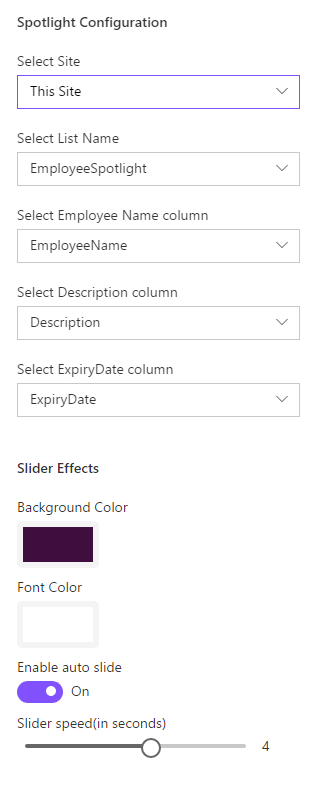
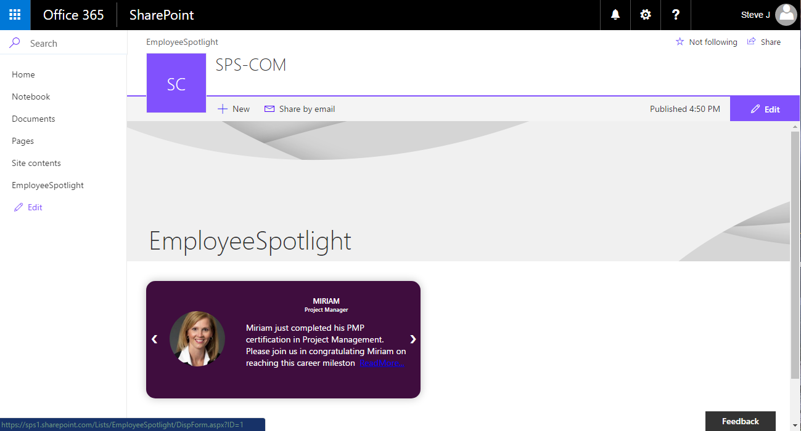

# Display Employee Spotlight JavaScript Client-Side Web Part

## Summary
Simple Web Part that demonstrates the use of SharePoint Framework for show casing Employee Spotlight. The web part pulls data from a configured list and User Profile service.
 The properties pane for this web part has 5 cascading dropdowns. 
 - A drop down list of sites(webs) in the current site collection.
 - A drop down list of list titles in the selected site(web). 
 - 3 drop downs with list of field names from selected list, which includes 
    * Name(Person or Group Column). 
    * Spotlight Description (Multiline - Enriched text Column). 
    * Expiry date for Spotlight event (DateTime Column with Date only option).  
 - The properties pane also has options for following slider effects.
    * Background color - A color picker to choose Slider background color 
    * Font color - A color picker to choose Slider font color
    * Set Auto slide - A switch to enable/disable auto slide for slider  
    * Slider Speed - A Slider control to select slider speed from 0sec - 7sec with 0.5sec as a step.

.
 
 Once the user selects all the configuration details, the web part displays the spotlight details from the configured list.

.

> Data is displayed only when hosted in SharePoint. No mock data included at this point for local testing. 

## Used SharePoint Framework Version

## Applies to
* [SharePoint Framework Developer](https://docs.microsoft.com/sharepoint/dev/spfx/sharepoint-framework-overview)
* [Office 365 developer tenant](https://docs.microsoft.com/sharepoint/dev/spfx/set-up-your-developer-tenant)

## Solution

Solution|Author(s)
--------|---------
js-employee-spotlight| SPS (Strategic Products and Services)

## Version history

Version|Date|Comments
-------|----|--------
1.0|June 12, 2017|Initial release

## Disclaimer
**THIS CODE IS PROVIDED "AS IS" WITHOUT WARRANTY OF ANY KIND, EITHER EXPRESS OR IMPLIED, INCLUDING ANY IMPLIED WARRANTIES OF FITNESS FOR A PARTICULAR PURPOSE, MERCHANTABILITY, OR NON-INFRINGEMENT.**

---

## Minimal Path to Awesome

- Clone this repository
- in the command line run:
  - `npm install`
  - `tsd install`
  - `gulp serve`
  - `Open the workbench on your Office 365 Developer tenant`
      - Basic functionality can be tested locally, data is only shown when used in context of SharePoint

## Features
The js-employee-spotlight web part displays the content of the list specified in the web part properties pane, The list should have the 3 mandatory fields. 

This Web Part illustrates the following concepts on top of the SharePoint Framework:

* Using a dynamic drop down box in the web part properties pane to display cascading dropdowns, which contains 
    - the titles webs in current sitecollection 
    - titles of the lists in the selected web 
    - fields of a selected list
* Use of a third party control(sp-client-custom-fields) for selecting webpart foregroud and background colors.
* Use of switch, slider controls to configure slider speed and auto scrolling.
* Using a javascript slider. 
* Fetching the user details from User Profile service like user designation, user profile image. 
* Logging.
* Rendering error messages.

