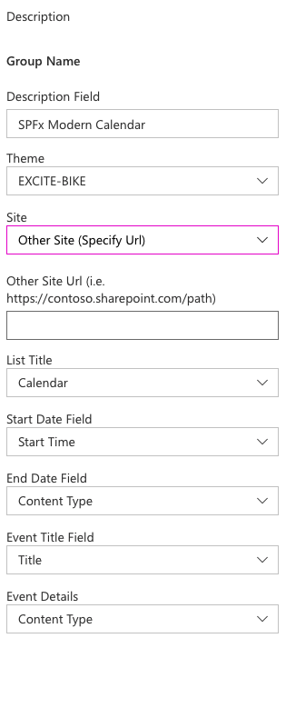
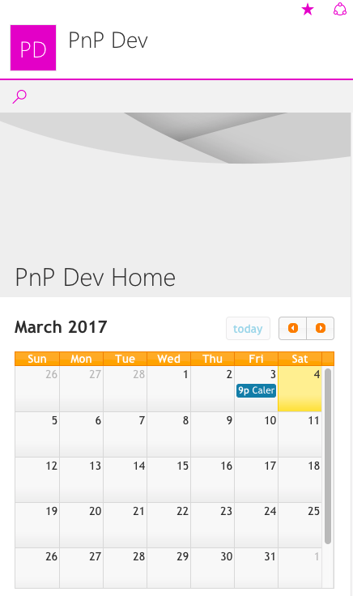

# Modern Calendar

## Summary

This is a modern web part built using the [SharePoint Framework](https://dev.office.com/sharepoint/docs/spfx/sharepoint-framework-overview) demonstrating how to build a custom web part with a calendar capabilities in it.  

## Compatibility

 
 

-Incompatible-red.svg "SharePoint Server 2016 Feature Pack 2 requires SPFx 1.1")

## Applies to

* [SharePoint Framework](https://blogs.office.com/2017/02/23/sharepoint-framework-reaches-general-availability-build-and-deploy-engaging-web-parts-today/)
* [Office 365 tenant](https://docs.microsoft.com/sharepoint/dev/spfx/set-up-your-development-environment)

## Prerequisites
 
None

## Solution

Solution|Author(s)
--------|---------
js-modern-calendar | [Jeremy Coleman](https://github.com/jcoleman-pcprofessional) (MCP, PC Professional, Inc.)
js-modern-calendar | [Nanddeep Nachan](https://github.com/nanddeepn) ([@NanddeepNachan](twitter.com/NanddeepNachan))
js-modern-calendar | [Ravi Chandra](https://github.com/Ravikadri)
js-modern-calendar | [Peter Paul Kirschner](https://github.com/petkir) ([@petkir_at](https://twitter.com/petkir_at))

## Version history

Version|Date|Comments
-------|----|--------
1.0.0.0|February 11, 2017|Initial release
1.0.0.1|June 05, 2020|Updated the external CDN references to public CDN references
1.0.2.0|February 9, 2021|Upgraded to SPFx 1.11 and fixed issues with missing dependencies
1.0.3.0|October 28, 2021|fixed issues with Timezones. The Browser Timezone Settings are now used

## Minimal Path to Awesome

- Clone this repository
- in the command line run:
  - `npm install`
  - `gulp serve`

>  This sample can also be opened with [VS Code Remote Development](https://code.visualstudio.com/docs/remote/remote-overview). Visit https://aka.ms/spfx-devcontainer for further instructions.

- Move to Online Workbench
- Ensure that you have Calendar list in your site
- Set web part properties accordingly
  - Choose site
  - List
  - Start, End, Title and Details fields
  

## Features
Renders a calendar from any list available on the selected site. Site, List, Start, End, Event Title,Event Details and Calendar Theme are user-definable in the web part properties, so that you could technically use a custom list as the source for calendar presentation.

## Help

We do not support samples, but we this community is always willing to help, and we want to improve these samples. We use GitHub to track issues, which makes it easy for  community members to volunteer their time and help resolve issues.

If you're having issues building the solution, please run [spfx doctor](https://pnp.github.io/cli-microsoft365/cmd/spfx/spfx-doctor/) from within the solution folder to diagnose incompatibility issues with your environment.

You can try looking at [issues related to this sample](https://github.com/pnp/sp-dev-fx-webparts/issues?q=label%3A%22sample%3A%20js-modern-calendar") to see if anybody else is having the same issues.

You can also try looking at [discussions related to this sample](https://github.com/pnp/sp-dev-fx-webparts/discussions?discussions_q=js-modern-calendar) and see what the community is saying.

If you encounter any issues while using this sample, [create a new issue](https://github.com/pnp/sp-dev-fx-webparts/issues/new?assignees=&labels=Needs%3A+Triage+%3Amag%3A%2Ctype%3Abug-suspected%2Csample%3A%20js-modern-calendar&template=bug-report.yml&sample=js-modern-calendar&authors=@jcoleman-pcprofessional%20@nanddeepn%20@Ravikadri%20@petkir&title=js-modern-calendar%20-%20).

For questions regarding this sample, [create a new question](https://github.com/pnp/sp-dev-fx-webparts/issues/new?assignees=&labels=Needs%3A+Triage+%3Amag%3A%2Ctype%3Aquestion%2Csample%3A%20js-modern-calendar&template=question.yml&sample=js-modern-calendar&authors=@jcoleman-pcprofessional%20@nanddeepn%20@Ravikadri%20@petkir&title=js-modern-calendar%20-%20).

Finally, if you have an idea for improvement, [make a suggestion](https://github.com/pnp/sp-dev-fx-webparts/issues/new?assignees=&labels=Needs%3A+Triage+%3Amag%3A%2Ctype%3Aenhancement%2Csample%3A%20js-modern-calendar&template=question.yml&sample=js-modern-calendar&authors=@jcoleman-pcprofessional%20@nanddeepn%20@Ravikadri%20@petkir&title=js-modern-calendar%20-%20).

## Disclaimer

**THIS CODE IS PROVIDED *AS IS* WITHOUT WARRANTY OF ANY KIND, EITHER EXPRESS OR IMPLIED, INCLUDING ANY IMPLIED WARRANTIES OF FITNESS FOR A PARTICULAR PURPOSE, MERCHANTABILITY, OR NON-INFRINGEMENT.**

