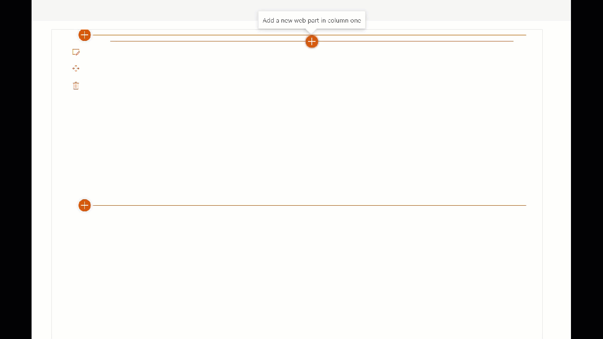

# Thumbnail/preview of pages and files in SharePoint

## Summary
A web part showcasing how to call the [Microsoft Graph Thumbnails API](https://docs.microsoft.com/en-us/graph/api/driveitem-list-thumbnails) to generate a preview image for files and pages in SharePoint. The sample illustrates how to craft the preview URL both from a search result as well as from a SharePoint item object.

_Note that a preview for all file formats (eg. Excel) might not currently be available._

The sample calls the Microsoft Graph API directly directly via the _api/2.0 endpoint in SharePoint Online, but can easily be changed to call the Graph API endpoint directly for scenarios outside of SharePoint as long as an access token is retrieved.

The goal of the sample is to illustrate a single call calling pattern for the thumbnail with the following calling pattern:

<pre>
&lt;img src="<i><b>&lt;endpoint&gt;</b>/sites/<b>&lt;site id&gt;</b>/lists/<b>&lt;list id&gt;</b>/items/<b>&lt;item id&gt;</b>/driveItem/thumbnails/0/<b>&lt;custom size&gt;</b>/content</i>">
</pre>

| Token | Description |
---|---
|endpoint| graph.microsoft.com/v1.0   tenant.sharepoint.com/_api/v2.0
|site id | Site object id - GUID. |
|list id | List object id - GUID. |
|item id | ListItem object id or unique id - Integer/GUID. |
|custom size | See [Requesting custom thumbnail sizes](https://docs.microsoft.com/en-us/graph/api/driveitem-list-thumbnails?view=graph-rest-1.0&tabs=http#requesting-custom-thumbnail-sizes) in the official Microsoft Graph documentation.

## Compatibility

 

-Incompatible-red.svg "SharePoint Server 2016 Feature Pack 2 requires SPFx 1.1")

## Applies to

* [SharePoint Framework Release GA](https://blogs.office.com/2017/02/23/sharepoint-framework-reaches-general-availability-build-and-deploy-engaging-web-parts-today/)
* [Office 365 tenant](https://docs.microsoft.com/sharepoint/dev/spfx/set-up-your-development-environment)

## Solution

Solution|Author(s)
--------|---------
js-msgraph-thumbnail | [Mikael Svenson](https://github.com/wobba) ([@mikaelsvenson](http://www.twitter.com/mikaelsvenson), [techmikael.com](techmikael.com))

## Version history

Version|Date|Comments
-------|----|--------
1.0|January 21st, 2020|Initial release

## Minimal Path to Awesome
### Local testing

- Clone this repository
- In the command line run:
  - `npm install`
  - `gulp serve`

### Deploy
* `gulp clean`
* `gulp bundle --ship`
* `gulp package-solution --ship`
* Upload the `js-msgraph-thumbnail.sppkg` file from `sharepoint\solution` to your tenant App Catalog
	* E.g.: https://&lt;tenant&gt;.sharepoint.com/sites/AppCatalog/AppCatalog
* Add the web part *Thumbnail* to a site collection where you have files in the `Shared Documents` folder, and test it on a page.
* Change `const libraryPath = "Shared Documents";` if you want to target `SitePages` or a different library.

## Help

We do not support samples, but we this community is always willing to help, and we want to improve these samples. We use GitHub to track issues, which makes it easy for  community members to volunteer their time and help resolve issues.

If you're having issues building the solution, please run [spfx doctor](https://pnp.github.io/cli-microsoft365/cmd/spfx/spfx-doctor/) from within the solution folder to diagnose incompatibility issues with your environment.

You can try looking at [issues related to this sample](https://github.com/pnp/sp-dev-fx-webparts/issues?q=label%3A%22sample%3A%20js-msgraph-thumbnail") to see if anybody else is having the same issues.

You can also try looking at [discussions related to this sample](https://github.com/pnp/sp-dev-fx-webparts/discussions?discussions_q=js-msgraph-thumbnail) and see what the community is saying.

If you encounter any issues while using this sample, [create a new issue](https://github.com/pnp/sp-dev-fx-webparts/issues/new?assignees=&labels=Needs%3A+Triage+%3Amag%3A%2Ctype%3Abug-suspected%2Csample%3A%20js-msgraph-thumbnail&template=bug-report.yml&sample=js-msgraph-thumbnail&authors=@wobba&title=js-msgraph-thumbnail%20-%20).

For questions regarding this sample, [create a new question](https://github.com/pnp/sp-dev-fx-webparts/issues/new?assignees=&labels=Needs%3A+Triage+%3Amag%3A%2Ctype%3Aquestion%2Csample%3A%20js-msgraph-thumbnail&template=question.yml&sample=js-msgraph-thumbnail&authors=@wobba&title=js-msgraph-thumbnail%20-%20).

Finally, if you have an idea for improvement, [make a suggestion](https://github.com/pnp/sp-dev-fx-webparts/issues/new?assignees=&labels=Needs%3A+Triage+%3Amag%3A%2Ctype%3Aenhancement%2Csample%3A%20js-msgraph-thumbnail&template=question.yml&sample=js-msgraph-thumbnail&authors=@wobba&title=js-msgraph-thumbnail%20-%20).

## Disclaimer

**THIS CODE IS PROVIDED *AS IS* WITHOUT WARRANTY OF ANY KIND, EITHER EXPRESS OR IMPLIED, INCLUDING ANY IMPLIED WARRANTIES OF FITNESS FOR A PARTICULAR PURPOSE, MERCHANTABILITY, OR NON-INFRINGEMENT.**

