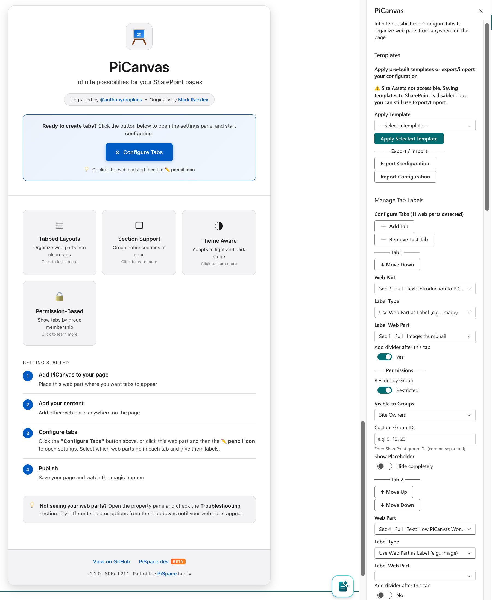
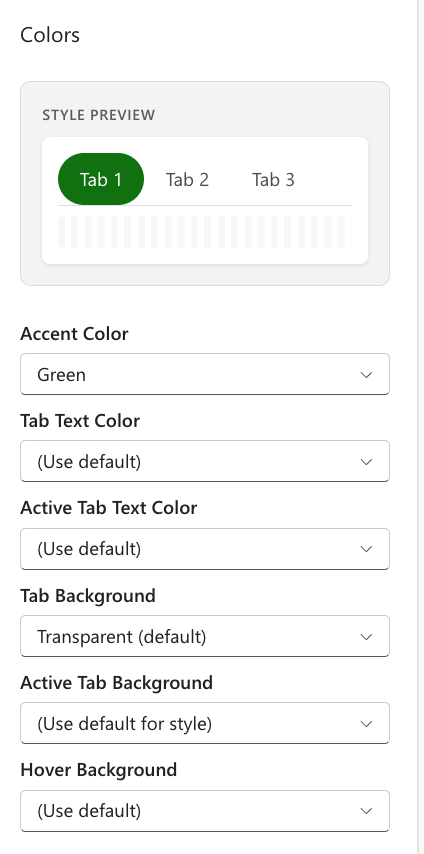
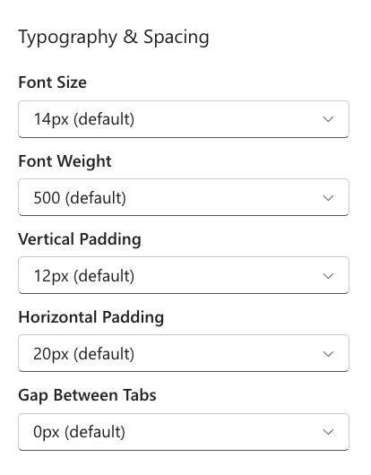
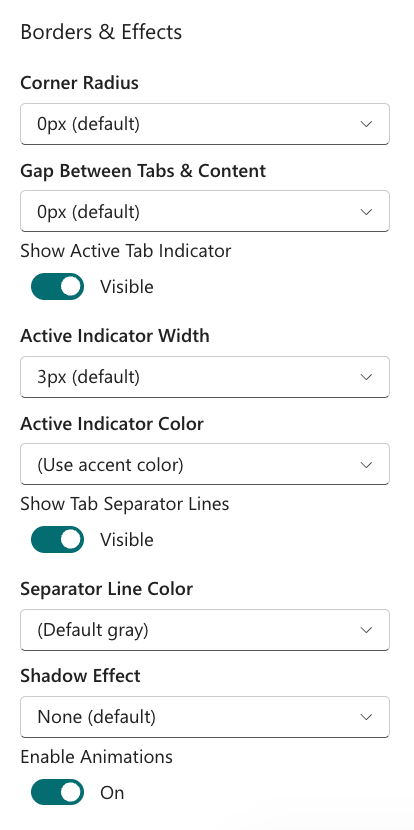
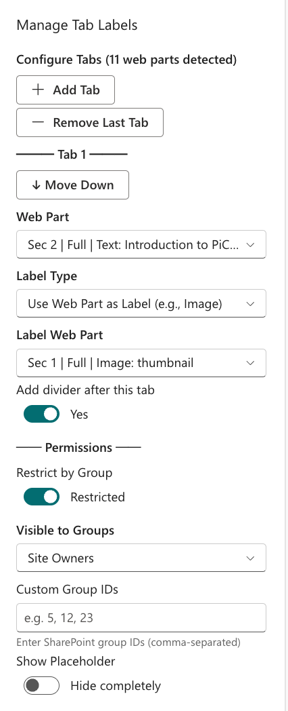
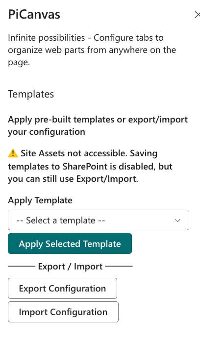
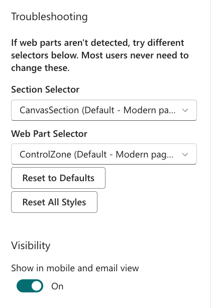

# PiCanvas


## Table of Contents

- [Features](#features) — Tabbed layouts, customization, permissions, templates
- [What's New in v2.x](#whats-new-in-v2x) — Version comparison, new capabilities
- [Installation](#installation) — Deploy to SharePoint, guest user access
- [Development](#development) — Local setup, build commands, project structure
- [Configuration Reference](#configuration-reference) — Property pane groups, CSS variables
- [Troubleshooting](#troubleshooting) — Common issues and solutions

---

### Versioning

PiCanvas v2.x is a complete modernization of [Mark Rackley's Hillbilly Tabs](http://www.markrackley.net/2022/06/29/the-return-of-hillbilly-tabs/). The major version "2" honors the original author, while minor versions track feature releases.



### Use Cases

- Combine multiple web parts into one tabbed view
- Replace several pages with a single organized page
- Build team hubs, dashboards, help desks, training portals
- Group entire page sections (multi-column layouts) into tabs
- Add multiple PiCanvas instances to one page for different tabbed areas
- Reuse the same web part across multiple tabs or PiCanvas instances (auto-cloned)
- **Show/hide tabs based on user permissions** (Owners, Members, Visitors, custom groups)
- **Export/import configurations** with templates for consistent deployments

### How It Works

1. Add PiCanvas to your page
2. Add your web parts anywhere on the page
3. Open settings, assign web parts to tabs
4. Publish

No Power Platform license required. Works on any modern SharePoint page.

---

## Features

### Tabbed Layouts

Organize multiple web parts into a clean tabbed interface, reducing page clutter and improving navigation.

```
┌─────────────────────────────────────────────────────────┐
│  [Tab 1]  [Tab 2]  [Tab 3]                              │
├─────────────────────────────────────────────────────────┤
│                                                         │
│   Web Part Content (dynamically shown/hidden)           │
│                                                         │
└─────────────────────────────────────────────────────────┘
```

### Full Customization

Control every aspect of your tabs:

| Category | Options |
|----------|---------|
| **Colors** | Accent, text, background, hover, active states |
| **Typography** | Font size (12-20px), weight (400-700) |
| **Spacing** | Vertical/horizontal padding, gap between tabs |
| **Borders** | Corner radius, indicator width/color |
| **Effects** | Shadows (none, subtle, medium, strong), animations |

<details>
<summary>View Settings Panels</summary>

Open the web part property pane and use the Colors, Typography, and Borders & Effects groups to reach these panels.

| Colors | Typography | Borders & Effects |
|--------|------------|-------------------|
|  |  |  |

</details>

### Tab Styles

| Style | Description |
|-------|-------------|
| `Default` | Clean underline indicator |
| `Pills` | Rounded pill-shaped buttons |
| `Underline` | Simple bottom border |
| `Boxed` | Bordered container |

### Section Support

Group entire SharePoint sections (including multi-column layouts) into single tabs:

```
┌─────────────────────────────────────┐
│ Select web part or section...    ▼  │
├─────────────────────────────────────┤
│ ── Section 1 ──                     │
│   Sec 1 | Full | Web Part #1        │
│   Sec 1 | Full | Image              │
│ ── Section 2 ──                     │
│   Sec 2 | 2-Col | Left Column       │
│   Sec 2 | 2-Col | Right Column      │
└─────────────────────────────────────┘
```

### Theme Aware

Automatically adapts to SharePoint's light and dark themes:

1. **Manual Override** - User explicitly sets Light/Dark
2. **SharePoint Theme** - Reads `window.__themeState__.theme.isInverted`
3. **Luminance Calculation** - Analyzes section background color
4. **Fallback** - Defaults to light mode

### Permission-Based Tab Visibility

Control which tabs users see based on their SharePoint group membership:

```
┌─────────────────────────────────────────────────────────┐
│ User Opens Page                                         │
├─────────────────────────────────────────────────────────┤
│ 1. Load user's group memberships (cached 5 min)         │
│ 2. For each tab with permissions enabled:               │
│    → Check if user is in ANY specified group (OR logic) │
│    → Show tab if member, hide if not                    │
│ 3. Tabs without permissions → visible to everyone       │
└─────────────────────────────────────────────────────────┘
```

| Group Type | Description |
|------------|-------------|
| **Site Owners** | Users with full control of the site |
| **Site Members** | Users with contribute permissions |
| **Site Visitors** | Users with read-only access |
| **Custom Group IDs** | Any SharePoint group by ID number |

**Quick Presets:**
- Everyone (no restriction) - default
- Site Owners only
- Site Members only
- Site Visitors only
- Owners & Members
- Members & Visitors
- All Site Groups

**How to Configure:**
1. Open the property pane for any tab
2. Enable **"Restrict by Group"** toggle
3. Select groups from the **"Visible to Groups"** dropdown
4. Optionally add custom group IDs (comma-separated)
5. Choose visibility behavior:
   - **Hide completely** (default) - Tab doesn't appear at all
   - **Show Placeholder** - Tab visible but disabled with custom message
6. Save changes - permissions apply immediately

The Permission Settings panel shows the "Restrict by Group" toggle, a multi-select dropdown for choosing Site Owners/Members/Visitors, a text field for custom group IDs, and radio buttons for visibility behavior.



**Visibility Options:**

| Option | Behavior |
|--------|----------|
| **Hide completely** | Tab is invisible to unauthorized users |
| **Show Placeholder** | Tab appears grayed out with lock icon and custom message |

**How Permission Filtering Works:**

```
┌─────────────────────────────────────────────────────────┐
│ Page Load Sequence                                       │
├─────────────────────────────────────────────────────────┤
│ 1. Web part initializes                                  │
│ 2. WAIT: Fetch user's group memberships from SharePoint │
│ 3. WAIT: Fetch site's associated groups (Owner/Member/  │
│          Visitor group IDs)                              │
│ 4. THEN: Render tabs with correct visibility             │
│ 5. Cache results for 5 minutes                          │
└─────────────────────────────────────────────────────────┘
```

> **Important:** The web part waits for permission data before rendering. This ensures tabs are filtered correctly on the first render. There may be a brief delay while SharePoint APIs respond.

**Enterprise Features:**
- **Synchronous permission check** - Waits for permission data before rendering (no flicker)
- **5-minute cache** - Group data cached to minimize API calls on subsequent views
- **Graceful fail-open** - If API fails, all tabs remain visible (users are never locked out)
- **Template support** - Permission settings export/import with templates
- **Placeholder option** - Show disabled tab instead of hiding (configurable per tab)
- **OR logic** - User in ANY specified group can see the tab

### Multi-Instance Web Part Sharing

Reuse the same web part across multiple PiCanvas instances or tabs on the same page:

```
┌─────────────────────────────────────────────────────────────────────┐
│ Page with Two PiCanvas Instances                                    │
├─────────────────────────────────────────────────────────────────────┤
│                                                                     │
│  ┌─────────────────────────────┐  ┌─────────────────────────────┐  │
│  │ PiCanvas #1                 │  │ PiCanvas #2                 │  │
│  │ [Overview] [Details]        │  │ [Summary] [Charts]          │  │
│  │ ┌─────────────────────────┐ │  │ ┌─────────────────────────┐ │  │
│  │ │ Image Web Part          │ │  │ │ Same Image (cloned)     │ │  │
│  │ │ (original)              │ │  │ │                         │ │  │
│  │ └─────────────────────────┘ │  │ └─────────────────────────┘ │  │
│  └─────────────────────────────┘  └─────────────────────────────┘  │
│                                                                     │
└─────────────────────────────────────────────────────────────────────┘
```

**How it works:**
- **First instance owns the original** - The web part moves to the first PiCanvas that references it
- **Other instances receive clones** - Subsequent references get DOM clones with sanitized IDs
- **Images auto-load** - Cloned images force-load by copying computed styles and triggering browser events
- **No React state** - Cloning works for static content (images, text, dividers); interactive React components won't retain state

**Use cases:**
- Show the same dashboard image in different tab layouts
- Display a company logo across multiple PiCanvas navigation areas
- Reuse informational content without duplicating web parts

### Template System

Export and import PiCanvas configurations for consistent deployments across sites.

The Templates panel in the property pane provides a dropdown of built-in templates (Classic, Dashboard, Navigation Dock, Portal Hub, Minimal), Export and Import buttons for JSON configuration files, and a "Save to Site Assets" option for team sharing.



**How to use templates:**
1. Open the web part property pane and expand **Templates**
2. Choose a built-in template to apply it to the current web part
3. Use the export/import controls to download or load a JSON template
4. Optionally save templates to Site Assets for reuse across pages

**Built-in Templates:**

| Template | Tabs | Style | Description |
|----------|------|-------|-------------|
| Classic | 3 | Default | Simple horizontal tabs with clean labels |
| Dashboard | 4 | Underline | Metrics-focused with icon labels |
| Navigation Dock | 5 | Pills | Vertical left sidebar navigation |
| Portal Hub | 4 | Boxed | Department hub with category tabs |
| Minimal | 3 | Underline | Light, minimal design |

**Template Features:**
- **Export to JSON** - Download complete configuration as JSON file
- **Import from JSON** - Load configuration from JSON file
- **Save to Site Assets** - Store templates in SharePoint for team sharing
- **Includes all settings** - Tab labels, icons, images, permissions, styling, colors
- **Content mapping preserved** - Web part assignments stay with templates
- **Dark Mode preset** - Pre-configured dark theme

---

## What's New in v2.x

PiCanvas is a complete modernization of [Mark Rackley's Modern Hillbilly Tabs](http://www.markrackley.net/2022/06/29/the-return-of-hillbilly-tabs/). The original was built on SPFx 1.13.1 (2021). As SharePoint Framework evolved through 8+ major versions, the codebase needed a full rebuild to leverage modern tooling and capabilities while honoring the original concept.

### Version Comparison

| Aspect | Original (Hillbilly Tabs) | PiCanvas 2.x |
|--------|--------------------------|--------------|
| SPFx Version | 1.13.1 (2021) | 1.22.0 (2026) |
| Node.js | 14.x / 16.x | 18.17.1+ / 22.14+ |
| TypeScript | 3.9 | 5.6 |
| Linting | TSLint (deprecated) | ESLint |
| Build Speed | Standard gulp | Heft build-watch |
| Theme Support | None | Auto light/dark detection |
| Tab Styles | 1 (default only) | 4 (default, pills, underline, boxed) |
| Tab Alignment | None | 4 (left, center, right, stretch) |
| Tab Orientation | Horizontal only | Horizontal & Vertical |
| Section Grouping | None | Full section support |
| Customization | None | Colors, typography, spacing, shadows |
| Tab Count | Fixed | 1-20 tabs with add/remove buttons |
| Edit Mode UI | Basic text | Rich feature cards with documentation |
| **Permissions** | None | Group-based tab visibility (Owners/Members/Visitors/Custom) |
| **Templates** | None | Export/import, built-in templates, Site Assets storage |

### Web Part as Label

One of the most powerful new features - use any SharePoint web part as your tab label:

```
┌───────────────────────────────────────────────────────────┐
│ [🏠 Image]  [📊 Chart]  [Logo.png]  [Custom Text]         │
├───────────────────────────────────────────────────────────┤
│                                                           │
│   Tab content appears here                                │
│                                                           │
└───────────────────────────────────────────────────────────┘
```

- **Use Image web parts** as tab headers (logos, icons, photos)
- **Use Text web parts** for rich formatted labels
- **Reuse the same web part** as both label AND content (auto-clones)
- **Configurable label height** - 40px to 120px, or "No limit" for full-size images
- All SharePoint chrome is automatically stripped for clean tab headers

### Tab Dividers

Create visual groupings between tabs with gradient dividers:

```
Horizontal:                         Vertical:
┌────────┬────────│────────┐       ┌──────────┐
│ Tab 1  │ Tab 2  │ Tab 3  │       │  Tab 1   │
└────────┴────────│────────┘       │  Tab 2   │
         divider ─┘                ├──────────┤ ← divider
                                   │  Tab 3   │
                                   └──────────┘
```

- Toggle "Add divider after this tab" for any tab
- Beautiful gradient lines that fade at edges
- Works in both horizontal and vertical orientations
- Use accent color automatically

### Smart Dropdown Labels

The property pane dropdowns show intelligent labels to help you identify web parts:

```
┌─────────────────────────────────────────────────────────────┐
│ Select web part or section...                            ▼  │
├─────────────────────────────────────────────────────────────┤
│ >> Section 1 (3 web parts)                                  │
│ >> Section 2 (2 web parts)                                  │
│ ─────────────────────────────────────────────────────────── │
│     Sec 1 | Left | Image: logo.png                          │
│     Sec 1 | Right | Text: "Welcome to our..."               │
│     Sec 2 | Full | Hero                                     │
│     Sec 2 | Full | Quick Links ⚠️ IN USE → Tab 2            │
└─────────────────────────────────────────────────────────────┘
```

- Shows **section number**, **column position** (Left/Right/Center/Full)
- Identifies **web part type** (Image, Text, Hero, Quick Links, etc.)
- Shows **content preview** (image filename, text snippet)
- Marks items **already assigned** to other tabs with warnings

### Vertical Tab Layout

Tabs can now appear on the left or right side of content:

```
Left Position:                      Right Position:
┌──────────┬────────────────────┐  ┌────────────────────┬──────────┐
│ [Tab 1]  │                    │  │                    │ [Tab 1]  │
│ [Tab 2]  │   Content Area     │  │   Content Area     │ [Tab 2]  │
│ ──────── │                    │  │                    │ ──────── │
│ [Tab 3]  │                    │  │                    │ [Tab 3]  │
└──────────┴────────────────────┘  └────────────────────┴──────────┘
```

- **Left or Right** positioning option
- **Configurable width** - 150px to 300px, or 25%/33% of container
- **Responsive** - automatically stacks horizontally on mobile (<768px)
- All 4 tab styles work in vertical mode

### Highlight on Selection

When selecting web parts in the property pane, they're highlighted on the page:

- **Animated pulse** with blue glow effect
- **Dashed border** animation
- **Auto-scroll** to bring selected element into view
- Different highlight style for sections vs individual web parts

### New Features Summary

| Feature | Description |
|---------|-------------|
| **Web Part as Label** | Use Image, Text, or any web part as tab header |
| **Multi-Instance Sharing** | Reuse web parts across multiple PiCanvas instances (auto-clones) |
| **Cross-Tab Reuse** | Same web part can appear in multiple tabs within one PiCanvas |
| **Tab Dividers** | Gradient separators between tabs |
| **Vertical Tabs** | Left/right side with responsive stacking |
| **Icon Picker** | 30+ emoji icons (🏠 📅 📄 📊 ⚙️ etc.) |
| **Image Labels** | 4 positions: left, right, top, background |
| **Smart Dropdowns** | Section/column/type/preview in labels |
| **In-Use Warnings** | Shows which items are already assigned |
| **Highlight Selection** | Animated visual feedback in edit mode |
| **Tab Reordering** | Move tabs up/down with buttons |
| **Shadow Presets** | None, subtle, medium, strong, colored glows |
| **Configurable Label Size** | 40px-120px or unlimited |
| **Theme Auto-Detection** | 3-tier detection with manual override |
| **Section Support** | Group multi-column sections into single tabs |
| **Column Preservation** | Maintains 2-col, 3-col, asymmetric layouts |
| **Responsive Design** | Vertical tabs stack on mobile |
| **Troubleshooting Tools** | Multiple selectors, reset buttons |
| **Rich Edit Mode** | Feature cards with interactive documentation |
| **Permission-Based Visibility** | Hide tabs by SharePoint group membership |
| **Template System** | Export/import configurations, built-in templates |
| **Site Assets Storage** | Save custom templates for team sharing |

### Full Customization Options

Every visual aspect of tabs is customizable through the property pane:

| Category | Properties | Options |
|----------|------------|---------|
| **Colors** | Accent Color | SharePoint Blue, Green, Purple, Orange, Red, Teal, Yellow, Black, Gray |
| | Tab Text Color | Dark Gray, Near Black, Black, White, or theme colors |
| | Active Text Color | Separate color for selected tab |
| | Background Color | Transparent or any color |
| | Active Background | Highlight color for selected tab |
| | Hover Background | Color on mouse hover |
| **Typography** | Font Size | 12px - 20px (Small to Extra Large) |
| | Font Weight | 400 (Normal) - 700 (Bold) |
| **Spacing** | Vertical Padding | 8px - 24px |
| | Horizontal Padding | 8px - 24px |
| | Tab Gap | 0px - 16px between tabs |
| | Content Gap | Space between tabs and content |
| **Borders** | Border Radius | 0px (Square) - 16px (Pill-like) |
| | Indicator Width | 2px - 6px for active tab indicator |
| | Indicator Color | Custom or use accent color |
| **Effects** | Shadow | None, Subtle, Medium, Strong |
| | Colored Glows | Blue Glow, Green Glow, Purple Glow |
| | Transitions | Enable/disable smooth animations |
| **Indicators** | Active Indicator | Show/hide bottom/side indicator |
| | Tab Separators | Show/hide lines between tabs |
| | Separator Color | Custom separator line color |
| **Per-Tab** | Image URL | Add image to individual tab |
| | Image Position | Left, Right, Top, or Background |
| | Divider After | Add separator line after specific tab |

### CSS Custom Properties

All styling uses CSS custom properties for easy theming and overrides:

```css
.addui-Tabs {
  /* Colors */
  --pi-tab-accent: #0078d4;
  --pi-tab-text: rgba(0, 0, 0, 0.7);
  --pi-tab-text-active: var(--pi-tab-accent);
  --pi-tab-bg: transparent;
  --pi-tab-bg-active: transparent;
  --pi-tab-bg-hover: rgba(0, 0, 0, 0.04);

  /* Typography */
  --pi-tab-font-size: 14px;
  --pi-tab-font-weight: 500;

  /* Spacing */
  --pi-tab-padding-v: 12px;
  --pi-tab-padding-h: 20px;
  --pi-tab-gap: 0px;
  --pi-tab-content-gap: 0px;

  /* Borders & Effects */
  --pi-tab-radius: 0px;
  --pi-tab-indicator-width: 3px;
  --pi-tab-indicator-color: var(--pi-tab-accent);
  --pi-tab-separator-color: rgba(0, 0, 0, 0.12);
  --pi-tab-shadow: none;
  --pi-tab-transition: all 0.2s ease;

  /* Label Images */
  --pi-label-image-height: 60px;

  /* Vertical Layout */
  --pi-vertical-tab-width: 200px;
}
```

### For Developers

| Improvement | Details |
|-------------|---------|
| **CSS Custom Properties** | 25+ `--pi-*` variables for complete theming |
| **Heft dev server** | build-watch with HTTPS and manifest hosting |
| **ESLint** | Modern linting with security rules (TSLint deprecated) |
| **TypeScript 5.6** | Latest features with strict null checks enabled |
| **Web Part Detection** | Uses aria-labels, automation IDs, DOM analysis |
| **Column Preservation** | CSS media queries maintain SharePoint grids |
| **Responsive Breakpoints** | 640px (columns), 768px (vertical tabs) |
| **Animation System** | CSS keyframes for pulse/dash effects |
| **PnP Telemetry** | Opt-out by default for privacy |
| **XSS Prevention** | HTML encoding and URL sanitization for all user inputs |
| **Security Linting** | 14 ESLint rules blocking eval, script URLs, prototype pollution |

---

## Installation

### Prerequisites

- SharePoint Online or SharePoint 2019+
- Site Collection App Catalog or Tenant App Catalog
- Site Collection Administrator permissions
- Node.js 18.17.1+ or 22.14+

### Deploy to SharePoint

Prebuilt packages are not provided; build the `.sppkg` locally.

1. Build the package from source:
   - `npm install`
   - `npx heft build --production`
   - `npx heft package-solution --production`
2. Upload `sharepoint/solution/pi-canvas.sppkg` to your **App Catalog** > **Apps for SharePoint**
3. Click **Deploy** when prompted
4. Add the app to your site from **Site Contents > New > App**

### Guest User Access

> **Important:** If you have **guest users** (external users) who need to use PiCanvas, you must deploy to a **Site Collection App Catalog** instead of the Tenant App Catalog.

| Deployment Location | Internal Users | Guest Users |
|---------------------|----------------|-------------|
| **Tenant App Catalog** | ✅ Works | ❌ `[object Object]` error |
| **Site Collection App Catalog** | ✅ Works | ✅ Works |

**Why?** Guest users cannot access tenant-level CDN resources where SPFx assets are hosted. Deploying to a site collection app catalog serves assets from the site's context, which guests can access.

**To enable Site Collection App Catalog:** ([Microsoft Docs](https://learn.microsoft.com/en-us/sharepoint/dev/general-development/site-collection-app-catalog))

> **Note:** Only **tenant administrators** can create site collection app catalogs. This cannot be done by site collection admins and must be done via PowerShell.
>
> **Required permissions:** The tenant admin must be a **Site Collection Administrator** on both:
> - The **Tenant App Catalog** site
> - The **target site** where you're provisioning the app catalog
>
> These permissions can be temporary—remove Site Collection Admin access after provisioning if not needed (recommended for security).

```powershell
# SharePoint Online Management Shell
Connect-SPOService -Url https://zava-admin.sharepoint.com
Add-SPOSiteCollectionAppCatalog -Site https://zava.sharepoint.com/sites/yoursite

# Or using PnP PowerShell
Connect-PnPOnline -Url https://zava-admin.sharepoint.com -Interactive
Add-PnPSiteCollectionAppCatalog -Site https://zava.sharepoint.com/sites/yoursite

# Or using CLI for Microsoft 365
m365 login
m365 spo site appcatalog add --siteUrl https://zava.sharepoint.com/sites/yoursite
```

Once provisioned, upload the packaged `.sppkg` from `sharepoint/solution/` to the site's **Apps for SharePoint** library.

### Add to a Page

1. Edit your SharePoint page
2. Add web parts you want to organize
3. Add the **PiCanvas** web part
4. Open the property pane (edit icon)
5. Click **Add Tab** for each tab you want
6. Select target web parts from dropdowns
7. Customize labels, icons, and styling
8. Publish the page

---

## Development

### Prerequisites

- [Node.js](https://nodejs.org/) v18.17.1+ or v22.14+

### Getting Started

```bash
# Clone the repository
git clone https://github.com/anthonyrhopkins/PiCanvas.git
cd PiCanvas

# Install dependencies
npm install

# Configure your local workbench
# Edit config/serve.json and set your SharePoint site URL:
# "initialPage": "https://your-tenant.sharepoint.com/_layouts/15/workbench.aspx"

# Start development server (Heft)
npm run serve
```

> **Note:** The `config/serve.json` file contains the workbench URL for local development. Update this to your own SharePoint tenant before running `npm run serve`. Heft serves the debug manifests from `/temp/build/manifests.js`.

> **First run:** If prompted, run `npx heft trust-dev-cert` and trust the local certificate.

### Build for Production

```bash
# Bundle for production
npx heft build --production

# Create SharePoint package
npx heft package-solution --production

# Or as a one-liner
npm install && npx heft build --production && npx heft package-solution --production
```

The `.sppkg` file will be in `sharepoint/solution/`.

### Project Structure

```
PiCanvas/
├── src/
│   └── webparts/
│       └── piCanvas/
│           ├── PiCanvasWebPart.ts           # Main web part logic
│           ├── PiCanvasWebPart.module.scss  # Theme styles
│           ├── AddTabs.js                   # Tab UI plugin
│           ├── AddTabs.css                  # Tab styling
│           └── loc/                         # Localization
├── config/
│   ├── config.json                          # External dependencies
│   ├── heft.json                            # Heft build pipeline
│   ├── package-solution.json                # Solution packaging
│   ├── rig.json                             # Heft rig definition
│   └── serve.json                           # Dev server config
│   └── webpack-patch/                       # Webpack customization
└── package.json
```

---

## Configuration Reference

### Property Pane Groups

| Group | Options |
|-------|---------|
| **Manage Tab Labels** | Add/remove tabs, select web parts, set labels, icons, images |
| **Appearance** | Style, alignment, orientation, image size, theme |
| **Colors** | Accent, text, backgrounds, hover states |
| **Typography & Spacing** | Font size/weight, padding, gaps |
| **Borders & Effects** | Radius, indicators, separators, shadows, animations |
| **Troubleshooting** | Section/web part selectors, reset buttons |

### Color Presets

- SharePoint Blue (default)
- Green, Purple, Orange, Red, Teal, Black
- Custom hex input

### Shadow Presets

- None (default)
- Subtle: `0 1px 2px rgba(0,0,0,0.1)`
- Medium: `0 2px 4px rgba(0,0,0,0.15)`
- Strong: `0 4px 8px rgba(0,0,0,0.2)`

---

## Troubleshooting

The Troubleshooting section in the property pane provides diagnostic tools when web parts aren't detected correctly. It includes Section Selector and Web Part Selector dropdowns to try different DOM query strategies, plus Reset buttons to restore defaults.



### Web parts not detected

1. Open property pane > **Troubleshooting** section
2. Try different **Section Selector** options
3. Try different **Web Part Selector** options
4. Click **Reset to Defaults** if needed

### Tabs not clicking (with Image labels)

This is fixed in v2.1.0. The `AddTabs.js` now handles nested clickable elements properly with `preventDefault()` and `stopPropagation()`.

### Mermaid diagrams not rendering (v2.2 fix)

**Problem:** Mermaid diagrams failed to render with CSS selector errors like `Failed to execute 'querySelector' on 'Document': '#mermaid-xxx=' is not a valid selector`.

**Cause:** The tab container IDs (used as part of mermaid element IDs) contained base64 characters including `=`, `+`, and `/` which are invalid in CSS selectors.

**Solution:** Added `makeCssSafeId()` function in `ContentRenderer.ts` that sanitizes IDs by:
- Replacing non-alphanumeric characters (except `-` and `_`) with hyphens
- Ensuring IDs start with a letter (prefix `m-` if starting with digit)
- Removing consecutive/leading/trailing hyphens

```typescript
// ContentRenderer.ts - CSS-safe ID generation
private static makeCssSafeId(str: string): string {
  let safeId = str.replace(/[^a-zA-Z0-9_-]/g, '-');
  if (/^[0-9]/.test(safeId)) safeId = 'm-' + safeId;
  return safeId.replace(/-+/g, '-').replace(/^-+|-+$/g, '');
}
```

### "Error Unknown" popup in development workbench (v2.2 fix)

**Problem:** When using `npm run serve` and testing in the SharePoint workbench, clicking "Add a new section" or performing other edit operations caused an "Error Unknown - rejectionHandler" popup from webpack-dev-server.

**Cause:** This is **NOT a PiCanvas bug** - it's SharePoint's internal workbench code throwing unhandled Promise rejections. The errors originate from:
- `sp-mysitecache` - SharePoint's personal cache API (`/_api/SP.UserProfiles.PersonalCache`)
- `sp-webpart-workbench` - Workbench internal operations
- `sp-canvas-legacy` - Canvas edit operations

These are Microsoft's internal APIs failing when certain data isn't available in the workbench environment.

**Solution:** Added comprehensive error suppression in `PiCanvasWebPart.ts` that only runs in DEBUG mode:

1. **Event listener with capture phase** - Catches rejections before webpack's handler
2. **Property descriptor override** - Wraps `window.onunhandledrejection`
3. **Error event listener** - Catches additional error types
4. **MutationObserver** - Removes overlay elements if they appear

```typescript
// Only active in development (DEBUG flag)
if (DEBUG) {
  window.addEventListener('unhandledrejection', (event) => {
    if (isSharePointInternalError(event.reason)) {
      event.preventDefault();
      event.stopImmediatePropagation();
      console.warn('[PiCanvas] Suppressed SharePoint internal error:', event.reason);
    }
  }, { capture: true });
}
```

**Important:** These suppressions only affect development mode. Production builds don't include the DEBUG code, and real SharePoint pages don't have these issues because they have proper page context.

### "Cannot read properties of undefined" in workbench preview

**Problem:** Clicking "Preview" in the workbench shows "Something went wrong" with error `Cannot read properties of undefined (reading 'getPageBasicInfo')`.

**Cause:** This is a SharePoint workbench bug in `sp-title-region-webpart`. The workbench doesn't have full page metadata, so internal SharePoint code fails when accessing page properties.

**Solution:** No fix needed - this only affects the workbench preview mode, not real SharePoint pages. Test on actual SharePoint pages for accurate preview behavior.

---

## Changelog

### v2.3 (January 2026)

**New Features:**
- **Multi-Instance Web Part Sharing** - Reuse the same web part across multiple PiCanvas instances on the same page. When a second PiCanvas references a web part already in use by another instance, PiCanvas automatically clones the DOM content. This enables scenarios like showing the same dashboard in different tab layouts across the page.
- **Cross-Tab Web Part Reuse** - Within a single PiCanvas, the same web part can now appear in multiple tabs. PiCanvas uses a "move first, share second" approach where the first tab owns the original element and subsequent tabs receive cloned copies.

**Toolchain Upgrade:**
- **SPFx 1.22.0** - Updated all SPFx packages and manifests to the latest SharePoint Framework version
- **Heft build system** - Replaced Gulp and fast-serve with RushStack Heft for faster, more reliable builds
- **Node.js 22.14+** - Added support for Node.js 22 LTS (Node 18.17.1+ still supported)
- **TypeScript 5.6** - Updated to the latest TypeScript version with stricter type checking
- **Webpack patches** - Migrated custom webpack changes into `config/webpack-patch/` for cleaner configuration

**Developer Experience:**
- `npm run serve` now uses `heft build-watch --serve` with HTTPS manifest hosting
- Debug manifests served from `/temp/build/manifests.js`
- Heft rig configuration via `config/rig.json` and `config/heft.json`
- jQuery import updated for `esModuleInterop` compatibility
- Removed deprecated fast-serve and gulp dependencies
- Cleaner project structure with Heft pipeline

**Technical Improvements:**
- **Global web part registry** - Static registry tracks which web parts are owned by which PiCanvas instance
- **DOM cloning with ID sanitization** - Cloned elements receive unique ID suffixes to prevent conflicts
- **Lazy loading compatibility** - Cloned images force-load by copying computed background styles, triggering resize events, and removing lazy-loading attributes
- **Instance isolation** - Each PiCanvas instance maintains its own local registry while sharing a global registry for cross-instance coordination

### v2.2 (December 2024)

**Bug Fixes:**
- **Mermaid CSS selector fix** - Fixed mermaid diagrams failing to render when tab container IDs contained base64 characters (`=`, `+`, `/`). Added `makeCssSafeId()` function to sanitize element IDs for CSS selector compatibility.
- **Development workbench error suppression** - Added comprehensive suppression for SharePoint workbench internal errors that caused "Error Unknown - rejectionHandler" popups during development. These errors originate from Microsoft's internal APIs (`sp-mysitecache`, `sp-webpart-workbench`, `sp-canvas-legacy`) and are not PiCanvas bugs.

**Technical Changes:**
- `ContentRenderer.ts` - New `makeCssSafeId()` method for generating CSS-safe element IDs
- `PiCanvasWebPart.ts` - Added DEBUG-only error suppression for SharePoint workbench errors

### v2.1 (November 2024)

- Initial public release
- Full SPFx 1.21.1 compatibility
- Permission-based tab visibility
- Template system with export/import
- Mermaid diagram support
- 4 tab styles, vertical layouts
- Theme auto-detection

---

## Credits

Based on [Modern Hillbilly Tabs](http://www.markrackley.net/2022/06/29/the-return-of-hillbilly-tabs/) by [Mark Rackley](http://www.markrackley.net/). Modernized and expanded by [@anthonyrhopkins](https://linkedin.com/in/anthonyrhopkins).

## License

MIT - This sample is licensed under the repository root MIT license.


