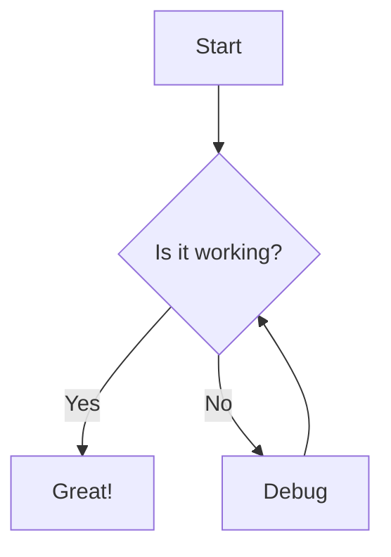
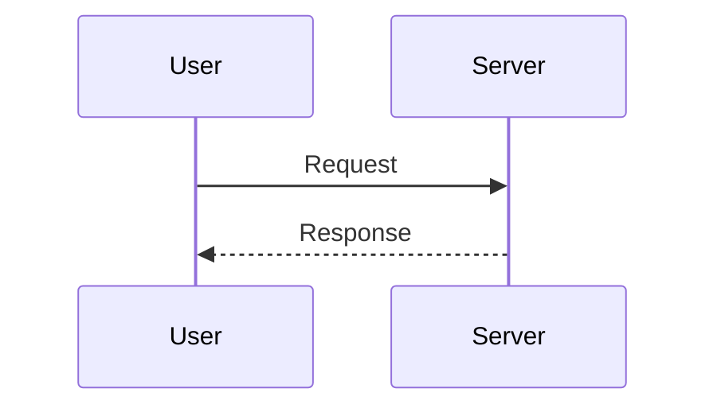
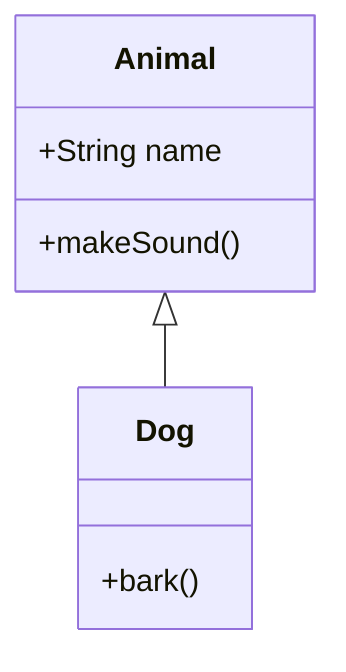
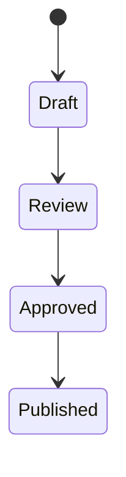
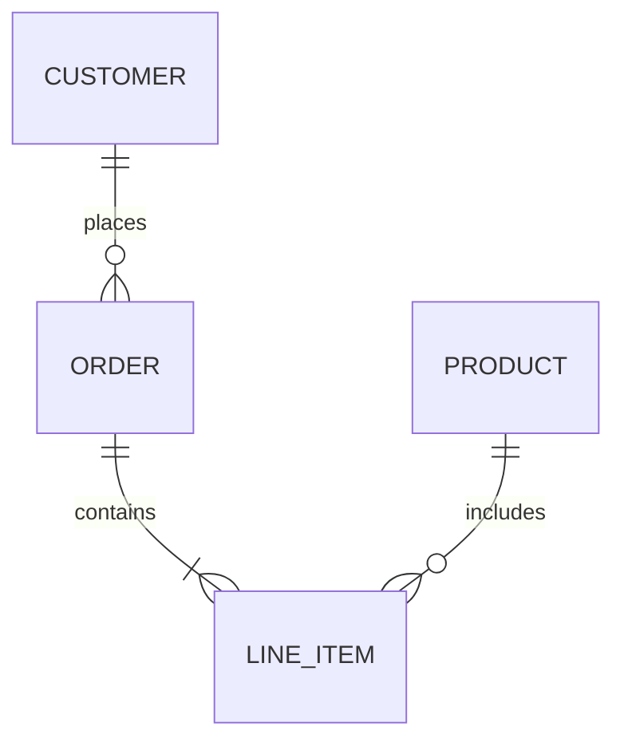
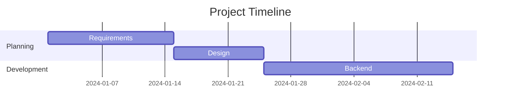
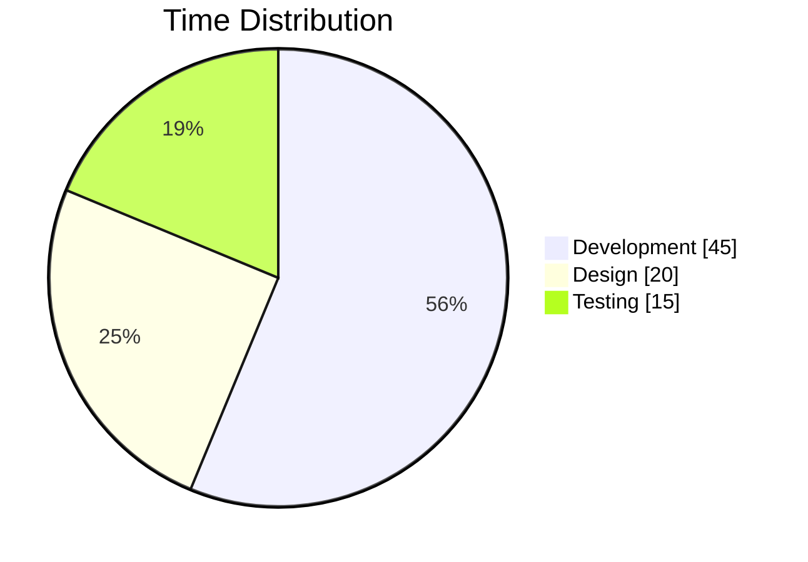
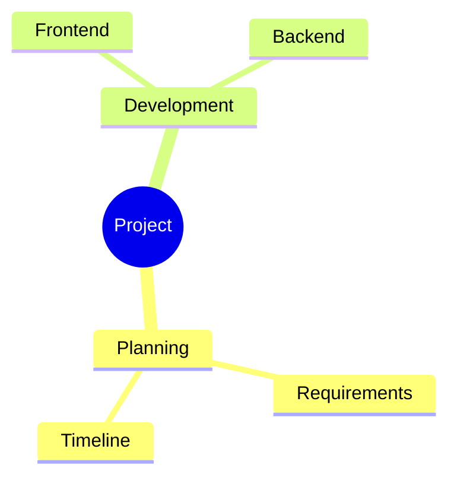
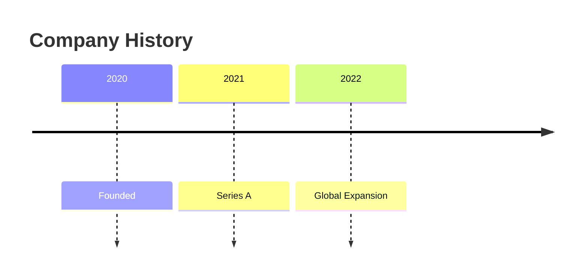
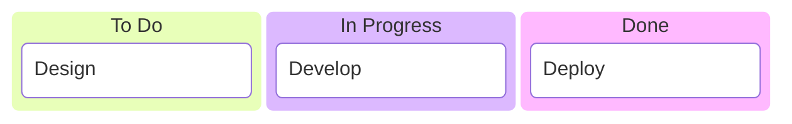

# PiCanvas Documentation

> This documentation mirrors the in-app help available when editing PiCanvas. Click any feature card in edit mode to see these guides directly in SharePoint.

## Quick Links

| Guide | Description |
|-------|-------------|
| [Tabbed Layouts](#tabbed-layouts) | Organize web parts into clean, navigable tabs |
| [Section Support](#section-support) | Group entire page sections into single tabs |
| [Theme Aware](#theme-aware) | Automatically adapts to light and dark modes |
| [Permission-Based Visibility](#permission-based-visibility) | Control tab visibility based on group membership |
| [Content Types](#content-types) | Markdown, HTML, Embed, and Mermaid diagrams |
| [Installation](#installation) | Deploy to SharePoint |
| [Troubleshooting](#troubleshooting) | Common issues and solutions |

---

## Tabbed Layouts

Organize web parts into clean, navigable tabs.

### How It Works

PiCanvas dynamically restructures your SharePoint page to create a tabbed experience. When you assign web parts to tabs, PiCanvas identifies them in your section, creates tab navigation with your custom labels, and moves content into tab panels that show/hide based on selection.

### Tab Orientation

| Option | Description |
|--------|-------------|
| **Horizontal** (default) | Tabs appear at the top of the content |
| **Vertical** | Tabs appear on the left or right side |

When using **Vertical** orientation, additional options appear:
- **Vertical Tab Position** - Left side or Right side
- **Vertical Tab Width** - 150px to 300px, or 25%/33% of container

### Configuration Options

| Option | Values | Description |
|--------|--------|-------------|
| Tab Style | `default`, `pills`, `underline`, `boxed` | Visual appearance of tab buttons |
| Tab Alignment | `left`, `center`, `right`, `stretch` | Horizontal positioning of tabs |
| Tab Count | 1-20 | Number of tabs in your layout |
| Label Image Size | `40px` to `120px`, or `No limit` | Max height for images used as tab labels |

### Tab Label Options

Each tab supports two label types:

#### 1. Text Labels (default)
- Enter any text as the tab label
- Built-in **icon picker** with 30+ emoji icons (🏠 📅 📄 📊 ⚙️ etc.)
- Optional **tab image URL** with position options (left, right, top, background)
- Empty labels default to "Tab 1", "Tab 2", etc.

#### 2. Web Part as Label
- Select **"Use web part as label"** from the Label Type dropdown
- Choose any web part (Image, Text, etc.) to become the tab label
- Perfect for using logos, icons, or rich content as tab headers
- **Label Image Size** controls the max height of images in web part labels
- Select **"No limit (full size)"** to let images fill their tab container

### Tab Dividers

Add visual separators between tabs to create logical groupings:
- Enable **"Add divider after this tab"** toggle for any tab
- Dividers appear as subtle gradient lines between tabs
- Works in both horizontal and vertical orientations

### Visual Structure

```
Horizontal Layout:
┌─────────────────────────────────────────────────────────┐
│  [Tab 1]  [Tab 2] │ [Tab 3]                             │
├─────────────────────────────────────────────────────────┤
│   Web Part Content (dynamically shown/hidden)           │
└─────────────────────────────────────────────────────────┘

Vertical Layout:
┌──────────┬──────────────────────────────────────────────┐
│ [Tab 1]  │                                              │
│ [Tab 2]  │   Web Part Content                           │
│ ──────── │   (dynamically shown/hidden)                 │
│ [Tab 3]  │                                              │
└──────────┴──────────────────────────────────────────────┘
```

### How to Configure

1. Open the property pane (edit web part settings)
2. Click **Add Tab** for each tab you need
3. Select a web part or section from the dropdown
4. Choose label type: Text or Web Part
5. For text labels: enter text and optionally add icons/images
6. For web part labels: select the web part to use as the label
7. Optionally enable dividers between tabs
8. Adjust **Label Image Size** if using images

---

## Reuse Across Tabs and Instances

PiCanvas can reuse the same web part in multiple tabs or across multiple PiCanvas web parts on the same page. It auto-clones the DOM and removes duplicate IDs to avoid conflicts, so you can build alternate views without duplicating content.

**Typical uses:**
- Show the same report under different tab labels
- Include a shared "Overview" tab in multiple PiCanvas instances

---

## Section Support

Group entire page sections into single tabs.

### How It Works

PiCanvas detects all sections on your SharePoint page and offers them as tab targets alongside individual web parts. This lets you put entire multi-column layouts into a single tab while preserving the original column structure.

### Section Detection

- **Automatic scanning** - Finds all `CanvasSection` elements on the page
- **Web part counting** - Shows how many web parts each section contains
- **Smart exclusion** - Automatically excludes the section containing PiCanvas itself
- **Empty filtering** - Sections without web parts are hidden from the dropdown

### Dropdown Display

```
┌─────────────────────────────────────┐
│ Select web part or section...    ▼  │
├─────────────────────────────────────┤
│ >> Section 1 (3 web parts)          │  ← Sections marked with >>
│ >> Section 2 (2 web parts)          │
│ ─────────────────────────────────── │
│     Sec 1 | Left | Text             │  ← Individual web parts
│     Sec 1 | Right | Image           │
└─────────────────────────────────────┘
```

### Column Layout Preservation

| SharePoint Layout | Columns | Preserved Width |
|-------------------|---------|-----------------|
| Full width | 1 | 100% |
| Two columns | 2 | 50% each |
| Three columns | 3 | 33.33% each |
| Asymmetric (1/3 + 2/3) | 2 | 33.33% + 66.66% |

### Responsive Behavior

- On screens < 640px, all columns stack vertically
- Images automatically resize to fit their column width
- Original spacing and padding are preserved

---

## Theme Aware

Automatically adapts to light and dark modes.

### Detection Strategy

PiCanvas uses a 3-tier priority system to detect the correct theme:

```
┌─────────────────────────────────────────────────────────┐
│ 1. Manual Override (Highest Priority)                   │
│    User explicitly sets Light/Dark in property pane     │
├─────────────────────────────────────────────────────────┤
│ 2. SharePoint Theme State                               │
│    Reads window.__themeState__.theme.isInverted         │
│    Most reliable for SharePoint Online                  │
├─────────────────────────────────────────────────────────┤
│ 3. Luminance Calculation                                │
│    Analyzes section background color                    │
│    Formula: (0.299×R + 0.587×G + 0.114×B) / 255        │
│    Dark if luminance < 50%                              │
├─────────────────────────────────────────────────────────┤
│ 4. Fallback → Light mode (default)                      │
└─────────────────────────────────────────────────────────┘
```

### Theme Configuration

| Setting | Behavior |
|---------|----------|
| **Auto** (default) | Detects from SharePoint theme and section background |
| **Light** | Forces light mode regardless of page theme |
| **Dark** | Forces dark mode regardless of page theme |

### Design System

PiCanvas uses CSS custom properties for consistent theming:

| Property | Light Mode | Dark Mode |
|----------|------------|-----------|
| `--pi-bg-primary` | #ffffff | #181818 |
| `--pi-bg-secondary` | #f5f5f7 | #232323 |
| `--pi-text-primary` | #1d1d1f | #ffffff |
| `--pi-text-secondary` | #424245 | #b3b3b3 |
| `--pi-accent` | #0066cc | #4da6ff |

### Accessibility

- All color combinations meet **WCAG AAA** contrast requirements
- Primary text maintains 18:1+ contrast ratio
- Interactive elements maintain 10:1+ contrast ratio
- Supports system-level dark mode preference via `prefers-color-scheme`

---

## Permission-Based Visibility

Control tab visibility based on SharePoint group membership.

The Permission Settings panel in the property pane shows the "Restrict by Group" toggle, a multi-select dropdown for choosing Site Owners/Members/Visitors, a text field for custom group IDs, and radio buttons for visibility behavior (Hide completely or Show Placeholder).


### How It Works

PiCanvas can show or hide individual tabs based on the current user's SharePoint group membership. When permission checking is enabled for a tab, only users in the specified groups will see that tab. This enables personalized experiences without duplicating content.

### Permission Logic

```
┌─────────────────────────────────────────────────────────┐
│ User Opens Page                                         │
├─────────────────────────────────────────────────────────┤
│ 1. Load user's group memberships (cached 5 min)         │
│ 2. For each tab with permissions enabled:               │
│    → Check if user is in ANY specified group (OR logic) │
│    → Show tab if member, hide if not                    │
│ 3. Tabs without permissions → visible to everyone       │
└─────────────────────────────────────────────────────────┘
```

### Supported Groups

| Group Type | Description |
|------------|-------------|
| **Site Owners** | Users with full control of the site |
| **Site Members** | Users with contribute permissions |
| **Site Visitors** | Users with read-only access |
| **Custom Group IDs** | Any SharePoint group by ID number |

### Quick Presets

The property pane offers convenient presets for common scenarios:

| Preset | Groups Included |
|--------|-----------------|
| Everyone | No restriction (default) |
| Site Owners | Owners only |
| Site Members | Members only |
| Site Visitors | Visitors only |
| Owners & Members | Owners + Members |
| Members & Visitors | Members + Visitors |
| All Site Groups | Owners + Members + Visitors |

### Custom Group IDs

For advanced scenarios, enter SharePoint group IDs directly:
- Find group IDs in SharePoint: `/_layouts/15/groups.aspx`
- Enter as comma-separated values: `5, 12, 23`
- Custom IDs work alongside standard group selections

### Visibility Behavior

| Option | What Happens |
|--------|--------------|
| **Hide completely** | Tab is invisible to unauthorized users |
| **Show Placeholder** | Tab appears grayed out with lock icon |

### How to Configure

1. Open the property pane for any tab
2. Enable **"Restrict by Group"** toggle
3. Select groups from the **"Visible to Groups"** dropdown
4. Optionally add custom group IDs
5. Choose visibility behavior (hide or placeholder)
6. Save changes - permissions apply immediately

### Performance & Reliability

- **5-minute cache** - Group data is cached to minimize API calls
- **Pre-loaded on init** - Permissions load in background for fast first render
- **Graceful fallback** - If API fails, all tabs remain visible (fail-open)
- **Template support** - Permission settings export/import with templates

### Use Cases

- **Admin tabs** - Show management tools only to Owners
- **Member features** - Display collaboration tools to Members
- **Public content** - Keep some tabs visible to all, hide others
- **Department pages** - Target content to specific security groups

---

## Content Types

PiCanvas supports four custom content types that let you create rich tab content without adding extra web parts.

### Markdown Content

Write beautifully formatted text using simple, readable syntax.

#### Basic Syntax

| Element | Syntax | Output |
|---------|--------|--------|
| Heading 1 | `# Heading` | Large title |
| Heading 2 | `## Heading` | Section title |
| Bold | `**bold**` | **bold** |
| Italic | `*italic*` | *italic* |
| Link | `[text](url)` | [text](#) |
| Image | `` | Image |
| Code | `` `code` `` | `code` |

#### Lists

```markdown
- Bullet item
- Another item
  - Nested item

1. First step
2. Second step
3. Third step

- [x] Completed task
- [ ] Incomplete task
```

#### Tables

```markdown
| Name | Role | Status |
|------|------|--------|
| Alice | Developer | Active |
| Bob | Designer | Active |
```

#### Code Blocks

````markdown
```javascript
function hello() {
  return 'Hello World!';
}
```
````

### HTML Content

Use custom HTML for advanced layouts with inline styling.

#### Allowed Elements

- **Structure:** `div`, `span`, `section`, `article`, `header`, `footer`
- **Text:** `p`, `h1-h6`, `strong`, `em`, `b`, `i`, `u`
- **Lists:** `ul`, `ol`, `li`
- **Tables:** `table`, `thead`, `tbody`, `tr`, `th`, `td`
- **Media:** `img`, `figure`, `video`
- **Links:** `a` (with `href`, `target`, `rel`)

#### Sample: Info Cards

```html
<div style="display: grid; grid-template-columns: repeat(auto-fit, minmax(200px, 1fr)); gap: 16px;">
  <div style="background: linear-gradient(135deg, #667eea 0%, #764ba2 100%); color: white; padding: 20px; border-radius: 12px;">
    <h3 style="margin: 0 0 8px;">📊 Analytics</h3>
    <p style="margin: 0; opacity: 0.9;">View dashboard reports</p>
  </div>
</div>
```

#### Security

- `<script>` tags are completely removed
- Event handlers (`onclick`, `onerror`, etc.) are stripped
- All HTML is sanitized using DOMPurify

### Embed (iframe) Content

Embed videos, apps, dashboards, and external content securely.

#### Trusted Domains

| Category | Domains |
|----------|---------|
| **Video** | YouTube, Vimeo, Microsoft Stream |
| **Microsoft 365** | SharePoint, OneDrive, Sway, Loop, Teams |
| **Power Platform** | Power BI, Power Apps, Power Automate |
| **Forms** | Microsoft Forms, Typeform, Calendly |
| **Design** | Canva, Figma, Miro, Lucidchart |
| **Productivity** | Notion, Airtable, Coda, Mural |

#### Getting Embed URLs

**YouTube:**
```
https://www.youtube.com/embed/VIDEO_ID
```

**Power BI:**
```
https://app.powerbi.com/reportEmbed?reportId=...
```

**Microsoft Forms:**
```
https://forms.office.com/Pages/ResponsePage.aspx?id=...
```

#### Custom Domain Allow List

Create `/SiteAssets/PiCanvas/embed-allowlist.json`:

```json
{
  "allowedDomains": [
    "custom-app.contoso.com",
    "internal-tool.company.com"
  ]
}
```

### Mermaid Diagrams

Create professional diagrams using simple text syntax. 20+ diagram types supported!

#### Flowchart



#### Sequence Diagram



#### Class Diagram



#### State Diagram



#### Entity Relationship Diagram



#### Gantt Chart



#### Pie Chart



#### Mind Map



#### Timeline



#### Kanban Board



#### More Diagram Types

- **Quadrant Chart** - Priority matrices
- **Git Graph** - Branching visualization
- **Architecture Diagram** - System design
- **XY Chart** - Line and bar charts
- **Sankey Diagram** - Flow visualization
- **Block Diagram** - Simple blocks
- **Radar Chart** - Multi-dimensional comparison

#### Resources

- [Mermaid Official Documentation](https://mermaid.js.org/)
- [Mermaid Live Editor](https://mermaid.live/) - Test diagrams online

---

## Templates

Save and share PiCanvas configurations across sites.

The Templates panel in the property pane shows a dropdown of built-in templates (Classic, Dashboard, Navigation Dock, Portal Hub, Minimal), plus Export and Import buttons for JSON configuration files, and a "Save to Site Assets" option for team sharing.


### How to Use Templates

1. Open the web part property pane and expand **Templates**
2. Select a built-in template to apply it
3. Use the export/import controls to download or load a JSON template
4. Optionally save templates to Site Assets for team reuse

### Built-in Templates

| Template | Tabs | Style | Description |
|----------|------|-------|-------------|
| **Classic** | 3 | Default | Simple horizontal tabs |
| **Dashboard** | 4 | Underline | Metrics-focused layout |
| **Navigation Dock** | 5 | Pills | Vertical sidebar |
| **Portal Hub** | 4 | Boxed | Department categories |
| **Minimal** | 3 | Underline | Light, clean design |

### Template Features

- **Export to JSON** - Download complete configuration as JSON file
- **Import from JSON** - Load configuration from JSON file
- **Save to Site Assets** - Store templates in SharePoint for team sharing
- **Includes all settings** - Tab labels, icons, images, permissions, styling, colors
- **Content mapping preserved** - Web part assignments stay with templates
- **Dark Mode preset** - Pre-configured dark theme

---

## Installation

### Prerequisites

- SharePoint Online or SharePoint 2019+
- Site Collection Administrator permissions (for Site Collection App Catalog)
- Tenant Administrator permissions (for Tenant App Catalog)

### Deploy to SharePoint

Prebuilt packages are not provided; build the `.sppkg` locally.

1. Build the package from source:
   - `npm install`
   - `npx heft build --production`
   - `npx heft package-solution --production`
2. Upload `sharepoint/solution/pi-canvas.sppkg` to your **App Catalog** > **Apps for SharePoint**
3. Click **Deploy** when prompted
4. Add the app to your site from **Site Contents > New > App**

### Guest User Access

> **Important:** If you have **guest users** (external users) who need to use PiCanvas, you must deploy to a **Site Collection App Catalog** instead of the Tenant App Catalog.

| Deployment Location | Internal Users | Guest Users |
|---------------------|----------------|-------------|
| **Tenant App Catalog** | ✅ Works | ❌ `[object Object]` error |
| **Site Collection App Catalog** | ✅ Works | ✅ Works |

**Why?** Guest users cannot access tenant-level CDN resources where SPFx assets are hosted. Deploying to a site collection app catalog serves assets from the site's context, which guests can access.

---

## Troubleshooting

The Troubleshooting section in the property pane provides diagnostic tools when web parts aren't detected correctly. It includes Section Selector and Web Part Selector dropdowns to try different DOM query strategies, plus Reset buttons to restore defaults.


### Web Parts Not Detected

**Symptom:** Dropdown shows no web parts or wrong web parts

**Solution:**
1. Open property pane > scroll to **Troubleshooting**
2. Try different **Section Selector** options:
   - `CanvasSection` (default for modern pages)
   - `CanvasZone` (older page layouts)
   - `webpart` (generic fallback)
3. Try different **Web Part Selector** options:
   - `ControlZone` (default)
   - `webpart-container`
   - `data-sp-feature-instance-id`
4. Click **Reset to Defaults** if things get stuck

### Permission Filtering Not Working

**Symptom:** Restricted tabs visible to everyone

**Possible causes:**
1. **API delay** - Wait a moment, permissions load asynchronously
2. **Cache** - Group data cached 5 minutes, wait or reload
3. **Guest users** - Must use Site Collection App Catalog deployment
4. **API failure** - Check browser console for errors (fails open by design)

### Guest User Issues

**Symptom:** Guest users see `[object Object]` error

**Solution:** Deploy to **Site Collection App Catalog** instead of Tenant App Catalog.

### Styles Not Applying

**Symptom:** Custom colors or styles not showing

**Solutions:**
1. Check theme mode (Light/Dark) matches your settings
2. Click **Reset All Styles** in Troubleshooting section
3. Ensure no conflicting page-level CSS
4. Try a different browser to rule out cache issues

---

## Customization Settings

### Colors

The Colors panel provides color pickers for Accent Color, Tab Text Color, Active Tab Text Color, Tab Background, Active Tab Background, and Hover Background. Each setting has a color swatch preview and hex input field.


| Setting | Description |
|---------|-------------|
| **Accent Color** | Primary color for active states |
| **Tab Text Color** | Inactive tab text |
| **Active Tab Text Color** | Selected tab text |
| **Tab Background** | Inactive tab background |
| **Active Tab Background** | Selected tab background |
| **Hover Background** | Tab background on mouse hover |

### Typography & Spacing

The Typography & Spacing panel contains sliders for Font Size (12-20px), Font Weight (400-700), Vertical Padding, Horizontal Padding, and Gap Between Tabs. Each slider shows the current value and updates the preview in real-time.


| Setting | Range | Default |
|---------|-------|---------|
| **Font Size** | 12px - 20px | 14px |
| **Font Weight** | 400 - 700 | 500 |
| **Vertical Padding** | 6px - 20px | 12px |
| **Horizontal Padding** | 10px - 40px | 20px |
| **Gap Between Tabs** | 0px - 20px | 0px |

### Borders & Effects

The Borders & Effects panel includes sliders for Corner Radius and Active Indicator Width, a color picker for Indicator Color, a dropdown for Shadow Effect presets, and toggles for Show Tab Separators and Enable Animations.


| Setting | Options |
|---------|---------|
| **Corner Radius** | 0px - 16px |
| **Active Indicator Width** | 2px - 6px |
| **Active Indicator Color** | Accent color or custom |
| **Shadow Effect** | None, Subtle, Medium, Strong |
| **Show Tab Separators** | Toggle separator lines between tabs |
| **Enable Animations** | Toggle smooth transitions |

---

## Additional Resources

- [Main README](../README.md) - Overview and quick start
- [GitHub Issues](https://github.com/anthonyrhopkins/PiCanvas/issues) - Report bugs or request features
- [Contributing Guide](../CONTRIBUTING.md) - Help improve PiCanvas

---

## Credits

PiCanvas is built on [Modern Hillbilly Tabs](http://www.markrackley.net/2022/06/29/the-return-of-hillbilly-tabs/) by Mark Rackley. Modernized and expanded by [@anthonyrhopkins](https://github.com/anthonyrhopkins).
