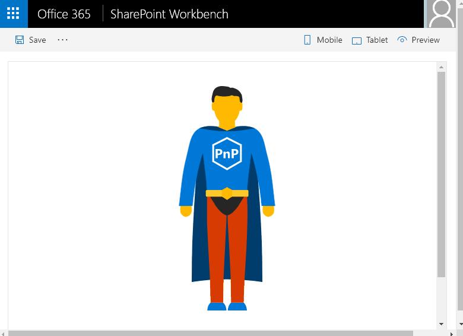

# JS Property Controls SVG

## Summary
An SPFx webpart that displays a Scalable Vector Graphics (SVG) image using properties to customize how it is rendered. The webpart utilizes the PnP SPFx Property Controls package (specifially the SpinButton and ColorPicker) to set these properties.

## Used SharePoint Framework Version 

## Which PnP SPFx controls are being used in this sample?
* [PropertyFieldSpinButton](https://github.com/SharePoint/sp-dev-fx-property-controls/wiki/PropertyFieldSpinButton)
* [PropertyFieldColorPicker](https://github.com/SharePoint/sp-dev-fx-property-controls/wiki/PropertyFieldColorPicker)

## Applies to

* [SharePoint Framework](https://docs.microsoft.com/sharepoint/dev/spfx/sharepoint-framework-overview)
* [sp-dev-fx-property-controls](https://github.com/SharePoint/sp-dev-fx-property-controls)
* [PnP Man](https://github.com/thechriskent/PnPMan)

## Solution

Solution|Author(s)
--------|---------
js-propertycontrols-svg | Chris Kent ([thechriskent.com](https://thechriskent.com), [@thechriskent](https://twitter.com/thechriskent))

## Version history

Version|Date|Comments
-------|----|--------
1.0|November 12, 2017|Initial release

## Disclaimer
**THIS CODE IS PROVIDED *AS IS* WITHOUT WARRANTY OF ANY KIND, EITHER EXPRESS OR IMPLIED, INCLUDING ANY IMPLIED WARRANTIES OF FITNESS FOR A PARTICULAR PURPOSE, MERCHANTABILITY, OR NON-INFRINGEMENT.**

---

## Minimal Path to Awesome

- Clone this repository
- in the command line run:
  - `npm install`
  - `gulp serve`
- Customize your PnP Hero!

## Features
Displays a Scalable Vector Graphics (SVG) image of the SharePoint Patterns and Practices Super Hero and allows users to customize the colors used and the size of the image through the use of PnP SPFx Property Controls (SpinButton & ColorPicker).

This Web Part illustrates the following concepts on top of the SharePoint Framework:

- Rendering an SVG image
- Using a PropertyFieldSpinButton control
- Using a PropertyFieldColorPicker control

