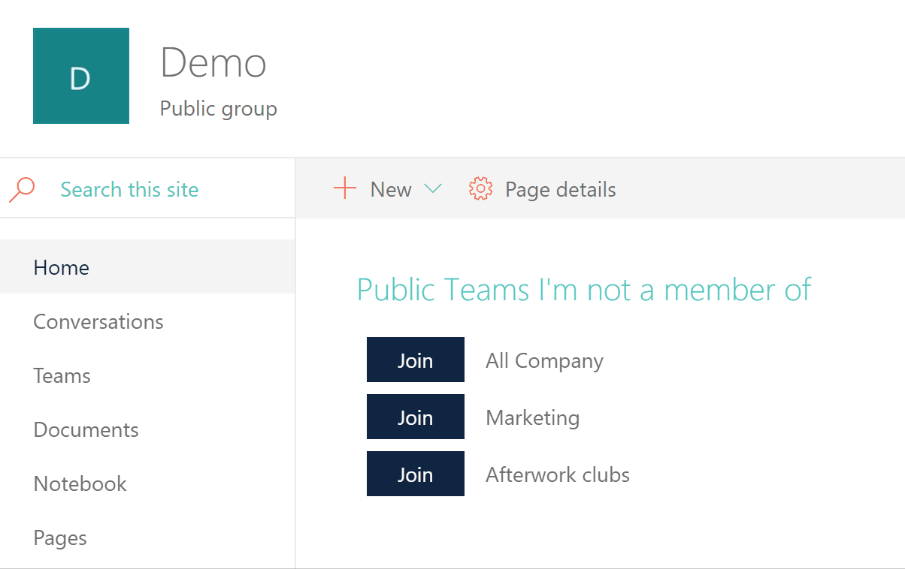

# Public teams I'm not a member of

## Summary
This web part lists all the public teams the current user is not yet a member of. They can then join any of those teams by clicking the button right next to the team name. This web part can also be added to Teams as a tab (built with the 1.7.1 plusbeta/preview version).

## Used SharePoint Framework Version 

## Applies to

* [SharePoint Framework](https://docs.microsoft.com/sharepoint/dev/spfx/sharepoint-framework-overview)
* [Office 365 tenant](https://docs.microsoft.com/sharepoint/dev/spfx/set-up-your-development-environment)

## Prerequisites

To be able to pin this web part as a Teams tab, your tenant currently needs to be in the targeted release mode. If your tenant is not in targeted release, you can still use the web part in SharePoint as usual.

## Solution

Solution|Author(s)
--------|---------
js-public-unjoined-teams | Laura Kokkarinen ([laurakokkarinen.com](https://laurakokkarinen.com), [@LauraKokkarinen](https://twitter.com/LauraKokkarinen))

## Version history

Version|Date|Comments
-------|----|--------
1.0|February 5, 2019|Initial release

## Disclaimer
**THIS CODE IS PROVIDED *AS IS* WITHOUT WARRANTY OF ANY KIND, EITHER EXPRESS OR IMPLIED, INCLUDING ANY IMPLIED WARRANTIES OF FITNESS FOR A PARTICULAR PURPOSE, MERCHANTABILITY, OR NON-INFRINGEMENT.**

---

## Minimal Path to Awesome

- Clone this repository
- in the command line run:
  - `npm install`
  - `gulp bundle --ship`
  - `gulp package solution --ship`
- Deploy the solution package under \sharepoint\solution to the SharePoint app catalog
- Approve the required Microsoft Graph permissions in the SharePoint admin center (Preview, API management)

## Features

This web part lists all the public teams the current user is not yet a member of. They can then join any of those teams by clicking the button right next to the team name. The Teams client does not present this kind of a complete list by default, so the web part is particularly handy to all end users who might not even be aware of all the public teams that are available. This web part can also be added to Teams as a tab. The web part colors are based on the site color theme.

