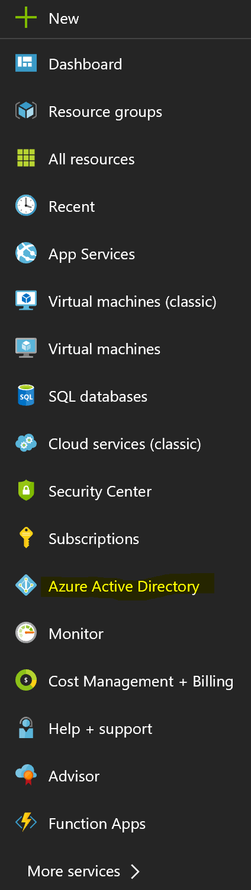
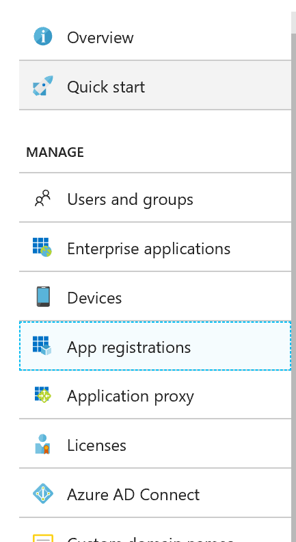
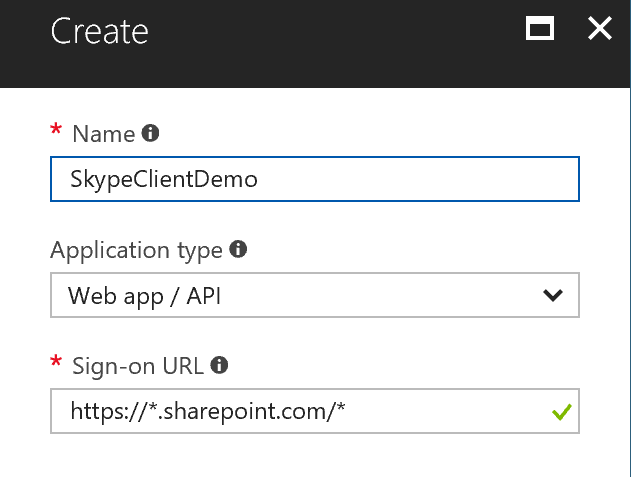
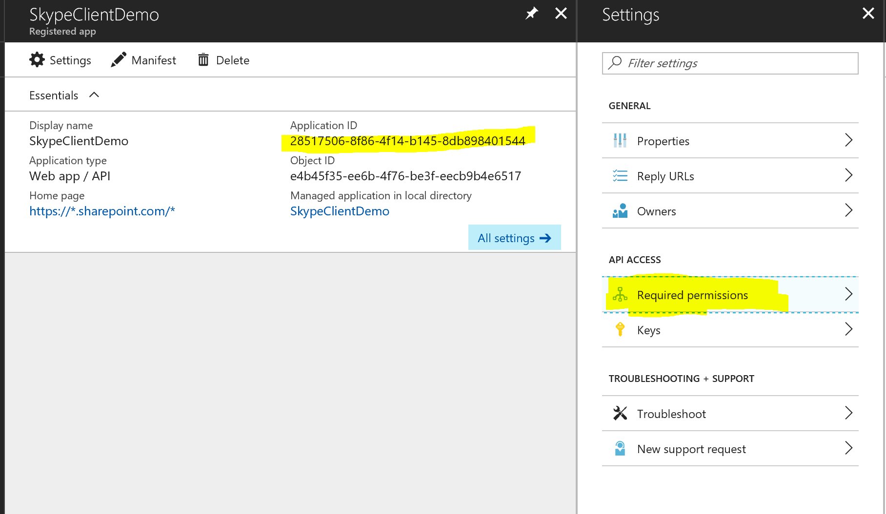
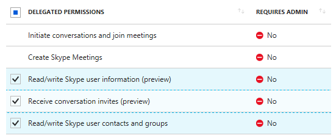
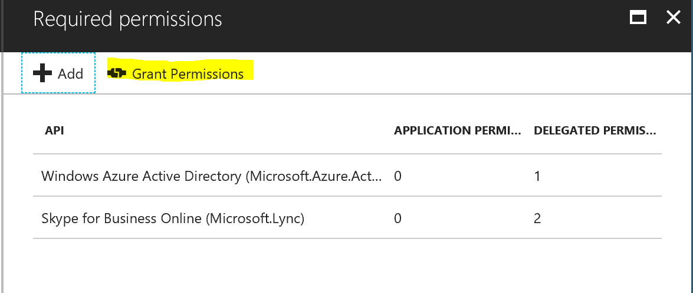

# JavaScript Skype Status WebPart

## Summary
This sample demonstrates how to use the UCWA JS SDK for skype in the SharePoint Framework. It shows how to subscribe to status change of the different people of the organization but you can get much more information, checkout the [documentation](https://msdn.microsoft.com/en-us/skype/websdk/docs/generalreference?f=255&MSPPError=-2147217396)  
The goal is to demonstrate how you can leverage the SDK and to have the simplest approach, hence the usage of JQuery. No Framework (React, Angular, Knockout...) is used here but you can use that SDK in conjuction with any framwork.  
No branding has been applied to keep it simple but you could perfectly leverage Office Ui Fabric to display persona cards.

Allows you to properly display and subscribe to change of users' availability.  
See the demo:  

## Used SharePoint Framework Version

## Applies to

* [SharePoint Framework Developer](https://docs.microsoft.com/sharepoint/dev/spfx/sharepoint-framework-overview)
* [Office 365 developer tenant](https://docs.microsoft.com/sharepoint/dev/spfx/set-up-your-developer-tenant)

## Solution

Solution|Author(s)
--------|---------
js-skype-status|[Vincent Biret](https://github.com/baywet)

## Version history

Version|Date|Comments
-------|----|--------
1.4|March 27th, 2019|Upgrade to SPFx 1.8.0
1.3|November 18th, 2018|Upgrade to SPFx 1.7.0
1.2|July 4th, 2018|Fixed a bug when subscribing to the current user's status
1.1|June 22nd, 2018|Upgraded to SPFx 1.5
1.0|December 1, 2017|Initial release

## Disclaimer
**THIS CODE IS PROVIDED *AS IS* WITHOUT WARRANTY OF ANY KIND, EITHER EXPRESS OR IMPLIED, INCLUDING ANY IMPLIED WARRANTIES OF FITNESS FOR A PARTICULAR PURPOSE, MERCHANTABILITY, OR NON-INFRINGEMENT.**

---

## Minimal Path to Awesome
### Authentication
Because the Skype API's are secured, you first need to register an Azure Active Directory application.  
To do that go to `portal.azure.com` and sign in as your tenant administrator.  
  
Click on `Azure Active Directory`.  
  
Click on on `App Registrations` and then `New Application Registration`  
  
Enter any name, select `Web app / API` in `Application Type` and in `Sign-In URL` enter `https://*.sharepoint.com/*`, then click on `Create`  
  
Take note of the `application ID`, we'll need it later. Click on `required permissions`.  
  
Click on `add` then `select an API` and select `Skype for Business`.  
  
Select under `delegated permissions` both `Read/Write Skype user contacts and groups`,  `Read/Write Skype user information (preview)`, `Receive conversation invites (preview)` (the receive conversation permission is required to get access to the mePerson object and have access to the current user's presence information) then click `select`. Finish by clicking `Done`.  
  
Don't forget to click on `Grant permissions` and `yes`.

### Updating the app
After copying that sample to your local machine and running `npm install` to install the depenencies, `/src/webparts/skypePresence/services/Constants.ts` open your favorite editor. Make sure you replace the value of `ApplicationIdKey` to the value application id we kept earlier.  

### Deploying the application
Start by running `gulp package-solution` and deploy the application to the app catalog. More information on how to do it [here](https://docs.microsoft.com/en-us/sharepoint/dev/spfx/web-parts/get-started/serve-your-web-part-in-a-sharepoint-page)  
**At the end select SkypePresence webpart instead**  
Don't forget to run `gulp serve --nobrowser` to start the debugging server.

### Additional page required
Because Skype needs to silently redirect the user to a page for the authentication flow, you need to create an additional page called `skypepresence` in your site.  
You don't need to add anything on that page.  

