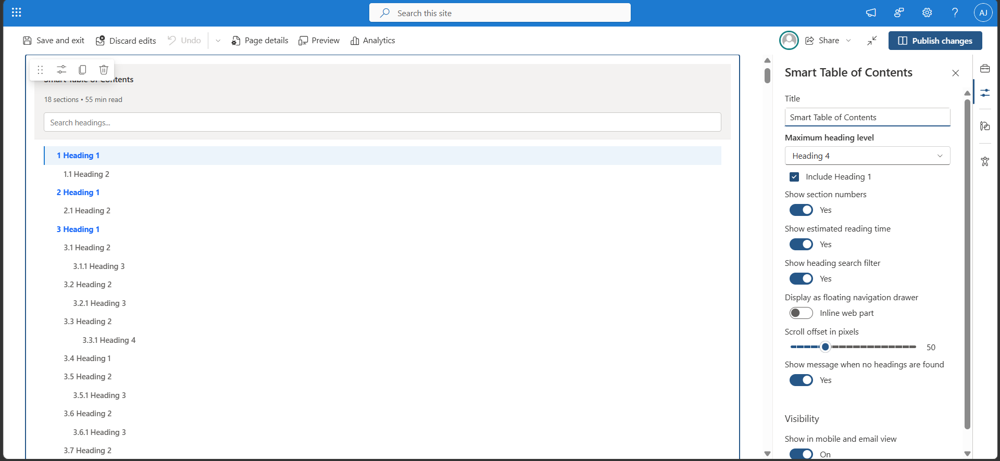
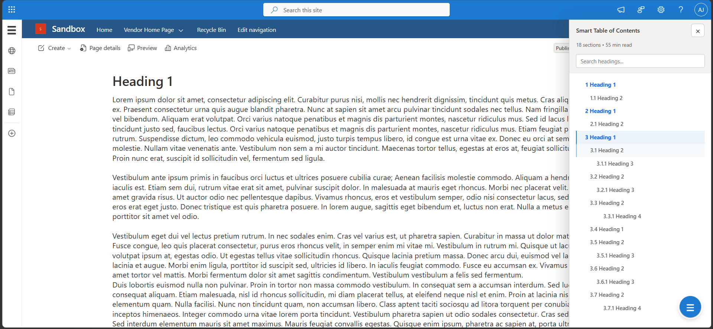
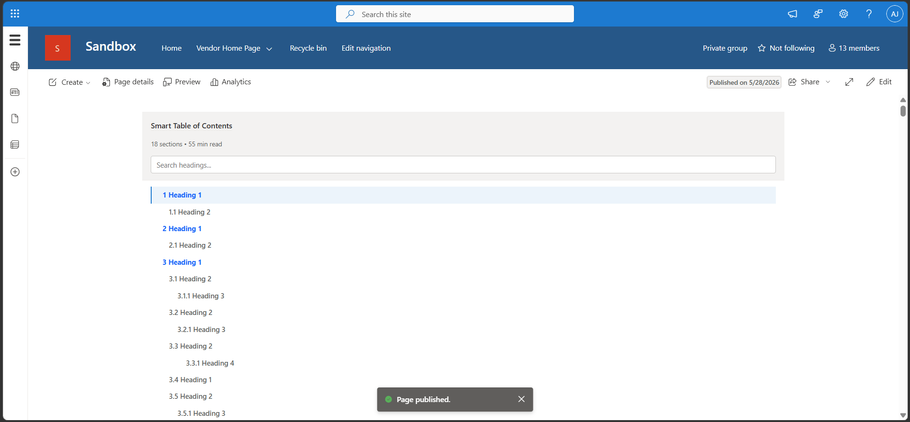
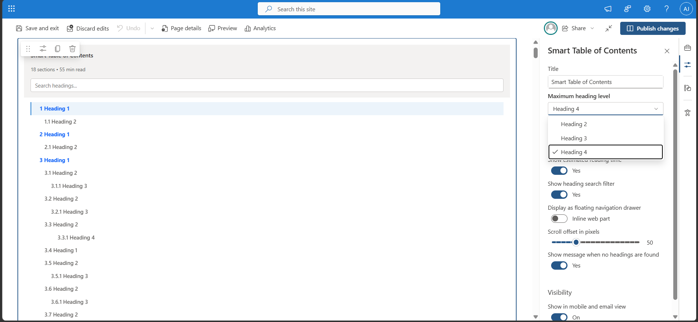
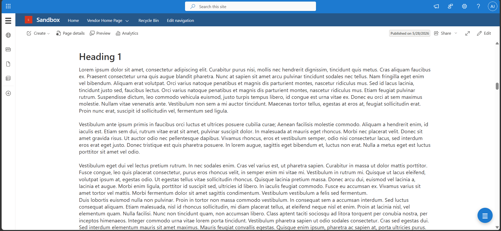

# Smart Table of Contents for SharePoint Framework (SPFx)

A modern, enterprise-ready Smart Table of Contents web part for SharePoint Online built with SharePoint Framework (SPFx).

This solution automatically generates a dynamic table of contents from page headings and provides smooth navigation, active section highlighting, nested heading support, floating navigation drawer mode, and live heading filtering.

---

## Features

### Dynamic Heading Detection

- Automatically scans SharePoint modern pages for headings.
- Supports Heading 1 through Heading 4.
- Configurable maximum heading level.

### ScrollSpy Navigation

- Automatically highlights the active section while scrolling.
- Smooth synchronized navigation experience.
- Nested sections expand dynamically based on active content.

### Floating Navigation Drawer

- Optional floating drawer mode.
- Persistent floating open button.
- Responsive right-side navigation experience.

### Inline Web Part Mode

- Traditional inline table of contents rendering.
- Works inside normal page layouts and sections.

### Live Heading Search

- Real-time filtering of headings.
- Instant narrowing of large documentation pages.

### Reading Metrics

- Displays:
  - Section count
  - Estimated reading time

### Smooth Scrolling

- Smooth animated navigation between headings.
- Configurable scroll offset.

### Enterprise-Friendly Design

- Does not rewrite the browser URL hash.
- Minimal visual footprint.
- Clean Fluent UI aligned styling.
- Works with modern SharePoint layouts.

### Dynamic Content Refresh

- Automatically refreshes headings after delayed SharePoint content hydration.
- Handles dynamically rendered modern page content.

---

# Preview

## Floating Drawer Mode



## ScrollSpy Active Tracking



## Nested Heading Expansion



## Property Pane Configuration



## Inline Mode



---

# Property Pane Options

| Setting                                 | Description                      |
| --------------------------------------- | -------------------------------- |
| Title                                   | Custom web part title            |
| Maximum Heading Level                   | Limits heading depth             |
| Include Heading 1                       | Includes or excludes H1 headings |
| Show Section Numbers                    | Enables heading numbering        |
| Show Estimated Reading Time             | Displays reading time metadata   |
| Show Heading Search Filter              | Enables live heading filtering   |
| Display as Floating Navigation Drawer   | Enables floating drawer mode     |
| Scroll Offset                           | Adjusts scroll target offset     |
| Show Message When No Headings Are Found | Displays empty-state message     |

---

# Build Requirements

## Supported Environment

- SharePoint Online
- SPFx 1.20+
- Node.js 20.x
- Gulp CLI
- TypeScript

---

# Installation

## Clone Repository

```bash
git clone https://github.com/pnp/sp-dev-fx-webparts.git
```

## Navigate to Sample

```bash
cd samples/js-smart-table-of-contents
```

## Install Dependencies

```bash
npm install
```

## Run Local Workbench

```bash
gulp serve
```

## Build Production Package

```bash
gulp build --ship
gulp bundle --ship
gulp package-solution --ship
```

---

# Usage

1. Add the Smart Table of Contents web part to a modern SharePoint page.
2. Configure heading depth and display options.
3. Add headings to the page using SharePoint text web parts.
4. Publish the page.
5. The TOC updates automatically as content changes.

---

# Known Limitations

## SharePoint Heading Dependency

The solution relies on standard SharePoint heading markup. Custom HTML structures may not be detected.

## Dynamic Third-Party Content

Third-party web parts that render content asynchronously after page load may require additional refresh timing logic.

## Extremely Large Pages

Pages with very large heading counts may require additional optimization depending on tenant customization and browser performance.

---

# Resolved Issues

## Dynamic Content Hydration

Resolved delayed heading detection on modern SharePoint pages through automatic refresh logic.

## Nested Hover Rendering

Resolved hover overlap between nested heading regions and search/filter UI.

## Drawer Scroll Containment

Resolved scrolling and z-index containment issues inside floating drawer mode.

---

# Roadmap / Future Enhancements

## Planned v3 Exploration

- Optional Heading 3 and Heading 4 visibility toggles.
- Additional animation refinements.
- Enhanced accessibility improvements.
- Collapsible heading persistence.
- Optional icon support.
- Dark mode refinements.

---

# Project Structure

```text
src/
 └── webparts/
      └── smartTableOfContents/
           ├── SmartTableOfContentsWebPart.ts
           ├── SmartTableOfContentsWebPart.manifest.json
           └── SmartTableOfContentsWebPart.module.scss
```

---

# Author

Jonathan R. Adcox

---

# License

MIT
