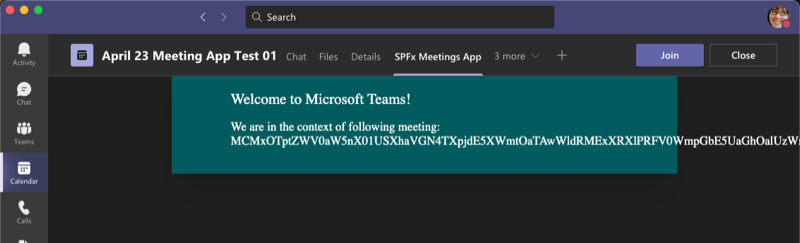

# SPFx web part in Teams Meetings App

Demo SPFx web part project that demonstrates using as a Microsoft Teams meetings app. This is associated with the SPFx docs tutorial: [Tutorial: Build meeting apps for Microsoft Teams with SPFx](https://docs.microsoft.com/sharepoint/dev//spfx/build-for-teams-meeting-app)

## Summary

This project demonstrates a SPFx web part used as a Microsoft Teams meetings app with minimal functionality.



## Compatibility

 
 
 


## Applies to

- [Microsoft Teams](https://aka.ms/microsoftteams)
- [SharePoint Framework](https://docs.microsoft.com/sharepoint/dev/spfx/sharepoint-framework-overview)
- [Microsoft 365 tenant](https://docs.microsoft.com/sharepoint/dev/spfx/set-up-your-development-environment)

## Prerequisites

- Administrative access to MS Teams to deploy the package

## Solution

Solution|Author(s)
--------|---------
js-teams-meeting-app | [Andrew Connell](/andrewconnell) ([@andrewconnell](https://twitter.com/andrewconnell)), [Voitanos, LLC](https://www.voitanos.io)

## Version history

Version |      Date      |    Comments
------- | -------------- | ---------------
1.0     | April 27, 2021 | Initial release


## Minimal Path to Awesome

Refer to the above mentioned SPFx tutorial for full repro instructions.

>  This sample can also be opened with [VS Code Remote Development](https://code.visualstudio.com/docs/remote/remote-overview). Visit https://aka.ms/spfx-devcontainer for further instructions.

- Clone this repository
- ZIP the contents of the `./teams` folder, *but not the folder itself*
  - rename the ZIP to `TeamsSPFxApp.zip`
- From the command line install all dependencies and create the package:

    ```console
    npm install
    gulp bundle -p
    gulp package-solution -p
    ```

- Upload the `.sppkg` to your SPO tenant's app catalog & deploy it
  - select the uploaded package, then select the **Sync to Teams** button in the **Files** tab in the ribbon
- In Microsoft Teams, create a new meeting using the **Calendar** app in the leftmost navigation bar
  - After creating the meeting, edit it, and select the **+** in the tab bar
  - Select the app you deployed to install the app

## Help

We do not support samples, but this community is always willing to help, and we want to improve these samples. We use GitHub to track issues, which makes it easy for  community members to volunteer their time and help resolve issues.

If you're having issues building the solution, please run [spfx doctor](https://pnp.github.io/cli-microsoft365/cmd/spfx/spfx-doctor/) from within the solution folder to diagnose incompatibility issues with your environment.

You can try looking at [issues related to this sample](https://github.com/pnp/sp-dev-fx-webparts/issues?q=label%3A%22sample%3A%20js-teams-meeting-app%22) to see if anybody else is having the same issues.

You can also try looking at [discussions related to this sample](https://github.com/pnp/sp-dev-fx-webparts/discussions?discussions_q=js-teams-meeting-app) and see what the community is saying.

If you encounter any issues while using this sample, [create a new issue](https://github.com/pnp/sp-dev-fx-webparts/issues/new?assignees=&labels=Needs%3A+Triage+%3Amag%3A%2Ctype%3Abug-suspected%2Csample%3A%20js-teams-meeting-app&template=bug-report.yml&sample=js-teams-meeting-app&authors=@andrewconnell&title=js-teams-meeting-app%20-%20).

For questions regarding this sample, [create a new question](https://github.com/pnp/sp-dev-fx-webparts/issues/new?assignees=&labels=Needs%3A+Triage+%3Amag%3A%2Ctype%3Aquestion%2Csample%3A%20js-teams-meeting-app&template=question.yml&sample=js-teams-meeting-app&authors=@andrewconnell&title=js-teams-meeting-app%20-%20).

Finally, if you have an idea for improvement, [make a suggestion](https://github.com/pnp/sp-dev-fx-webparts/issues/new?assignees=&labels=Needs%3A+Triage+%3Amag%3A%2Ctype%3Aenhancement%2Csample%3A%20js-teams-meeting-app&template=suggestion.yml&sample=js-teams-meeting-app&authors=@andrewconnell&title=js-teams-meeting-app%20-%20).


## Disclaimer

**THIS CODE IS PROVIDED *AS IS* WITHOUT WARRANTY OF ANY KIND, EITHER EXPRESS OR IMPLIED, INCLUDING ANY IMPLIED WARRANTIES OF FITNESS FOR A PARTICULAR PURPOSE, MERCHANTABILITY, OR NON-INFRINGEMENT.**


