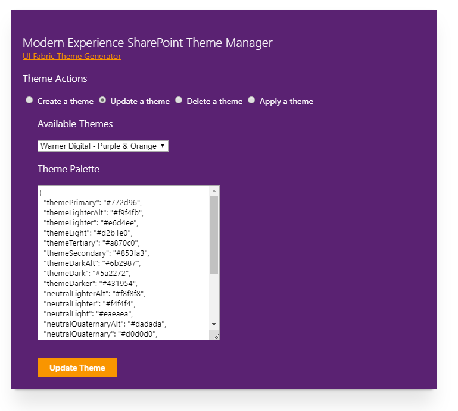
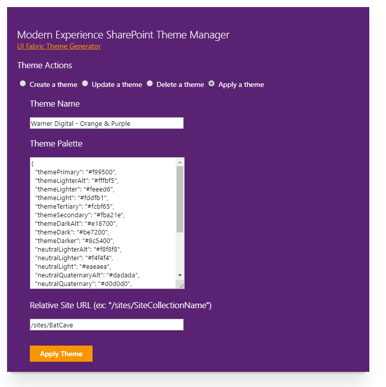

# Modern Experience Theme Manager

## Summary
This sample web part provides a user interface for creating, updating, deleting and applying a Modern Experience SharePoint theme in SharePoint Online.

The Theme Palette can be generated using the UI Fabric Theme Generator at: https://developer.microsoft.com/en-us/fabric#/styles/themegenerator

### The following four features are available within this sample:

#### Create a theme:
Using a provided theme name and theme color palette a Modern Experience them is created and available at the tenant level.

#### Update a theme:
By selecting a pre-existing theme from the dropdown, the theme at the tenant level will be updated with the palette provided in the Theme Palette texbox.

#### Delete a theme:
By selecting a pre-existing theme from the dropdown, the theme will be deleted from the tenant level.

#### Apply a theme:
By providing a Site Collection URL, along with a theme name and palette, the theme will be applied to the Site Collection directly without being added to the tenant Company Theme options. 
NOTE: This is a great option to provide theme management of a Site Collection without adding a theme to the "Company Themes" choices within the "Change the Look" options at the tenant level. The web part could be added to a Site Collection App Catalog to ensure availability of the web part is only available to those approved for theme management.

## Used SharePoint Framework Version 

## Applies to

* [SharePoint Framework](https://docs.microsoft.com/sharepoint/dev/spfx/sharepoint-framework-overview)
* [Office 365 tenant](https://docs.microsoft.com/sharepoint/dev/spfx/set-up-your-development-environment)

## Solution

Solution|Author(s)
--------|---------
js-theme-manager (Upgrade) | Hugo Bernier ([@bernierh](https://twitter.com/bernierh) / [Tahoe Ninjas](https://tahoeninjas.blog))
js-theme-manager | Beau Cameron ([@Beau__Cameron](https://twitter.com/@Beau__Cameron) / [Blog](https://beaucameron.net/))
js-theme-manager | Beau Cameron ([@Beau__Cameron](https://twitter.com/@Beau__Cameron) / [Blog](https://beaucameron.net/))

## Version history

Version|Date|Comments
-------|----|--------
1.0|February 27, 2019|Initial release
2.0|June 1, 2020|Upgraded to SPFx 1.10.0

## Disclaimer
**THIS CODE IS PROVIDED *AS IS* WITHOUT WARRANTY OF ANY KIND, EITHER EXPRESS OR IMPLIED, INCLUDING ANY IMPLIED WARRANTIES OF FITNESS FOR A PARTICULAR PURPOSE, MERCHANTABILITY, OR NON-INFRINGEMENT.**

---

## Minimal Path to Awesome

- Clone this repository
- in the command line run:
  - `npm install`
  - `gulp serve`

## Features
This Web Part illustrates the following concepts on top of the SharePoint Framework:

- Using the SharePoint Online REST API to manage Modern Experience Themes

## Additional Information:

- [Office UI Fabric Theme Palette Generator](https://developer.microsoft.com/en-us/fabric#/styles/themegenerator)

