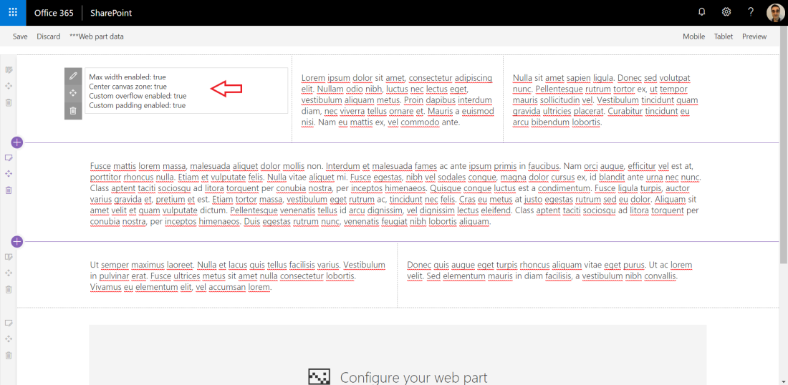

# Workbench customizer

## Summary

This sample shows how the Workbench page can be customized to display in a way that better mimics a modern SharePoint page.
This is done using CSS overrides on some of the page styles, which does not cause any negative impact on your site as the web part is not intended to be consumed by final users, only developers.
The web part also has some properties that control which customizations are applied to the workbench page (all enabled by default). There is also an option to switch the page to Preview after the page is loaded, which gives a UI more close to what end users will see on a published page - this is very useful when doing UI work.

## Usage

### Deploy to tenant

The easiest way to use the solution is to package it up and deploy to the App Catalog. You can then add the web part to the bottom of the O365 Workbench page when developing your custom solutions.

### Run locally

Alternatively, you can add the output files for the web part to a custom SPFx project and the web part will also be served and available both from the local or hosted Workbench page:

* Generate the output files for the solution by executing `gulp bundle --ship`
* Copy all files from `js-workbench-customizer\dist` to the `dist` folder of your custom solution
* Copy the `workbenchCustomizer` folder from `js-workbench-customizer\lib\webparts` to the corresponding webparts folder of your custom solution

Note: This approach will not "pollute" your solution with additional resources or dependencies as the SPFx toolchain will ignore those additional files by default when you package your solution. You can also clean everything by running `gulp clean` as both the lib and dist folders are deleted and recreated again. Git will also ignore dist and lib folders by default, so the files will never be added to source control.

## Used SharePoint Framework Version

## Applies to

* [SharePoint Framework](https://docs.microsoft.com/sharepoint/dev/spfx/sharepoint-framework-overview)

## Prerequisites

* Office 365 subscription with SharePoint Online license
* SharePoint Framework [development environment](https://docs.microsoft.com/sharepoint/dev/spfx/set-up-your-development-environment) already set up.

## Solution

Solution|Author(s)
--------|---------
workbench-customizer|Joel Rodrigues

## Version history

Version|Date|Comments
-------|----|--------
1.0|January 24, 2019|Initial release
1.1|February 05, 2020|Update to SPFx 1.10.0
1.2|June 04, 2020|Added full-width support
1.3|July 07, 2020|Simplified web part
1.4|July 28, 2020|Update styles to minimise toolbar overlap
1.5|July 30, 2020|Update styles to improve full-width mode

## Disclaimer

**THIS CODE IS PROVIDED *AS IS* WITHOUT WARRANTY OF ANY KIND, EITHER EXPRESS OR IMPLIED, INCLUDING ANY IMPLIED WARRANTIES OF FITNESS FOR A PARTICULAR PURPOSE, MERCHANTABILITY, OR NON-INFRINGEMENT.**

---

## Minimal Path to Awesome

* Clone this repository
* in the command line run:
  * `npm install`
  * `gulp serve`

