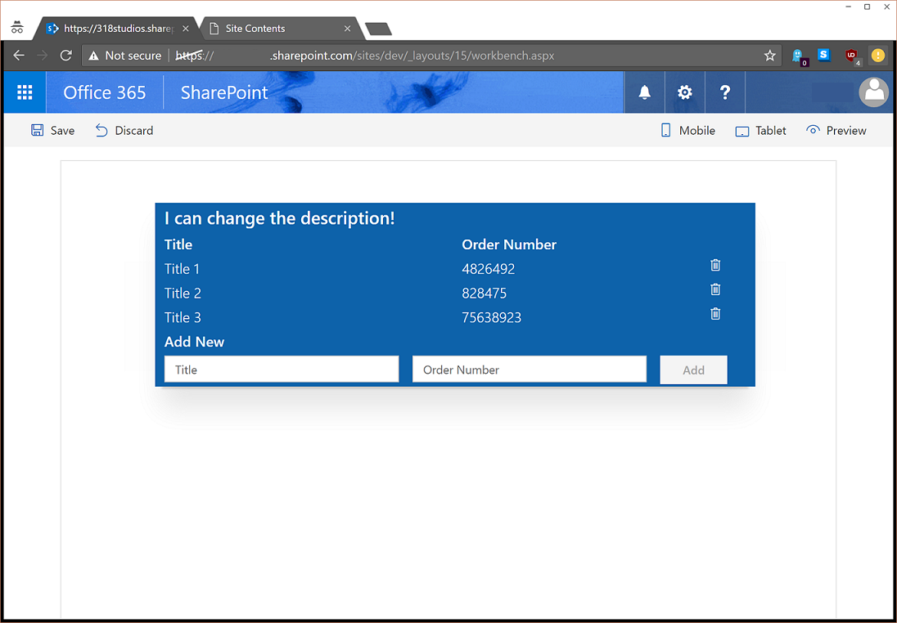

# Sample showing the use of @pnp/sp library with Knockoutjs

## Summary

This webpart demonstrates how to integrate the @pnp/sp library into the SharePoint Framework as well as including mock data and simple list I/O.

## Used SharePoint Framework Version

## Applies to

* [SharePoint Framework](https://docs.microsoft.com/sharepoint/dev/spfx/sharepoint-framework-overview)
* [Office 365](https://docs.microsoft.com/sharepoint/)

## Solution

Solution|Author(s)
--------|---------
spfx-sp-pnp-js-example|Patrick Rodgers ([@mediocrebowler](https://twitter.com/mediocrebowler))

Upgrade to v1.7.0|Gautam Sheth ([@gautamdsheth](https://twitter.com/gautamdsheth))

## Version history

Version|Date|Comments
-------|----|--------
0.0.1|February 28, 2017|Initial release
1.0.0| November 14, 2018| Version Upgrade

## Disclaimer
**THIS CODE IS PROVIDED *AS IS* WITHOUT WARRANTY OF ANY KIND, EITHER EXPRESS OR IMPLIED, INCLUDING ANY IMPLIED WARRANTIES OF FITNESS FOR A PARTICULAR PURPOSE, MERCHANTABILITY, OR NON-INFRINGEMENT.**

---

## Minimal Path to Awesome

- Clone this repo
- In the command line run:
  - `npm install`
  - `gulp serve`
  - Open the *workbench* on your Office 365 Developer tenant
  - Test out the web part

## Features

Demonstrates integration of @pnp/sp js with the SharePoint Framework GA release. Also shows the use of mock data in the local workbench.

