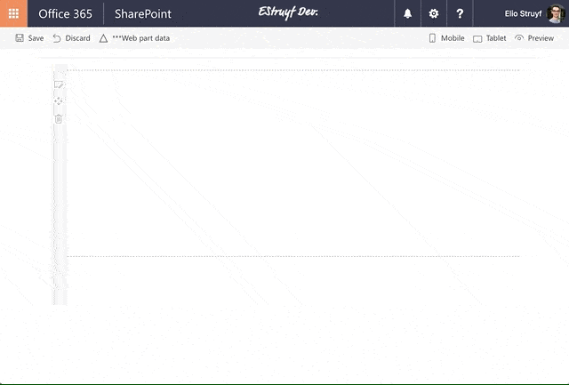

# SharePoint Framework PnP Controls Sample

## Summary

This is a sample project that contains a web part which makes use of the PnP SPFx Controls:

- [SharePoint Framework React Controls](https://www.npmjs.com/package/@pnp/spfx-controls-react)
- [SharePoint Framework Property Controls](https://www.npmjs.com/package/@pnp/spfx-property-controls)



## Used SharePoint Framework Version


## Which PnP SPFx controls are being used in this sample?

The sample makes use of the following controls:
- PropertyFieldListPicker
- PropertyFieldTermPicker
- Placeholder
- ListView (which also uses the FileTypeIcon control)

## Applies to

* [SharePoint Framework](https://docs.microsoft.com/sharepoint/dev/spfx/sharepoint-framework-overview)

## Solution

Solution|Author(s)
--------|---------
pnp-controls|Elio Struyf (MVP, U2U, [@eliostruyf](https://twitter.com/eliostruyf))

## Version history

Version|Date|Comments
-------|----|--------
0.0.1|September 20, 2017|Initial release
0.0.2|March 03, 2018|Update to 1.4.1

## Disclaimer
**THIS CODE IS PROVIDED *AS IS* WITHOUT WARRANTY OF ANY KIND, EITHER EXPRESS OR IMPLIED, INCLUDING ANY IMPLIED WARRANTIES OF FITNESS FOR A PARTICULAR PURPOSE, MERCHANTABILITY, OR NON-INFRINGEMENT.**

---

## Minimal Path to Awesome

To test out this web part, you need to have a library with a managed metadata field. In my case, I made use of a field called **Country**.


Once you have such a library in place, you can copy the code and run the following commands:

```bash
npm install
gulp serve --nobrowser
```


