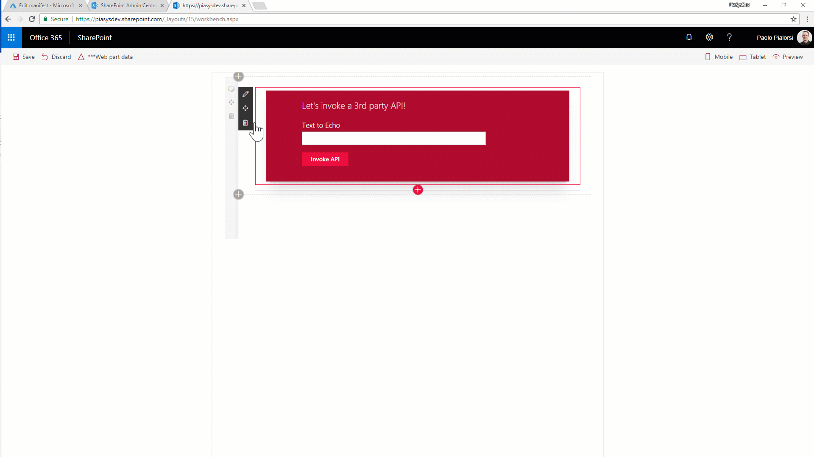

# Consuming Third Party APIs secured with Azure Active Directory within SharePoint Framework

## Summary

This sub folder contains a client-side project that shows how to consume a 3rd party API within SharePoint Framework.



In subfolder _Server-API_ you can find the sample REST API built using ASP.NET MVC.
You will need to publish the web application on a hosting environment (for example an Azure App Service), configure CORS, and configure the application in the Azure AD tenant under the cover of your target SharePoint Online tenant.

## Solution

| Solution  | Author(s) |
| ------------- | ------------- |
| react-3rd-party-api  | Paolo Pialorsi (PiaSys.com - @PaoloPia)   |

## Version history

| Version  | Date | Comments |
| ------------- | ------------- | ------------- |
| 1.0.0  | February 19th 2018   | Initial release |

## Build and run the sample

To build and run this client-side project, you will need to clone and build the tutorials project.

Clone this repo by executing the following command in your console:

```
git clone https://github.com/pnp/sp-dev-fx-webparts.git
```

Navigate to the cloned repo folder which should be the same as the repo name:

```
cd sp-dev-fx-webparts
```

Navigate to the `tutorials` folder:

```
cd tutorials
```

Navigate to the `specific web part` folder:

```
cd 'subfolder'
```


Now run the following command to install the npm packages:

```
npm install
```

This will install the required npm packages and dependencies to build and run the client-side project.

Once the npm packages are installed, run the command to preview your web parts in SharePoint Workbench:

```
gulp serve
```
## Disclaimer

**THIS CODE IS PROVIDED AS IS WITHOUT WARRANTY OF ANY KIND, EITHER EXPRESS OR IMPLIED, INCLUDING ANY IMPLIED WARRANTIES OF FITNESS FOR A PARTICULAR PURPOSE, MERCHANTABILITY, OR NON-INFRINGEMENT.**

----------


