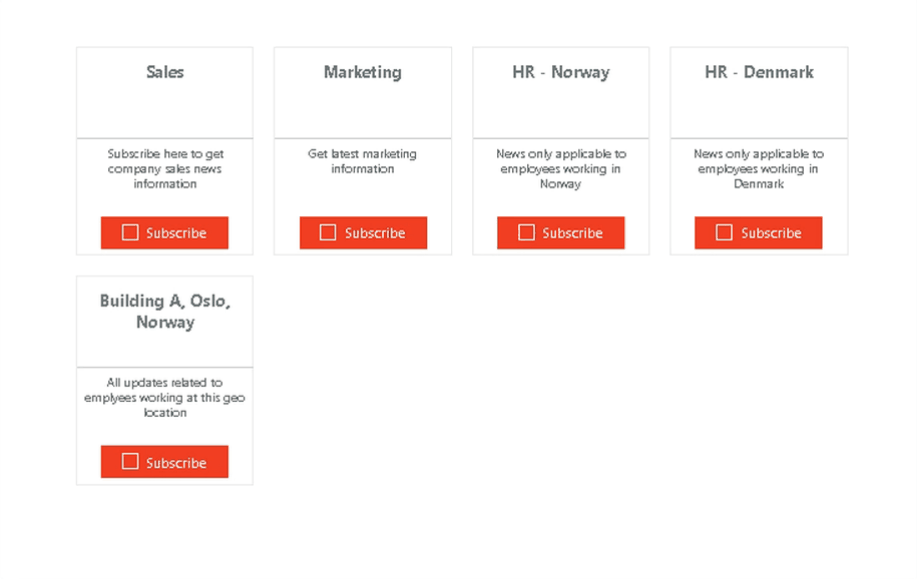
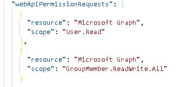
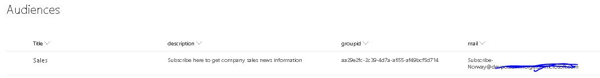
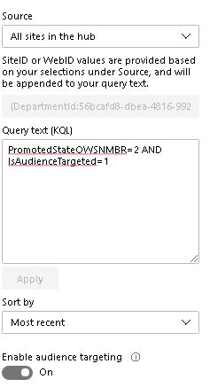

## my-subscriptions


## Summary

We now have audiences in modern sharepoint. The most benefit from this feature is that we can target News/ Article 
to different users groups.
So the idea was to use the concept of audiences and build something called as subscription, when the user subscribes he/she becomes member of that group i.e office 365 groups
Thus giving end users the opportunity on what kind of news/article they would be intrested in.

Please note: This is only applicable to public office 365 groups (Audiences).




Now the user determines what kind of news/article , he wants to see 

Requirements 
1. Graph api to fetch groups i am a member of 
2. Graph api to add/remove current user from office 365 public group

3. A SharePoint list to maintain a group of audiences


Please create list in the following structure, all are text columns.

Also we can use high lighted content webpart to show all subscribed audience news/articles by using following query :


## Used SharePoint Framework Version 1.10


## Applies to

* [SharePoint Framework](https:/dev.office.com/sharepoint)


## Disclaimer

**THIS CODE IS PROVIDED *AS IS* WITHOUT WARRANTY OF ANY KIND, EITHER EXPRESS OR IMPLIED, INCLUDING ANY IMPLIED WARRANTIES OF FITNESS FOR A PARTICULAR PURPOSE, MERCHANTABILITY, OR NON-INFRINGEMENT.**

---

## Minimal Path to Awesome

* Clone this repository
* in the command line run:
  * `npm install`
  * `gulp bundle --ship`
  * `gulp package-solution --ship`
* Add the package to your app catalog
* Approve the Graph API permissions in the SharePoint admin center
* Add the webpart to your page


## Features


### Building the code

```bash
git clone the repo
npm i
npm i -g gulp
gulp
```

This package produces the following:

* lib/* - intermediate-stage commonjs build artifacts
* dist/* - the bundled script, along with other resources
* deploy/* - all resources which should be uploaded to a CDN.

### Build options

gulp clean - TODO
gulp test - TODO
gulp serve - TODO
gulp bundle - TODO
gulp package-solution - TODO
