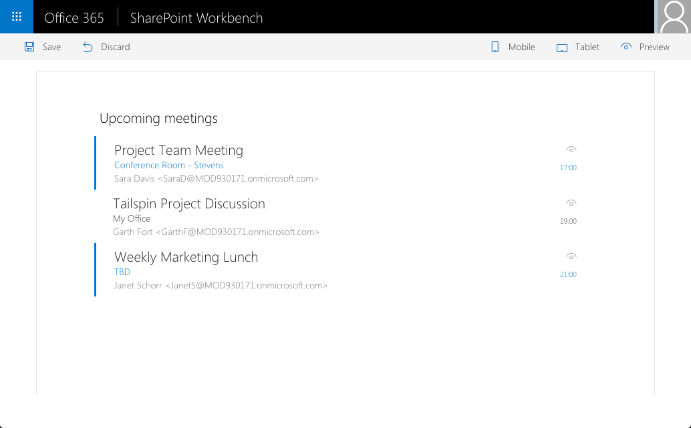

# Azure Active Directory implicit flow authentication samples

## Summary

Sample SharePoint Framework web parts built using React illustrating different scenarios using implicit OAuth flow with Azure Active Directory.

### Upcoming meetings

Sample SharePoint Framework client-side web part built using React showing upcoming meetings for the current user retrieved using the Microsoft Graph.

## Used SharePoint Framework Version 

## Applies to

* [SharePoint Framework](https://docs.microsoft.com/sharepoint/dev/spfx/sharepoint-framework-overview)
* [Office 365 developer tenant](https://docs.microsoft.com/sharepoint/dev/spfx/set-up-your-developer-tenant)

## Solution

Solution|Author(s)
--------|---------
react-aad-implicitflow|Waldek Mastykarz (MVP, Rencore, @waldekm)

## Version history

Version|Date|Comments
-------|----|--------
1.1.0|March 17, 2017|Updated to SPFx GA
1.0.0|September 22, 2016|Initial release

## Disclaimer
**THIS CODE IS PROVIDED *AS IS* WITHOUT WARRANTY OF ANY KIND, EITHER EXPRESS OR IMPLIED, INCLUDING ANY IMPLIED WARRANTIES OF FITNESS FOR A PARTICULAR PURPOSE, MERCHANTABILITY, OR NON-INFRINGEMENT.**

---

## Prerequisites

- Office 365 subscription with SharePoint Online and Exchange

## Minimal Path to Awesome

- clone this repo
- in the Azure Active Directory corresponding to your Office 365 tenant register a new Web Application:
  - as the **Sign-on URL** enter the URL of the hosted version of SharePoint workbench, eg. *https://contoso.sharepoint.com/_layouts/15/workbench.aspx*
  - enable OAuth implicit flow
  - grant the application the **Microsoft Graph/Read user calendars** permission
  - copy the application's ID
- in the `src/webparts/upcomingMeetings/AdalConfig.ts` file in the `clientId` property enter the application ID registered in Azure
- in the command line execute
  - `npm i`
  - `gulp serve --nobrowser`
- navigate to the hosted version of the SharePoint workbench
- add the **Upcoming meetings** web part

## Features

Sample web part in this solution illustrates the following concepts on top of the SharePoint Framework:

- using React for building SharePoint Framework client-side web parts
- using Office UI Fabric React styles for building user experience consistent with SharePoint and Office
- on-demand authentication with the Azure Active Directory using the ADAL JS library
- communicating with the Microsoft Graph using its REST API
- using the ADAL JS library with SharePoint Framework web parts built using React
- passing web part properties to React components

