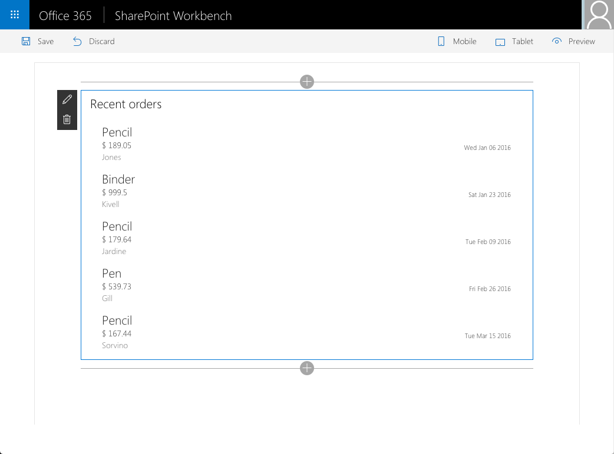

# Call custom Web API secured with AAD from SharePoint Framework client-side web part

## Summary

Sample SharePoint Framework client-side web part illustrating communication with a custom Web API secured with Azure Active Directory.

## Used SharePoint Framework Version 

## Applies to

* [SharePoint Framework Developer Preview](https://docs.microsoft.com/sharepoint/dev/spfx/sharepoint-framework-overview)
* [Office 365 developer tenant](https://docs.microsoft.com/sharepoint/dev/spfx/set-up-your-developer-tenant)

## Solution

Solution|Author(s)
--------|---------
react-aad-webapi|[Waldek Mastykarz](https://github.com/waldekmastykarz)  (MVP, Rencore, @waldekm)

## Version history

Version|Date|Comments
-------|----|--------
1.0|October 10, 2016|Initial release

## Minimal Path to Awesome

- clone this repo

### Deploy custom Web API

- in the Azure Management Portal at https://portal.azure.com create a new API App
  - in the settings enable CORS to all origins using an `*`
- from the **api** folder, in Visual Studio open the **pnp.api.contosoorders.sln** file
- build the solution
- deploy the **pnp.api.contosoorders** project to the newly created API App
- verify that you can access the API by navigating in your web browser to **https://your-api-app.azurewebsites.net/api/orders**

### Secure custom Web API with AAD

- in the Azure Management Portal at https://manage.windowsazure.com navigate to Azure Active Directory and register a new web application:
  - as the name use `Orders API`
  - as the sign-in URL use the URL of the previously created API App 
  - copy the application ID
  - from the **View endpoints** option, copy the GUID from the **Federation Metadata Document**
- in the Azure Management Portal at https://portal.azure.com navigate to the Authentication settings of your API App
  - enable App Service Authentication by switching the toggle to **On**
  - as **Action to take when request is not authenticated** set **Log in with Azure Active Directory**
  - in the list of **Authentication Providers** configure **Azure Active Directory**
    - in the **Client ID** field paste the ID of the newly registered Azure AD application
    - in the **Issuer Url** field enter `https://sts.windows.net/` followed, by the GUID copied from the **Federation Metadata Document**, eg. `https://sts.windows.net/61546bfa-b299-4703-a06d-d682b6401123`
- confirm that the API is secured with AAD by in your web browser navigating to **https://your-api-app.azurewebsites.net/api/orders**. You should be prompted with the AAD login page and after signing in you should see the list of orders returned by the API
- in the Azure Management Portal at https://manage.windowsazure.com navigate to Azure Active Directory and register a new web application
  - as the name use `Orders`
  - as the sign-in URL use `https://your-machine:4321/temp/workbench.html` where *your-machine* is the name of your developer machine
  - add permissions to other applications
    - change the filter to show all applications
    - from the list of applications select **Orders API**
    - in the list of **Delegated Permissions** select **Access Orders API**
  - copy the application ID

### Configure the web part

- in the command line change the working directory to the `webpart` folder
- in the command line run `npm i`
- in your code editor open the `webpart` folder
- in the `./src/webparts/recentOrders/AdalConfig.ts` file
  - replace the empty GUID in the `clientId` property with the application ID of the **Orders** application
  - in the `endpoints` property, replace the URL of the API with the URL of your API App and the empty GUID with the application ID of the **Orders API** app.
- in the `./src/webparts/recentOrders/components/RecentOrders.tsx` file
  - in line 155 replace the empty GUID with the application ID of the **Orders API** application
  - in line 185 replace the URL with the URL of your API App
- in the command line execute `gulp serve`
- add the web part to SharePoint workbench
- in the web part sign in with your organizational account
- the web part should show 5 recently placed orders retrieved from the API hosted on Azure

## Features

This project contains sample Web API returning a fixed set or recently placed orders and a client-side web part connected to that API.

This web part illustrates the following concepts on top of the SharePoint Framework:
- connecting to resources secured with Azure Active Directory from React
- persisting state in React components
- communicating state updates in React components to users
- executing REST API web requests from React components

## Help

We do not support samples, but this community is always willing to help, and we want to improve these samples. We use GitHub to track issues, which makes it easy for  community members to volunteer their time and help resolve issues.

If you're having issues building the solution, please run [spfx doctor](https://pnp.github.io/cli-microsoft365/cmd/spfx/spfx-doctor/) from within the solution folder to diagnose incompatibility issues with your environment.

You can try looking at [issues related to this sample](https://github.com/pnp/sp-dev-fx-webparts/issues?q=label%3A%22sample%3A%20react-aad-webapi%22) to see if anybody else is having the same issues.

You can also try looking at [discussions related to this sample](https://github.com/pnp/sp-dev-fx-webparts/discussions?discussions_q=react-aad-webapi) and see what the community is saying.

If you encounter any issues while using this sample, [create a new issue](https://github.com/pnp/sp-dev-fx-webparts/issues/new?assignees=&labels=Needs%3A+Triage+%3Amag%3A%2Ctype%3Abug-suspected%2Csample%3A%20react-aad-webapi&template=bug-report.yml&sample=react-aad-webapi&authors=@waldekmastykarz&title=react-aad-webapi%20-%20).

For questions regarding this sample, [create a new question](https://github.com/pnp/sp-dev-fx-webparts/issues/new?assignees=&labels=Needs%3A+Triage+%3Amag%3A%2Ctype%3Aquestion%2Csample%3A%20react-aad-webapi&template=question.yml&sample=react-aad-webapi&authors=@waldekmastykarz&title=react-aad-webapi%20-%20).

Finally, if you have an idea for improvement, [make a suggestion](https://github.com/pnp/sp-dev-fx-webparts/issues/new?assignees=&labels=Needs%3A+Triage+%3Amag%3A%2Ctype%3Aenhancement%2Csample%3A%20react-aad-webapi&template=suggestion.yml&sample=react-aad-webapi&authors=@waldekmastykarz&title=react-aad-webapi%20-%20).

## Disclaimer

**THIS CODE IS PROVIDED *AS IS* WITHOUT WARRANTY OF ANY KIND, EITHER EXPRESS OR IMPLIED, INCLUDING ANY IMPLIED WARRANTIES OF FITNESS FOR A PARTICULAR PURPOSE, MERCHANTABILITY, OR NON-INFRINGEMENT.**

