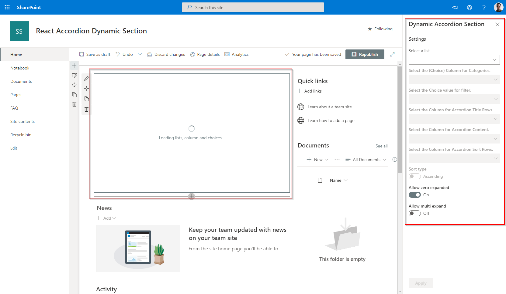
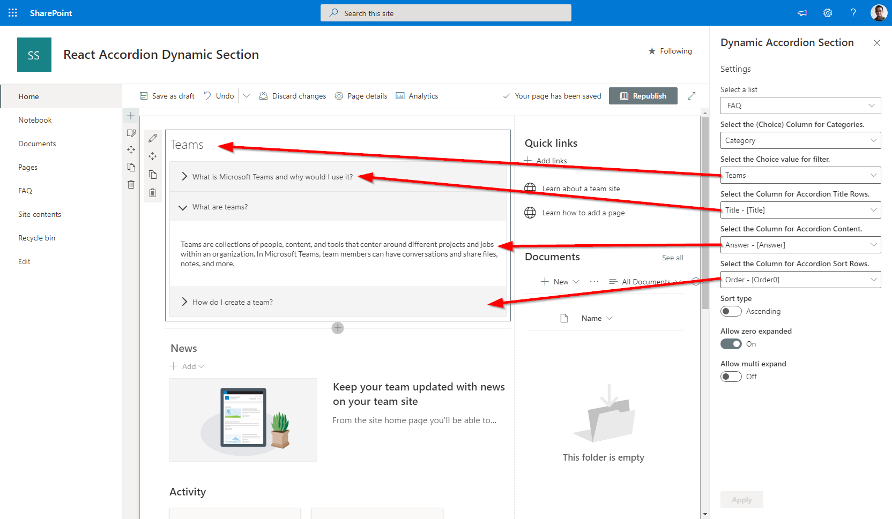

# Dynamic Accordion - FAQ Builder

## Summary

- This sample is based on [Erik Benke](https://github.com/ejbenke) and [Mike Zimmerman](https://github.com/mikezimm)'s [Accordion Section FAQ Builder web part](https://github.com/pnp/sp-dev-fx-webparts/tree/main/samples/react-accordion-section). It adds extended support for single FAQs list based on Category and dynamic properties selection.
- Adds a collapsible accordion section to an Office 365 SharePoint page or Teams Tab.
- Ideal for displaying FAQs.
- When adding the web part, you'll be prompted to select a list from a property panel dropdown (target list must be created with FAQ type Question and Answer.).
- The web part expects a column called **Category** of type choice that will be used as the category.
- The web part will automatically load all the properties in two dropdowns. One for Accordion Title and One for Accordion Content that must be html type.
- This will generate an accordion with one section for each item in the list.
- Modifications/deletions/additions to the list items in the target list of an added web part are automatically reflected on the page.
- To deploy to a Teams tab see current [Microsoft documentation](https://docs.microsoft.com/en-us/sharepoint/dev/spfx/web-parts/get-started/using-web-part-as-ms-teams-tab).

### Usage

**1) Create or use a list for FAQs.  It can have the FAQ format e.g. Title and a Content columns. You can also used the attached STP file if needed.:**

- The value in the Accordion Title property for each item will appear in the heading bars of the Accordion.
- The value in the Accordion Content property for each item will appear in the collapsible content section of the Accordion
- When creating the columns, select "Multiple lines of text". Rich text is now supported within the Content column.

[FAQ list Template for use with the Accordion](./assets/FAQsList.stp)
[FAQ Site Script  use with the Accordion](./assets/FAQsList.json)

**2) Add the Dynamic Accordion Section web part to your page & select your list, category, title and content columns. Click Apply and Publish:**

## Compatibility

 

 

## Applies to

* [SharePoint Framework](https://docs.microsoft.com/sharepoint/dev/spfx/sharepoint-framework-overview)
* [Microsoft 365 tenant](https://docs.microsoft.com/sharepoint/dev/spfx/set-up-your-development-environment)

## Prerequisites

Please create the list as described above

## Solution

| Solution                                   | Author(s)                                                                                            |
| ------------------------------------------ | -----------------------------------------------------------------------------------------------------|
| SPFx Collapsible Accordion Section         | [Erik Benke](https://github.com/ejbenke) ([@erikjbenke](https://twitter.com/erikjbenke))             |
| SPFx Collapsible Accordion Section         | [Mike Zimmerman](https://github.com/mikezimm)                                                        |
| Dynamic SPFx Collapsible Accordion Section | [Jerry Yasir](https://github.com/jyasir)                                                             |
| Dynamic SPFx Collapsible Accordion Section | [Ari Gunawan](https://github.com/AriGunawan) ([@AriGunawan3023](https://twitter.com/AriGunawan3023)) |

## Version history

| Version | Date               | Comments                                                                                            |
| ------- | ------------------ | --------------------------------------------------------------------------------------------------- |
| 1.0     | September 20, 2020 | Reused [Erik Benke] and [Mike Zimmerman] web part                                                   |
| 1.1     | September 20, 2020 | Added Support for Dynamic Column selection for reuseability, Dynamic Property Selection for Columns |
| 1.8     | August 8, 2021     | Add configuration for sorting the items                                                             |

## Minimal Path to Awesome

- Clone or download this repository
- Run in command line:
  - `npm install` to install the npm dependencies
  - `gulp serve` to display in Developer Workbench (recommend using your tenant workbench so you can test with real lists within your site)
- To package and deploy:
  - Use `gulp bundle --ship` & `gulp package-solution --ship`
  - Add the `.sppkg` to your SharePoint App Catalog

## Disclaimer

**THIS CODE IS PROVIDED *AS IS* WITHOUT WARRANTY OF ANY KIND, EITHER EXPRESS OR IMPLIED, INCLUDING ANY IMPLIED WARRANTIES OF FITNESS FOR A PARTICULAR PURPOSE, MERCHANTABILITY, OR NON-INFRINGEMENT.**

## Help

We do not support samples, but we this community is always willing to help, and we want to improve these samples. We use GitHub to track issues, which makes it easy for  community members to volunteer their time and help resolve issues.

If you encounter any issues while using this sample, [create a new issue](https://github.com/pnp/sp-dev-fx-webparts/issues/new?assignees=&labels=Needs%3A+Triage+%3Amag%3A%2Ctype%3Abug-suspected&template=bug-report.yml&sample=react-accordion-dynamic-section&authors=@mikezimm%20@jyasir%20@AriGunawan&title=react-accordion-dynamic-section%20-%20).

For questions regarding this sample, [create a new question](https://github.com/pnp/sp-dev-fx-webparts/issues/new?assignees=&labels=Needs%3A+Triage+%3Amag%3A%2Ctype%3Abug-suspected&template=question.yml&sample=react-accordion-dynamic-section&authors=@mikezimm%20@jyasir%20@AriGunawan&title=react-accordion-dynamic-section%20-%20).

Finally, if you have an idea for improvement, [make a suggestion](https://github.com/pnp/sp-dev-fx-webparts/issues/new?assignees=&labels=Needs%3A+Triage+%3Amag%3A%2Ctype%3Abug-suspected&template=suggestion.yml&sample=react-accordion-dynamic-section&authors=@mikezimm%20@jyasir%20@AriGunawan&title=react-accordion-dynamic-section%20-%20).

