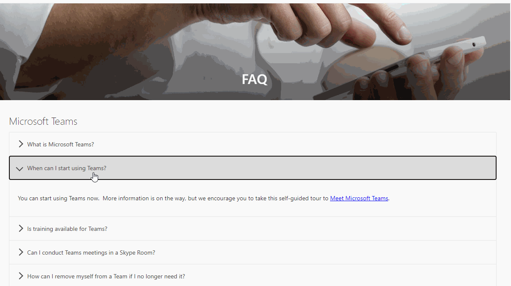
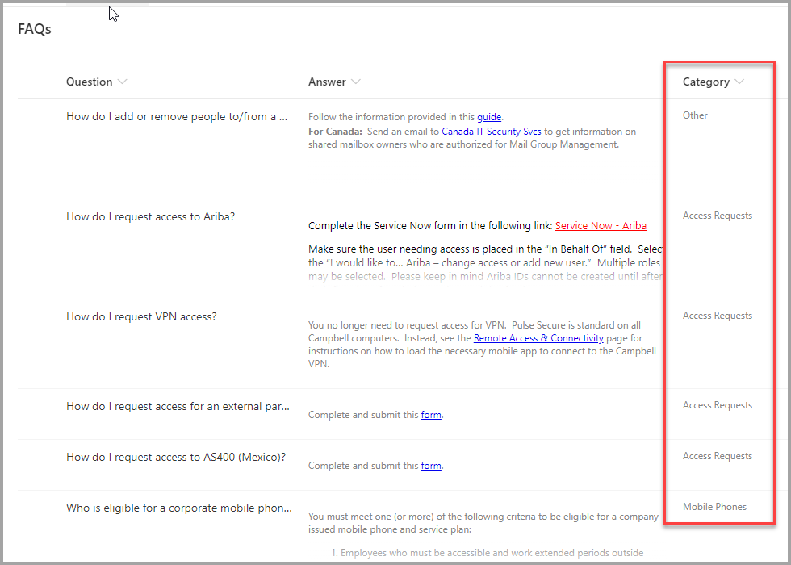
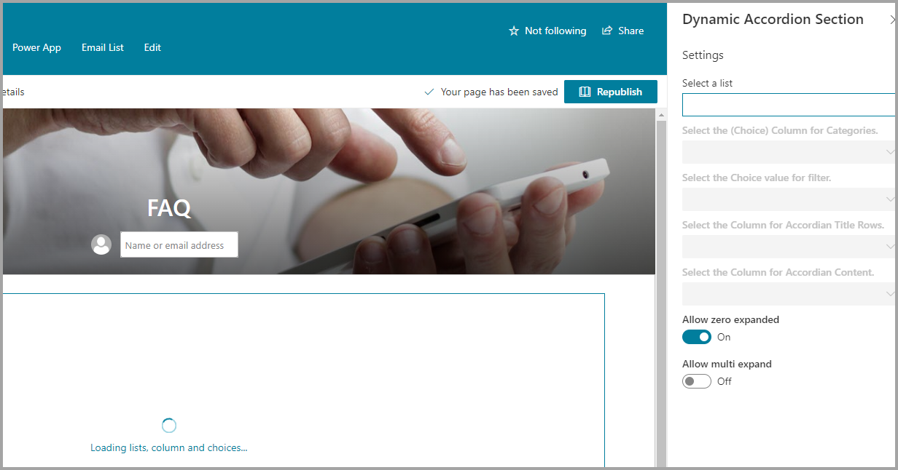
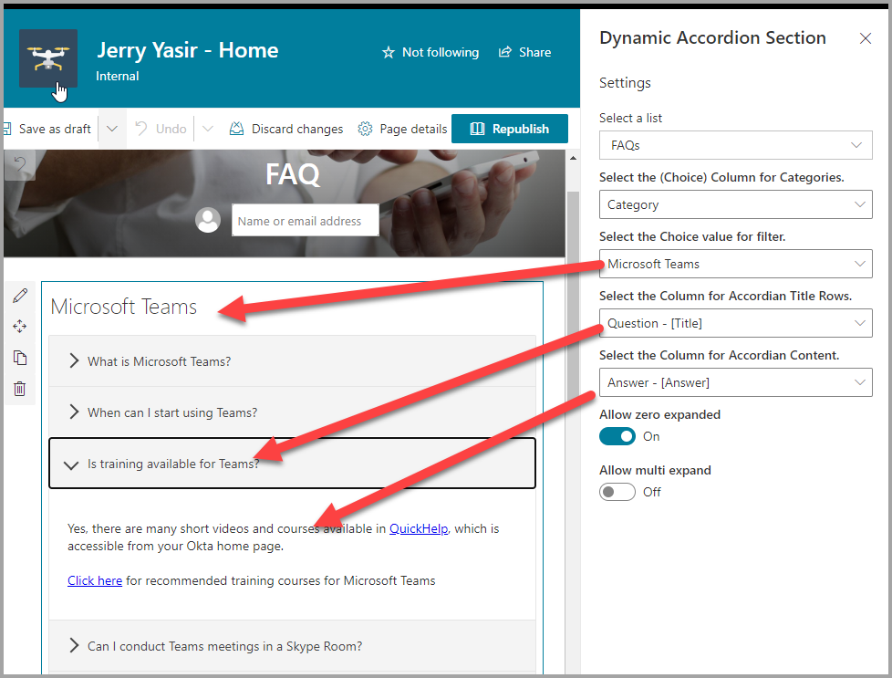

# SPFx Dynamic Accordion - FAQ Builder web part

## Summary

- This sample is based on [Erik Benke] and [Mike Zimmerman] (Accordion Section FAQ Builder web part. I has extended it support single FAQs list based on Category and dynamic properties selection.
- Adds a collapsible accordion section to an Office 365 SharePoint page or Teams Tab.
- Ideal for displaying FAQs.
- When adding the web part, you'll be prompted to select a list from a property panel dropdown (target list must be created with FAQ type Question and Answer.).
- The web part expects a choice type that will be used as Category.
- The web part will automatically load all the properties in two dropdowns. One for Accordion Title and One for Accordion Content that must be html type.
- This will generate an accordion with one section for each item in the list.
- Modifications/deletions/additions to the list items in the target list of an added web part are automatically reflected on the page.
- To deploy to a Teams tab see current [Microsoft documentation](https://docs.microsoft.com/en-us/sharepoint/dev/spfx/web-parts/get-started/using-web-part-as-ms-teams-tab).

### Usage

**1) Create or use a list for FAQs.  It can have the FAQ format e.g. Title and a Content columns. You can also used the attached STP file if needed.:**

- The value in the Accordion Title property for each item will appear in the heading bars of the Accordion.
- The value in the Accordion Content property for each item will appear in the collapsible content section of the Accordion
- When creating the columns, select "Multiple lines of text". Rich text is now supported within the Content column.

**2) Add the Dynamic Accordion Section web part to your page & select your list, category, title and content columns. Click Apply and Publish:**

## Used SharePoint Framework Version

## Applies to

- [SharePoint Framework](https://docs.microsoft.com/sharepoint/dev/spfx/sharepoint-framework-overview)
- [Office 365 tenant](https://docs.microsoft.com/sharepoint/dev/spfx/set-up-your-development-environment)

## Prerequisites

Please create the list as described above

## Solution

| Solution                                   | Author(s)                                                                                |
| ------------------------------------------ | ---------------------------------------------------------------------------------------- |
| SPFx Collapsible Accordion Section         | [Erik Benke](https://github.com/ejbenke) ([@erikjbenke](https://twitter.com/erikjbenke)) |
| SPFx Collapsible Accordion Section         | [Mike Zimmerman](https://github.com/mikezimm)                                            |
| Dynamic SPFx Collapsible Accordion Section | [Jerry Yasir](https://github.com/jyasir)                                                 |

## Version history

| Version | Date               | Comments                                                                                            |
| ------- | ------------------ | --------------------------------------------------------------------------------------------------- |
| 1.0     | September 20, 2020 | Reused [Erik Benke] and [Mike Zimmerman] web part                                               |
| 1.1     | September 20, 2020 | Added Support for Dynamic Column selection for reuseability, Dynamic Property Selection for Columns |

## Disclaimer

**THIS CODE IS PROVIDED _AS IS_ WITHOUT WARRANTY OF ANY KIND, EITHER EXPRESS OR IMPLIED, INCLUDING ANY IMPLIED WARRANTIES OF FITNESS FOR A PARTICULAR PURPOSE, MERCHANTABILITY, OR NON-INFRINGEMENT.**

---

## Minimal Path to Awesome

- Clone or download this repository
- Run in command line:
  - `npm install` to install the npm dependencies
  - `gulp serve` to display in Developer Workbench (recommend using your tenant workbench so you can test with real lists within your site)
- To package and deploy:
  - Use `gulp bundle --ship` & `gulp package-solution --ship`
  - Add the `.sppkg` to your SharePoint App Catalog

