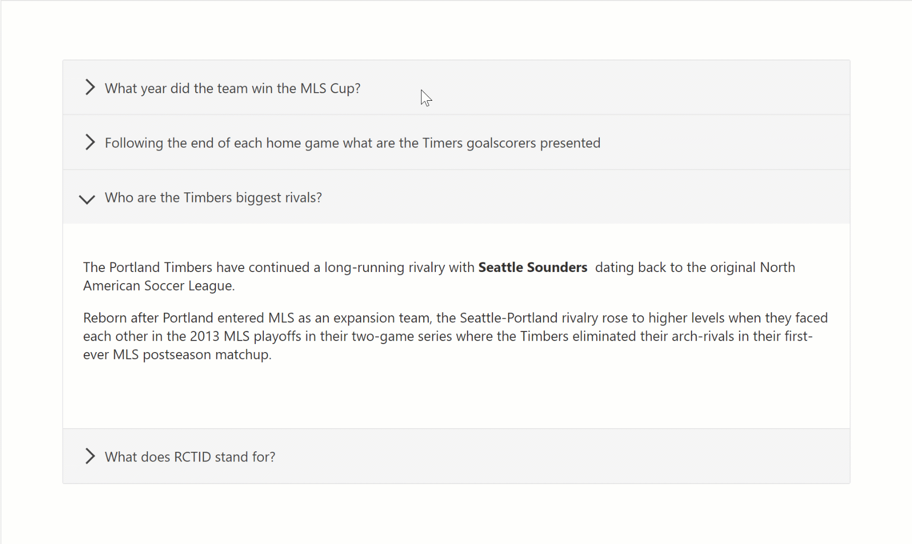
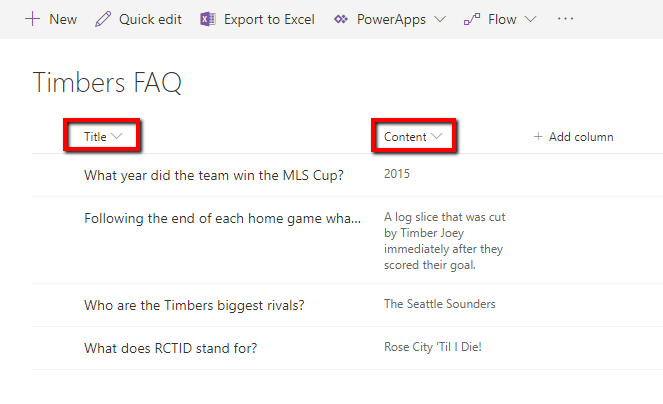
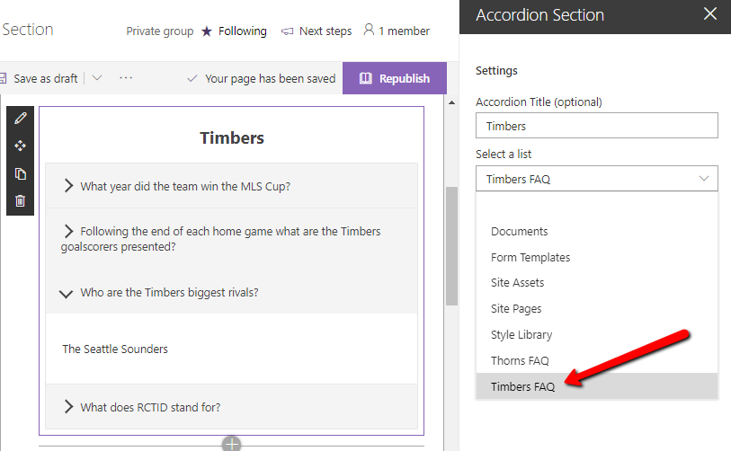
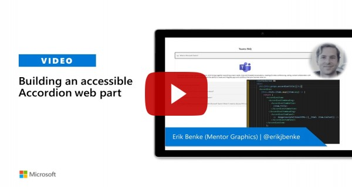

# Accordion Section -- FAQ Builder

## Summary

* Adds a collapsible accordion section to an Office 365 SharePoint page or Teams Tab.
* Ideal for creating FAQs.
* When adding the web part, you'll be prompted to select a list from a property panel dropdown (target list must have a Title column and Content column).  This will generate an accordion with one section for each item in the list.
* Modifications/deletions/additions to the list items in the target list of an added web part are automatically reflected on the page.
* To deploy to a Teams tab see current [Microsoft documentation](https://docs.microsoft.com/en-us/sharepoint/dev/spfx/web-parts/get-started/using-web-part-as-ms-teams-tab).

### Usage

**1) Create or use a list with a Title and a Content column:**

* The value in the Title column for each item will appear in the heading bars of the Accordion.  
* The value in the Content column for each item will appear in the collapsible content section of the Accordion
* When creating the columns, select "Multiple lines of text".  Rich text is now supported within the Content column.

**2) Add the Accordion Section web part to your page & select your list:**  

## Compatibility

 

-Incompatible-red.svg "SharePoint Server 2016 Feature Pack 2 requires SPFx 1.1")

## Applies to

* [SharePoint Framework](https://docs.microsoft.com/sharepoint/dev/spfx/sharepoint-framework-overview)
* [Office 365 tenant](https://docs.microsoft.com/sharepoint/dev/spfx/set-up-your-development-environment)

## Prerequisites

Please create the list as described above

## Solution

Solution|Author(s)
--------|---------
SPFx Collapsible Accordion Section|[Erik Benke](https://github.com/ejbenke) ([@erikjbenke](https://twitter.com/erikjbenke))
SPFx Collapsible Accordion Section|[Mike Zimmerman](https://github.com/mikezimm)
SPFx Collapsible Accordion Section|[Ravi Chandra](https://github.com/Ravikadri)
SPFx Collapsible Accordion Section|[Jack Vinitsky](https://github.com/jack-vinitsky)

## Version history

Version|Date|Comments
-------|----|--------
1.0|August 14, 2019|Initial release
1.1|September 19, 2019|Minor updates, adding to GitHub
1.2|April 15, 2020|Added Polyfills for IE11 compatibility
1.3|July 10, 2020|Adding Rich Text support for Content panels
1.4|July 10, 2020|Upgraded to SPFx 1.10.
1.5|September 1, 2020|Adds ability to click on expanded section headers to collapse accordions
1.6|September 2, 2020|Added Web Part Title, and ability to expand multiple sections
1.7|January 5, 2021|Fixed web part title style to be consistent with first-party web parts; updated other dependencies

## Minimal Path to Awesome

- Clone or download this repository
- Run in command line:
  - `npm install` to install the npm dependencies
  - `gulp serve` to display in Developer Workbench (recommend using your tenant workbench so you can test with real lists within your site)
- To package and deploy:
  - Use `gulp bundle --ship` & `gulp package-solution --ship`
  - Add the `.sppkg` to your SharePoint App Catalog

>  This sample can also be opened with [VS Code Remote Development](https://code.visualstudio.com/docs/remote/remote-overview). Visit https://aka.ms/spfx-devcontainer for further instructions.

## Video

## Help

We do not support samples, but we this community is always willing to help, and we want to improve these samples. We use GitHub to track issues, which makes it easy for  community members to volunteer their time and help resolve issues.

If you're having issues building the solution, please run [spfx doctor](https://pnp.github.io/cli-microsoft365/cmd/spfx/spfx-doctor/) from within the solution folder to diagnose incompatibility issues with your environment.

You can try looking at [issues related to this sample](https://github.com/pnp/sp-dev-fx-webparts/issues?q=label%3A%22sample%3A%20react-accordion-section") to see if anybody else is having the same issues.

You can also try looking at [discussions related to this sample](https://github.com/pnp/sp-dev-fx-webparts/discussions?discussions_q=react-accordion-section) and see what the community is saying.

If you encounter any issues while using this sample, [create a new issue](https://github.com/pnp/sp-dev-fx-webparts/issues/new?assignees=&labels=Needs%3A+Triage+%3Amag%3A%2Ctype%3Abug-suspected%2Csample%3A%20react-accordion-section&template=bug-report.yml&sample=react-accordion-section&authors=@ejbenke%20@mikezimm%20@Ravikadri%20@jack-vinitsky&title=react-accordion-section%20-%20).

For questions regarding this sample, [create a new question](https://github.com/pnp/sp-dev-fx-webparts/issues/new?assignees=&labels=Needs%3A+Triage+%3Amag%3A%2Ctype%3Aquestion%2Csample%3A%20react-accordion-section&template=question.yml&sample=react-accordion-section&authors=@ejbenke%20@mikezimm%20@Ravikadri%20@jack-vinitsky&title=react-accordion-section%20-%20).

Finally, if you have an idea for improvement, [make a suggestion](https://github.com/pnp/sp-dev-fx-webparts/issues/new?assignees=&labels=Needs%3A+Triage+%3Amag%3A%2Ctype%3Aenhancement%2Csample%3A%20react-accordion-section&template=question.yml&sample=react-accordion-section&authors=@ejbenke%20@mikezimm%20@Ravikadri%20@jack-vinitsky&title=react-accordion-section%20-%20).

## Disclaimer

**THIS CODE IS PROVIDED *AS IS* WITHOUT WARRANTY OF ANY KIND, EITHER EXPRESS OR IMPLIED, INCLUDING ANY IMPLIED WARRANTIES OF FITNESS FOR A PARTICULAR PURPOSE, MERCHANTABILITY, OR NON-INFRINGEMENT.**

