# Adaptive Cards Host

## Summary

[Adaptive Cards](https://adaptivecards.io/) are platform-agnostic snippets of user interface, written in JSON, that apps and services can openly exchange.

You'll find Adaptive Cards in many Microsoft products such as Microsoft Bots Framework, Cortana Skills, Outlook Actionable Messages, Power Automate, Power Virtual Agents, Microsoft Teams, Windows Timeline, and so on.

This sample creates an Adaptive Cards Host web part that you can use to display Adaptive Cards in your SharePoint applications.

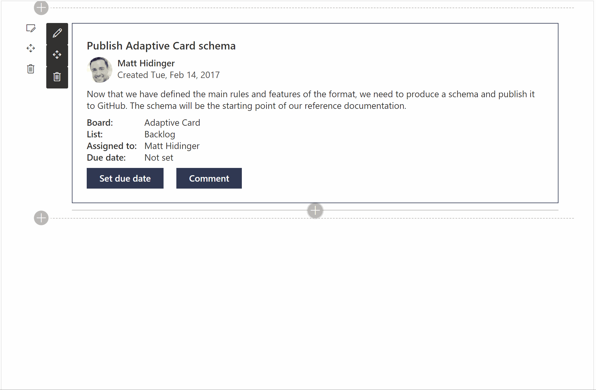


## Compatibility


 


-Incompatible-red.svg "SharePoint Server 2016 Feature Pack 2 requires SPFx 1.1")


## Applies to

* [SharePoint Framework](https://docs.microsoft.com/sharepoint/dev/spfx/sharepoint-framework-overview)
* [Office 365 tenant](https://docs.microsoft.com/sharepoint/dev/spfx/set-up-your-development-environment)

## Prerequisites

There are no pre-requisites, but you'll probably want to have some [Adaptive Cards samples](https://adaptivecards.io/samples/) ready to try out the web part.

## Solution

Solution|Author(s)
--------|---------
react-adaptivecards | [Hugo Bernier](https://github.com/hugoabernier) ([Tahoe Ninjas](https://tahoeninjas.blog), [@bernier](https://twitter.com/bernierh))
react-adaptivecards | Paul Schaeflein ([http://www.schaeflein.net](http://www.schaeflein.net), [@paulschaeflein](https://twitter.com/paulschaeflein))

## Version history

Version|Date|Comments
-------|----|--------
1.0.0|March 24, 2020|Initial release
2.0.0|April 06, 2020|Added data and template URLs
2.1.0|June 11, 2020|Fixed breaking changes introduced with Adaptive Card Templating in May update
2.2.0|August 25, 2020|Upgraded to SPFx 1.11
2.2.1|February 23, 2021|Fixed FluentUI dependencies introduced with newer versions of Adaptive Cards React.
2.3.0|August 2, 2021|Upgraded to SPFx 1.12.1

## Minimal Path to Awesome

* Clone this repository
* From your command line, change to the folder for this sample (`react-adaptivecards`)
* In the command line run:
  * `npm install`
  * `gulp serve`

>  This sample can also be opened with [VS Code Remote Development](https://code.visualstudio.com/docs/remote/remote-overview). Visit https://aka.ms/spfx-devcontainer for further instructions.

> Don't want to clone the entire repository? Try downloading this folder [as a Zip file](https://pnp.github.io/download-partial/?url=https://github.com/pnp/sp-dev-fx-webparts/tree/main/samples/react-adaptivecards). Unzip the file, and continue with the command-line instructions.

## Features

The sample also supports the following features and concepts:

### Adaptive Cards

This web part supports all features of the [Adaptive Cards schema](https://adaptivecards.io/explorer), including the **Preview** Adaptive Card Templating features (see below).

The web part uses a brand new control called `AdaptiveCard`, which you can use to embed Adaptive Cards in your own solutions.

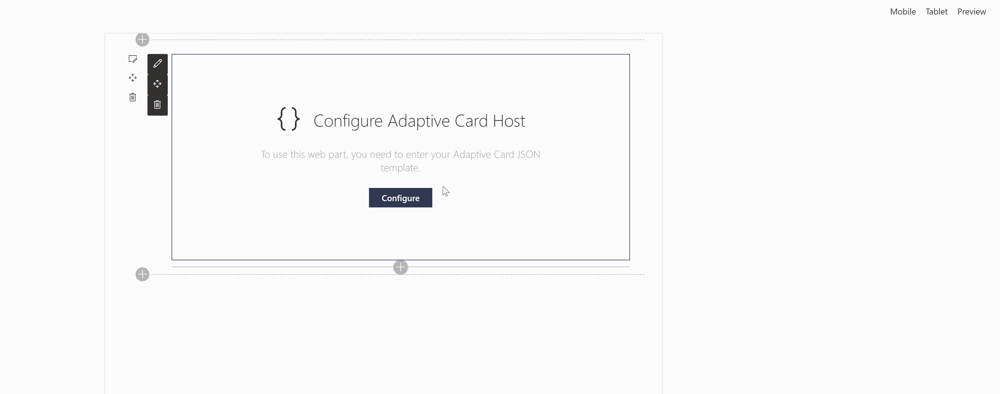

To use the web part, follow these simple steps:

1. Insert the **Adaptive Cards Host** web part on your page
2. When prompted to **Configure Adaptive Card Host**, click **Configure** to display the property pane.
3. Select **Template JSON** code editor and paste your Adaptive Card template JSON.  You can find template JSON samples on the Adaptive Cards [samples and templates page](https://adaptivecards.io/samples/). Alternatively, you can copy the following JSON:

```json
{
  "$schema": "http://adaptivecards.io/schemas/adaptive-card.json",
  "type": "AdaptiveCard",
  "version": "1.0",
  "body": [
    {
      "type": "TextBlock",
      "text": "Create Adaptive Card web parts",
      "weight": "bolder",
      "size": "medium"
    },
    {
      "type": "ColumnSet",
      "columns": [
        {
          "type": "Column",
          "width": "auto",
          "items": [
            {
              "type": "Image",
              "url": "https://pbs.twimg.com/profile_images/1112818195797176322/jAUChJDM_400x400.jpg",
              "size": "small",
              "style": "person"
            }
          ]
        },
        {
          "type": "Column",
          "width": "stretch",
          "items": [
            {
              "type": "TextBlock",
              "text": "Hugo Bernier",
              "weight": "bolder",
              "wrap": true
            },
            {
              "type": "TextBlock",
              "spacing": "none",
              "text": "Created {{DATE(2020-03-24T06:08:39Z, SHORT)}}",
              "isSubtle": true,
              "wrap": true
            }
          ]
        }
      ]
    },
    {
      "type": "TextBlock",
      "text": "Now that we have a control to embed Adaptive Cards in SharePoint web parts, we need to create some cool web parts.",
      "wrap": true
    },
    {
      "type": "FactSet",
      "facts": [
        {
          "title": "Board:",
          "value": "Web Part Samples"
        },
        {
          "title": "List:",
          "value": "Backlog"
        },
        {
          "title": "Assigned to:",
          "value": "Hugo Bernier"
        },
        {
          "title": "Due date:",
          "value": "Not set"
        }
      ]
    }
  ],
  "actions": [
    {
      "type": "Action.ShowCard",
      "title": "Set due date",
      "card": {
        "type": "AdaptiveCard",
        "body": [
          {
            "type": "Input.Date",
            "id": "dueDate"
          }
        ],
        "actions": [
          {
            "type": "Action.Submit",
            "title": "OK"
          }
        ]
      }
    },
    {
      "type": "Action.ShowCard",
      "title": "Comment",
      "card": {
        "type": "AdaptiveCard",
        "body": [
          {
            "type": "Input.Text",
            "id": "comment",
            "isMultiline": true,
            "placeholder": "Enter your comment"
          }
        ],
        "actions": [
          {
            "type": "Action.Submit",
            "title": "OK"
          }
        ]
      }
    }
  ]
}
```

### Adaptive Card Templating

[Adaptive Card Templating](https://docs.microsoft.com/en-us/adaptive-cards/templating/) is a new feature that allows you to separate your Adaptive Card data from its layout. 

The web part allows you to **Use Adaptive Card Templating** features with a simple toggle.

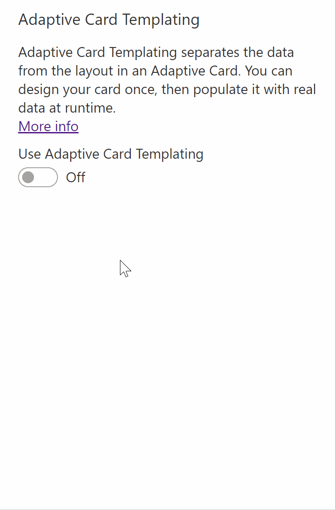

When you use **Adaptive Card Templating**, the web part will prompt you to enter two things:

* Your Adaptive Card template JSON
* Some data -- either as a JSON structure or by connecting to a SharePoint list or document library.

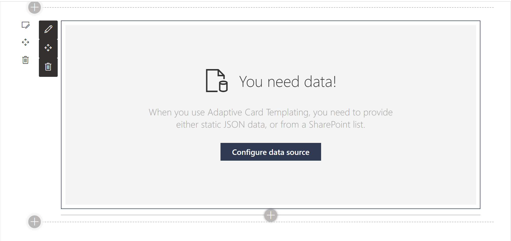

When browsing the [Adaptive Cards samples and templates](https://adaptivecards.io/samples/) page, you can enable Adaptive Card Templating by toggling the **Use Adaptive Card Templating** setting on the page.

To use an Adaptive Card Templating sample, copy the **Template JSON** to the web part's **Template JSON**, and the **Data JSON** to the **Data JSON** web part property.

When you import a template JSON with Adaptive Card templating syntax, the web part will remind you that you should turn on **Use Adaptive Card Templating**.

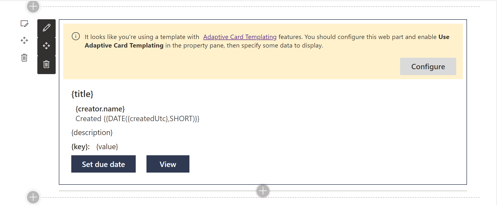

Using Adaptive Card Templating, you can connect your Adaptive Card to live data from a SharePoint list or document library.

To do so, follow these steps:

1. In your SharePoint list or document library, create a view and define the columns you want to display, as well as your filter, sort, and limit options. The Adaptive Card will use the same settings.
2. Add the **Adaptive Card Host** web part to a SharePoint page.
3. Edit the web part's property pane. We'll skip the **Template JSON** and go straight to the **Adaptive Card Templating** section.
4. Turn on **Use Adaptive Card Templating**
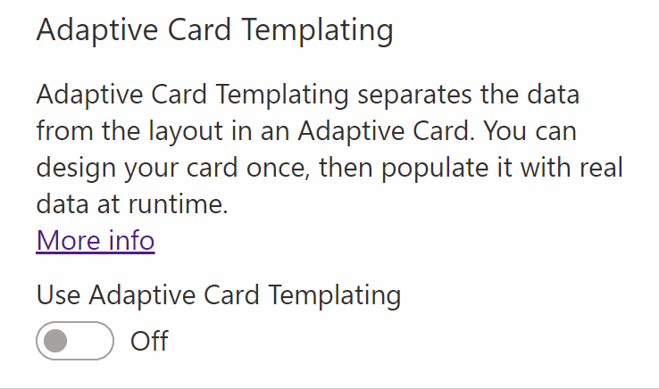
5. From the **Data Source**, select **List**
6. From the **Select a list** drop-down, pick your list or document library.
7. From the **Select a view** drop-down, pick the view you created in **Step 1**
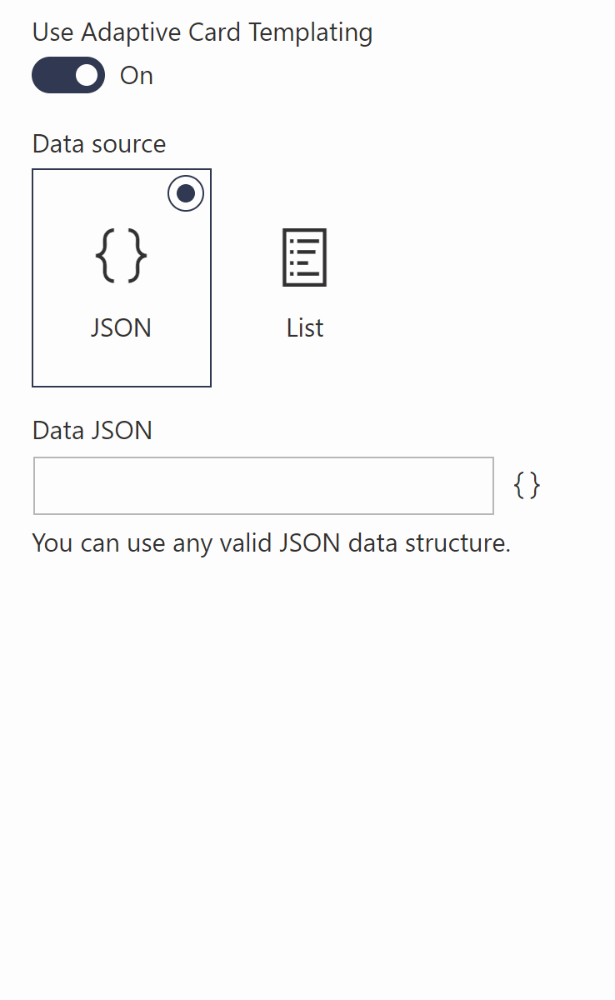
8. To create your template JSON, you'll need to know what data your web part will receive from your list or library. If you need help with finding out what your data looks like, the web part will log your data JSON to your browser's dev tools console when your page is in **Edit** mode. Just look for **Data JSON** on the **Console** tab and copy that JSON.
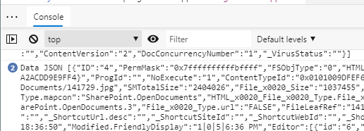
9. Armed with your **Data JSON**, go to the [Adaptive Card Designer](https://adaptivecards.io/designer) and paste your **Data JSON** in the **Sample Data Editor** then select the **Copy the structure of this data into the Data Structure toolbox** button to load your sample data into the designer.
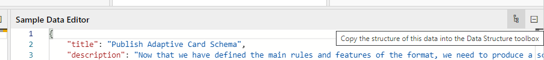
10. Create your Adaptive Card template using the editor. For repeating rows of data, make sure to bind your `Container` or `ColumnSet` to the `{$root}` **Data context**. All repeating items within the container/column set should bind to the `{$data}` **Data context**. Make sure to use the **Preview mode** to test your template before continuing.
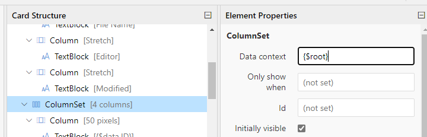
11. Copy your template JSON from the **Card Payload Editor**
12. Back on your SharePoint page, paste your JSON in the web parts **Template JSON**

> NOTE: In a future version of this web part, we'll embed an Adaptive Card editor to make this process easier.

For example, this is a very **basic** template JSON for a SharePoint Document Library**:

```json
{
    "type": "AdaptiveCard",
    "body": [
        {
            "type": "ColumnSet",
            "columns": [
                {
                    "type": "Column",
                    "width": "50px",
                    "id": "I",
                    "items": [
                        {
                            "type": "TextBlock",
                            "text": "ID",
                            "weight": "Bolder"
                        }
                    ]
                },
                {
                    "type": "Column",
                    "width": "stretch",
                    "items": [
                        {
                            "type": "TextBlock",
                            "text": "File Name",
                            "weight": "Bolder"
                        }
                    ]
                },
                {
                    "type": "Column",
                    "width": "stretch",
                    "items": [
                        {
                            "type": "TextBlock",
                            "text": "Editor",
                            "weight": "Bolder"
                        }
                    ]
                },
                {
                    "type": "Column",
                    "width": "stretch",
                    "items": [
                        {
                            "type": "TextBlock",
                            "text": "Modified",
                            "weight": "Bolder"
                        }
                    ]
                }
            ]
        },
        {
            "type": "ColumnSet",
            "columns": [
                {
                    "type": "Column",
                    "width": "50px",
                    "items": [
                        {
                            "type": "TextBlock",
                            "text": "{ID}",
                            "$data": "{$data}"
                        }
                    ]
                },
                {
                    "type": "Column",
                    "width": "stretch",
                    "items": [
                        {
                            "type": "TextBlock",
                            "text": "{FileLeafRef}",
                            "$data": "{$data}"
                        }
                    ]
                },
                {
                    "type": "Column",
                    "width": "stretch",
                    "items": [
                        {
                            "type": "TextBlock",
                            "text": "{Editor[0].title}",
                            "$data": "{$data}"
                        }
                    ]
                },
                {
                    "type": "Column",
                    "width": "stretch",
                    "items": [
                        {
                            "type": "TextBlock",
                            "text": "{Modified}",
                            "$data": "{$data}"
                        }
                    ]
                }
            ],
            "$data": "{$root}"
        }
    ],
    "$schema": "http://adaptivecards.io/schemas/adaptive-card.json",
    "version": "1.0"
}
```

> DISCLAIMER: The sample above focuses on simplicity to get you started. We'd recommend you explore [list formatting](https://aka.ms/list-formatting) before using Adaptive Cards to render your lists. However, if you find that list formatting does not meet your needs, try using Adaptive Cards.

### Adaptive Card Actions

The Adaptive Card schema supports [Actions](https://adaptivecards.io/explorer/Action.OpenUrl.html), which allow you to create interactive Adaptive Cards. 

The web part supports all Adaptive Card actions, including:

* [`Action.OpenUrl`](https://adaptivecards.io/explorer/Action.OpenUrl.html)
* [`Action.Submit`](https://adaptivecards.io/explorer/Action.Submit.html)
* [`Action.ShowCard`](https://adaptivecards.io/explorer/Action.ShowCard.html)
* [`Action.ToggleVisibility`](https://adaptivecards.io/explorer/Action.ToggleVisibility.html)

However, if you want to support `Action.Submit` in your own web part, we recommend you implement your own `onExecuteAction` event handler on your `AdaptiveCard` control. The sample will simply pop-up an alert instead of performing a submit.

### Markdown Support

Adaptive Cards provide support for Markdown syntax, but they do not render the Markdown.

In our sample, we used [Markdown-it](https://www.npmjs.com/package/markdown-it) to process any Markdown syntax in the rendered Adaptive Card before displaying it in the web part.

### Fallback Support

Adaptive Cards provide a mechanism for handling unknown Adaptive Card elements called **Fallback**.

When the client doesn't support an Adaptive Card element, or the version specified, it will display text (or markdown) by specifying a `fallbackText` element.

The web part provides fallback handling.

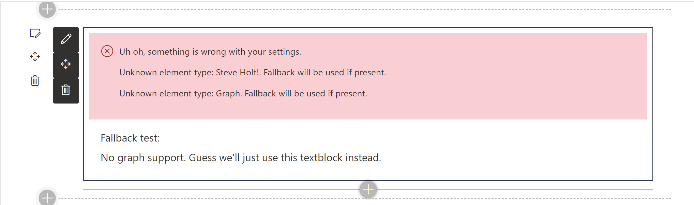

### Support for UI Fabric

The component that is responsible for rendering Adaptive Cards in every application is called the **Adaptive Card Host**. It is the responsibility of every Adaptive Card Host to render the cards so that they take on the appearance of the application where the Adaptive Card will be displayed.

The following is an example of how the same Adaptive Card renders differently in each Adaptive Card Host:
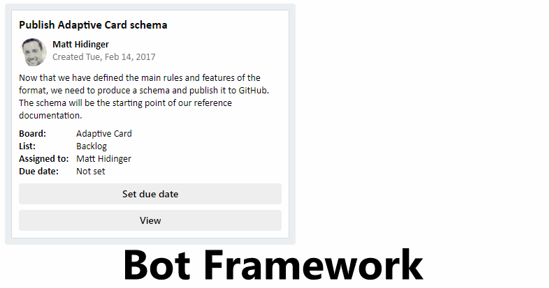

When the web part renders Adaptive Cards in SharePoint, it injects [UI Fabric](https://developer.microsoft.com/en-us/fabric#/) styles to ensure that the rendered card blends in with other SharePoint content.

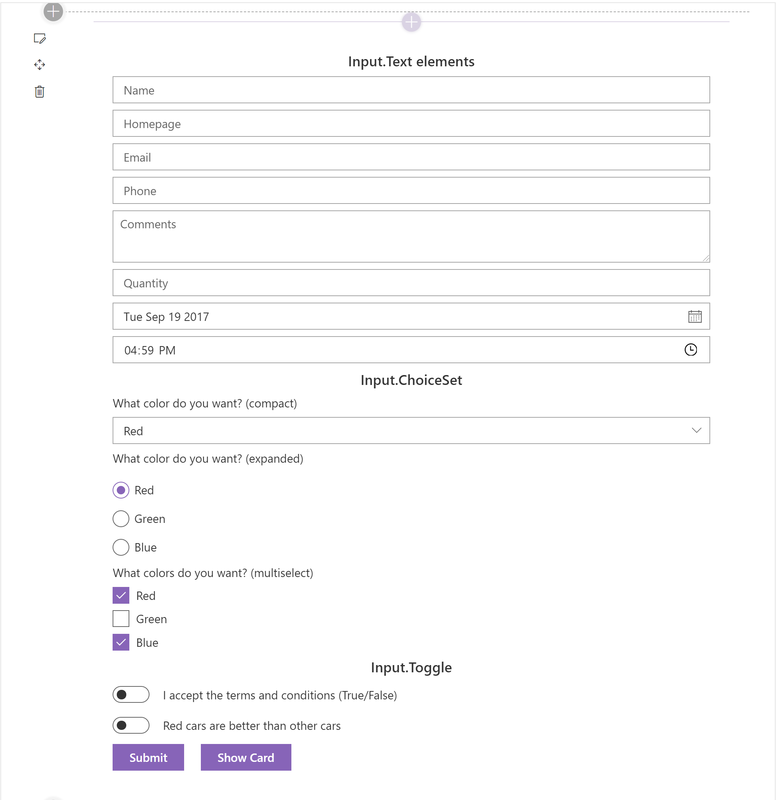

The web part also ensures that the Adaptive Cards resize according to the web part's dimensions and adapt to the site's theme.

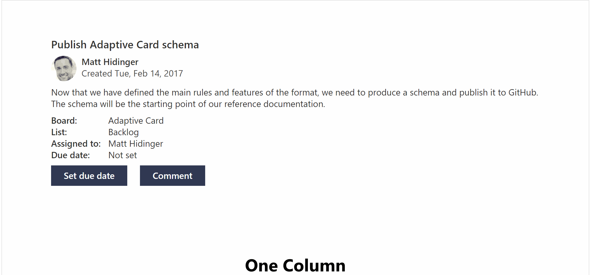

### Section Background Color Support

In addition to theme color support, the web part uses the method described at [Supporting Section Background](https://docs.microsoft.com/en-us/sharepoint/dev/spfx/web-parts/guidance/supporting-section-backgrounds) to adjust to changing section colors.

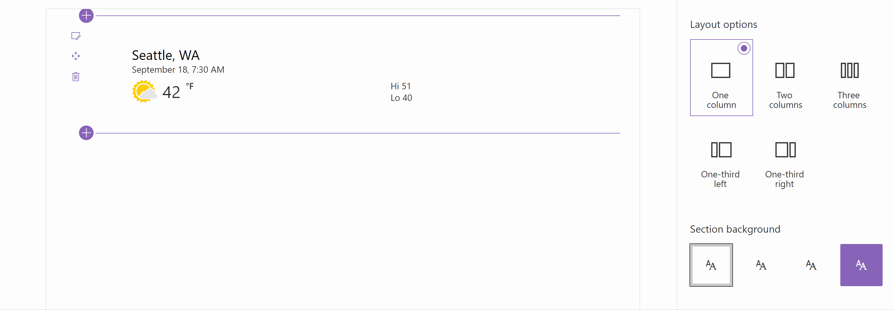

Keep in mind that some Adaptive Cards may include images which may not render well on different background colors. Also, the **Strong** section color may cause action buttons to render the same color as the background, but this appears to be a limitation of themes in SharePoint rather than a limitation of Adaptive Cards.

### SharePoint RenderListDataAsStream API

To retrieve your list data, we use PnPJS's [RenderListDataAsStream](https://pnp.github.io/pnpjs/sp/lists/#render-list-data-as-stream) method. `RenderListDataAsStream` is the same method SharePoint calls when rendering lists and document libraries.

The method allows us to pass the selected View's CAML query and retrieve all the relevant data we need in a single call -- including the values for lookup and managed metadata fields.

### Dynamically Loading Property Pane Resources

Our web part uses the [Property Field Code Editor](https://sharepoint.github.io/sp-dev-fx-property-controls/controls/PropertyFieldCodeEditor/) from the [@pnp/spfx-property-controls](https://sharepoint.github.io/) library.

However, as you load more controls in your web part's property pane, you may notice that your web part takes longer to load. That is because the bundle sizes tend to increase with each new library you include in your solution.

This web part uses `loadPropertyResources` to dynamically load some of its property pane controls when the property pane is shown, as described in the Microsoft documentation on [Dynamic loading](https://docs.microsoft.com/en-us/sharepoint/dev/spfx/dynamic-loading#special-property-pane-dynamic-loading).

You can use `loadPropertyResources` in your web part to reduce the number of resources that are loaded when the web part renders, and only load resources when the property pane of your web part is shown.

### Dependent Property Pane Controls

The web part sample conditionally hides and shows property pane controls depending on which settings you choose.

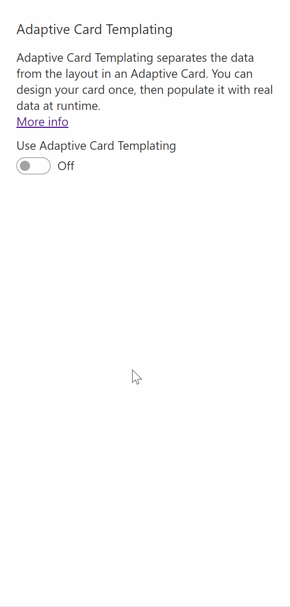

### CodeTour

This project contains a CodeTour that will walk you through the areas of interest. To use it, make sure you install [CodeTour](https://marketplace.visualstudio.com/items?itemName=vsls-contrib.codetour) for Visual Studio Code. When you open the project, you'll be prompted to start the tour, but you can also find the **Code Walk-through** tour in the **CodeTour** pane.

## For More Information

If you'd like to read more about the various concepts illustrated in this sample, please refer to the following links:

* [Adaptive Cards](https://adaptivecards.io/)
* [Adaptive Card Templating](https://docs.microsoft.com/en-us/adaptive-cards/templating/)
* [Adaptive Cards Designer](https://adaptivecards.io/designer/)
* [Adaptive Cards Viewer for Visual Studio Code](https://marketplace.visualstudio.com/items?itemName=tomlm.vscode-adaptivecards)
* [Dynamic Loading of Property Pane Resources](https://docs.microsoft.com/en-us/sharepoint/dev/spfx/dynamic-loading#special-property-pane-dynamic-loading)
* [Supporting Section Background](https://docs.microsoft.com/en-us/sharepoint/dev/spfx/web-parts/guidance/supporting-section-backgrounds)
* [Use cascading dropdowns in web part properties](https://docs.microsoft.com/en-us/sharepoint/dev/spfx/web-parts/guidance/use-cascading-dropdowns-in-web-part-properties)
* [Using the SharePoint RenderListDataAsStream API to fetch lookup and single managed metadata field values](https://www.eliostruyf.com/using-sharepoint-renderlistdataasstream-api-fetch-lookup-single-managed-metadata-field-values/)
* [RenderListDataAsStream](https://pnp.github.io/pnpjs/sp/lists/#render-list-data-as-stream)
* [Introduction to Adaptive Cards](https://poszytek.eu/en/microsoft-en/introduction-to-adaptive-cards/)

## Video

[](https://www.youtube.com/watch?v=gWrvC-0HF4A "Adaptive Cards Host SharePoint Framework web part")

## Help

We do not support samples, but this community is always willing to help, and we want to improve these samples. We use GitHub to track issues, which makes it easy for  community members to volunteer their time and help resolve issues.

If you're having issues building the solution, please run [spfx doctor](https://pnp.github.io/cli-microsoft365/cmd/spfx/spfx-doctor/) from within the solution folder to diagnose incompatibility issues with your environment.

You can try looking at [issues related to this sample](https://github.com/pnp/sp-dev-fx-webparts/issues?q=label%3A%22sample%3A%20react-adaptivecards") to see if anybody else is having the same issues.

You can also try looking at [discussions related to this sample](https://github.com/pnp/sp-dev-fx-webparts/discussions?discussions_q=react-adaptivecards) and see what the community is saying.

If you encounter any issues while using this sample, [create a new issue](https://github.com/pnp/sp-dev-fx-webparts/issues/new?assignees=&labels=Needs%3A+Triage+%3Amag%3A%2Ctype%3Abug-suspected%2Csample%3A%20react-adaptivecards&template=bug-report.yml&sample=react-adaptivecards&authors=@hugoabernier&title=react-adaptivecards%20-%20).

For questions regarding this sample, [create a new question](https://github.com/pnp/sp-dev-fx-webparts/issues/new?assignees=&labels=Needs%3A+Triage+%3Amag%3A%2Ctype%3Aquestion%2Csample%3A%20react-adaptivecards&template=question.yml&sample=react-adaptivecards&authors=@hugoabernier&title=react-adaptivecards%20-%20).

Finally, if you have an idea for improvement, [make a suggestion](https://github.com/pnp/sp-dev-fx-webparts/issues/new?assignees=&labels=Needs%3A+Triage+%3Amag%3A%2Ctype%3Aenhancement%2Csample%3A%20react-adaptivecards&template=question.yml&sample=react-adaptivecards&authors=@hugoabernier&title=react-adaptivecards%20-%20).


## Disclaimer

**THIS CODE IS PROVIDED *AS IS* WITHOUT WARRANTY OF ANY KIND, EITHER EXPRESS OR IMPLIED, INCLUDING ANY IMPLIED WARRANTIES OF FITNESS FOR A PARTICULAR PURPOSE, MERCHANTABILITY, OR NON-INFRINGEMENT.**


