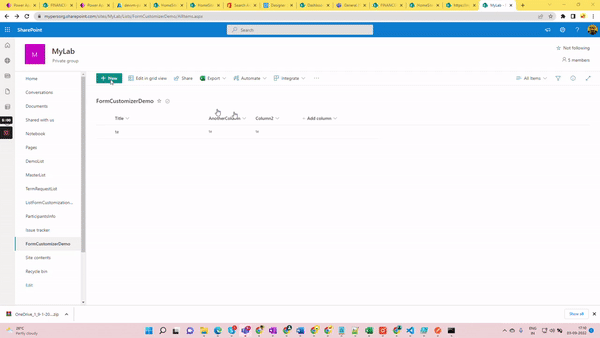

# Add Form Customizer to List

A React based SPFx utility web part which will help admins/user(s) to associate and remove association of the list form customizer extension to a particular list. 

With SPFx version 1.15.1, we can now create new type of Extension as Form customizer which allows use to associate custom forms to SharePoint List.
As of writing this web part, this no direct way to associate this form customizer to SP list. We will have to either write PowerShell or Use REST API to associate it with the list.

This web part serves as utility so the developers can use to associate single form customizer with multiple lists with control over option to associate New/Edit/View form separately.

Note - This web part only serve to associate the Form customizer, so it is required that the actual SPFx Form Customizer solution is deployed and installed to targeted Site before association.

## WebPart in Action



### Highlights

* Option to Select Site->List->Content Type
* Option to choose associate either with one or more type of forms(New/Edit/View)
* Option to remove association of form
* Associate single customizer with multiple lists/forms

## Compatibility


-Incompatible-red.svg "SharePoint Server 2016 Feature Pack 2 requires SPFx 1.1")


## Applies to

* [SharePoint Framework](https://learn.microsoft.com/sharepoint/dev/spfx/sharepoint-framework-overview)
* [Microsoft 365 tenant](https://learn.microsoft.com/sharepoint/dev/spfx/set-up-your-development-environment)

> Get your own free development tenant by subscribing to [Microsoft 365 developer program](http://aka.ms/m365devprogram)

### Package and Deploy

Note - If you don't want to build and package on your own, you can directly download package at this [location](https://github.com/siddharth-vaghasia/public-docs/blob/master/react-add-formcustomizer-to-list.sppkg) and upload to app catalog and install app on required site collection. Skip below steps and directly go to How to use section.
Clone the solution and make sure there is no error before packaging. Try first on local work bench.

Change the `pageURL` property in `/config/serve.json` - This should be a valid modern page on your site collection.

```bash
git clone the repo
npm i
gulp serve
```

- Execute the following gulp task to bundle your solution. This executes a release build of your project by using a dynamic label as the host URL for your assets. This URL is automatically updated based on your tenant CDN settings:
  
```bash
gulp bundle --ship
```

- Execute the following task to package your solution. This creates an updated `react-add-formcustomizer-to-list.sppkg` package on the `sharepoint/solution` folder.

```bash
gulp package-solution --ship
```

- Upload or drag and drop the newly created client-side solution package to the app catalog in your tenant.
- Based on your tenant settings, if you would not have CDN enabled in your tenant, and the `includeClientSideAssets` setting would be true in the `package-solution.json`, the loading URL for the assets would be dynamically updated and pointing directly to the `ClientSideAssets` folder located in the app catalog site collection.

### How to Use Solution

* Once app is deployed to app catalog successfully
* Install app to required site collection
* Create new modern page. Add **react-add-formcustomizer-to-list** web part to page. 
* Publish the page.

To do the association or removing the association , user needs to follow the below steps:

* Select the site from available sites
* Choose a list from the available options
* Choose the content type to which the form customizer needs to associate/remove association if its already associated
* User needs to grab client component id present in form customizer manifest `json` file (Information is added in the client component id section with image)
* Select the required check box option New Form/Edit Form/View Form
* After filling the required values, click on Associate/Remove Association button
* Once it is successful then go to respective list and check the forms 
* Users can only associate/remove association of the form customizer to lists of the sites that they have access

You can copy the actual component ID of form customizer with from its `manifest.json` file.

## Solution

Solution|Author(s)
--------|---------
react-add-formcustomizer-to-list | [Siddharth Vaghasia](https://github.com/siddharth-vaghasia) (<https://www.linkedin.com/in/siddharthvaghasia/>)

## Version history

Version|Date|Comments
-------|----|--------
1.0.0|September 04, 2022|Initial release

## Help

We do not support samples, but this community is always willing to help, and we want to improve these samples. We use GitHub to track issues, which makes it easy for  community members to volunteer their time and help resolve issues.

If you're having issues building the solution, please run [spfx doctor](https://pnp.github.io/cli-microsoft365/cmd/spfx/spfx-doctor/) from within the solution folder to diagnose incompatibility issues with your environment.

You can try looking at [issues related to this sample](https://github.com/pnp/sp-dev-fx-webparts/issues?q=label%3A%22sample%3A%20react-add-formcustomizer-to-list%22) to see if anybody else is having the same issues.

You can also try looking at [discussions related to this sample](https://github.com/pnp/sp-dev-fx-webparts/discussions?discussions_q=react-add-formcustomizer-to-list) and see what the community is saying.

If you encounter any issues using this sample, [create a new issue](https://github.com/pnp/sp-dev-fx-webparts/issues/new?assignees=&labels=Needs%3A+Triage+%3Amag%3A%2Ctype%3Abug-suspected%2Csample%3A%20react-add-formcustomizer-to-list&template=bug-report.yml&sample=react-add-formcustomizer-to-list&authors=@siddharth-vaghasia&title=react-add-formcustomizer-to-list%20-%20).

For questions regarding this sample, [create a new question](https://github.com/pnp/sp-dev-fx-webparts/issues/new?assignees=&labels=Needs%3A+Triage+%3Amag%3A%2Ctype%3Aquestion%2Csample%3A%20react-add-formcustomizer-to-list&template=question.yml&sample=react-add-formcustomizer-to-list&authors=@siddharth-vaghasia&title=react-add-formcustomizer-to-list%20-%20).

Finally, if you have an idea for improvement, [make a suggestion](https://github.com/pnp/sp-dev-fx-webparts/issues/new?assignees=&labels=Needs%3A+Triage+%3Amag%3A%2Ctype%3Aenhancement%2Csample%3A%20react-add-formcustomizer-to-list&template=suggestion.yml&sample=react-add-formcustomizer-to-list&authors=@siddharth-vaghasia&title=react-add-formcustomizer-to-list%20-%20).

## Disclaimer

**THIS CODE IS PROVIDED *AS IS* WITHOUT WARRANTY OF ANY KIND, EITHER EXPRESS OR IMPLIED, INCLUDING ANY IMPLIED WARRANTIES OF FITNESS FOR A PARTICULAR PURPOSE, MERCHANTABILITY, OR NON-INFRINGEMENT.**

For any issue or help, Buzz me on twitter:([siddh_me](https://twitter.com/siddh_me/))

> Sharing is caring!


