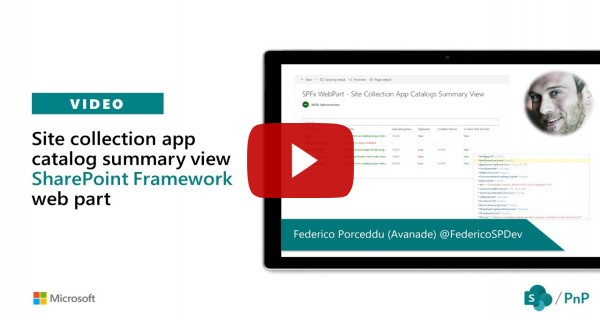

# Site Collection App Catalog Summary View.

## Summary

A SPFx web part using [@pnp/sp/appcatalog](https://pnp.github.io/pnpjs/sp/docs/alm/) and [@pnp/spfx-controls-react](https://sharepoint.github.io/sp-dev-fx-controls-react/). It allows to see in a single view all the SiteCollection catalogs and the Apps installed with some useful metadata.
It needs Globlal Administrator or SharePoint Online Administrator permissions in order to access Site collection App Catalogs hidden list (https://yourtenant.sharepoint.com/sites/appcatalog/Lists/SiteCollectionAppCatalogs) and each Site Collection App Catalog. This web part use [@pnp/spfx-controls-react WebPartTitle](https://sharepoint.github.io/sp-dev-fx-controls-react/controls/WebPartTitle/) and [@pnp/spfx-controls-react ListView](https://sharepoint.github.io/sp-dev-fx-controls-react/controls/ListView/) components.

## Compatibility

 
 

-Incompatible-red.svg "SharePoint Server 2016 Feature Pack 2 requires SPFx 1.1")

## Applies to

* [SharePoint Framework](https://docs.microsoft.com/sharepoint/dev/spfx/sharepoint-framework-overview)
* [Office 365 tenant](https://docs.microsoft.com/sharepoint/dev/spfx/set-up-your-development-environment)

## Solution

Solution|Author(s)
--------|---------
react-admin-sc-catalog-pnpjs |  [Federico Porceddu](https://github.com/fredupstair) (https://www.federicoporceddu.com)

## Version history

Version|Date|Comments
-------|----|--------
1.0|November 07, 2019|Initial release

## Minimal Path to Awesome

* Clone this repository
* From your command line, change your current directory to the directory containing this sample (`react-admin-sc-catalog-pnpjs`, located under `samples`)
* in the command line run:
  * restore dependencies: `npm install`
  * build solution `gulp build --ship`
  * bundle solution: `gulp bundle --ship`
  * package solution: `gulp package-solution --ship`
  * locate solution at `.\sharepoint\solution\react-admin-sc-catalog-pnpjs.sppkg` 
  * upload it to your tenant app catalog
  * add `react-admin-sc-catalog-pnpjs` app to your site
  * add `react-admin-sc-catalog-pnpjs` web part to your page to see it in action

>  This sample can also be opened with [VS Code Remote Development](https://code.visualstudio.com/docs/remote/remote-overview). Visit https://aka.ms/spfx-devcontainer for further instructions.

## Features

This Web Part illustrates the following concepts on top of the SharePoint Framework:

* How to use [@pnp/sp/appcatalog](https://pnp.github.io/pnpjs/sp/docs/alm/).
* How to use [@pnp/spfx-controls-react WebPartTitle](https://sharepoint.github.io/sp-dev-fx-controls-react/controls/WebPartTitle/)
* How to use [@pnp/spfx-controls-react ListView](https://sharepoint.github.io/sp-dev-fx-controls-react/controls/ListView/)

## Video

## Help

We do not support samples, but this community is always willing to help, and we want to improve these samples. We use GitHub to track issues, which makes it easy for  community members to volunteer their time and help resolve issues.

If you're having issues building the solution, please run [spfx doctor](https://pnp.github.io/cli-microsoft365/cmd/spfx/spfx-doctor/) from within the solution folder to diagnose incompatibility issues with your environment.

You can try looking at [issues related to this sample](https://github.com/pnp/sp-dev-fx-webparts/issues?q=label%3A%22sample%3A%20react-admin-sc-catalog-pnpjs") to see if anybody else is having the same issues.

You can also try looking at [discussions related to this sample](https://github.com/pnp/sp-dev-fx-webparts/discussions?discussions_q=react-admin-sc-catalog-pnpjs) and see what the community is saying.

If you encounter any issues while using this sample, [create a new issue](https://github.com/pnp/sp-dev-fx-webparts/issues/new?assignees=&labels=Needs%3A+Triage+%3Amag%3A%2Ctype%3Abug-suspected%2Csample%3A%20react-admin-sc-catalog-pnpjs&template=bug-report.yml&sample=react-admin-sc-catalog-pnpjs&authors=@fredupstair&title=react-admin-sc-catalog-pnpjs%20-%20).

For questions regarding this sample, [create a new question](https://github.com/pnp/sp-dev-fx-webparts/issues/new?assignees=&labels=Needs%3A+Triage+%3Amag%3A%2Ctype%3Aquestion%2Csample%3A%20react-admin-sc-catalog-pnpjs&template=question.yml&sample=react-admin-sc-catalog-pnpjs&authors=@fredupstair&title=react-admin-sc-catalog-pnpjs%20-%20).

Finally, if you have an idea for improvement, [make a suggestion](https://github.com/pnp/sp-dev-fx-webparts/issues/new?assignees=&labels=Needs%3A+Triage+%3Amag%3A%2Ctype%3Aenhancement%2Csample%3A%20react-admin-sc-catalog-pnpjs&template=question.yml&sample=react-admin-sc-catalog-pnpjs&authors=@fredupstair&title=react-admin-sc-catalog-pnpjs%20-%20).

## Disclaimer

**THIS CODE IS PROVIDED *AS IS* WITHOUT WARRANTY OF ANY KIND, EITHER EXPRESS OR IMPLIED, INCLUDING ANY IMPLIED WARRANTIES OF FITNESS FOR A PARTICULAR PURPOSE, MERCHANTABILITY, OR NON-INFRINGEMENT.**

