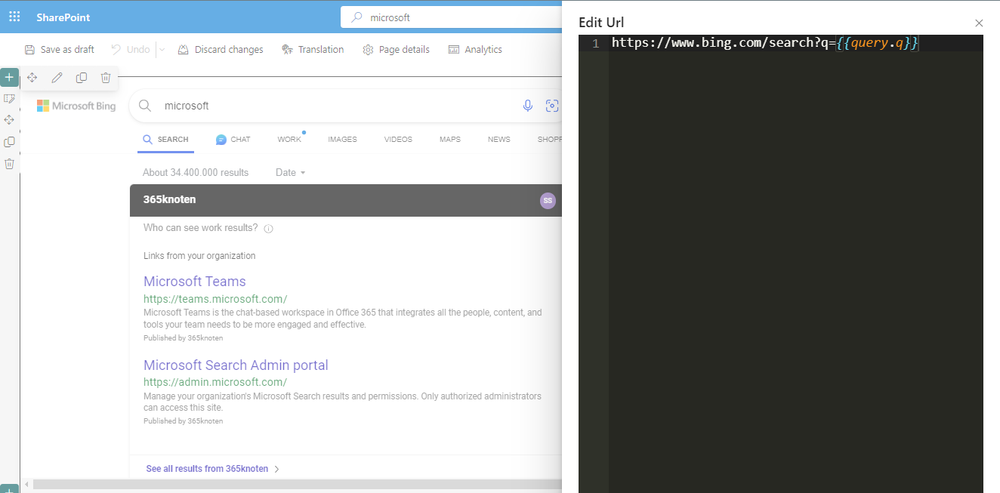
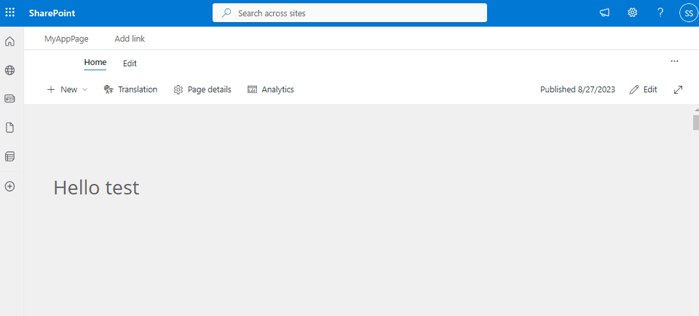
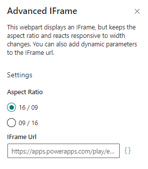

# Advanced IFrame web part

## Summary

This web part allows users to add a webpage in an IFrame to a modern SharePoint page.

Main features include:

- The web part can be embedded in a "Full-Width" section.
- The web part only allows pages to be embedded that have been added to the "Allow external IFrames" in "HTML Field Security"
- The web part resizes the IFrame to automatically fit the given space on the page. It keeps the aspect ratio.
- The web part can add additional dynamic parameters to the IFrame URL. These parameters include
  - Color codes of the current color scheme
  - Query string parameters
  - Information about the logged in user
  - Information about the current page and site



## Compatibility

| :warning: Important          |
|:---------------------------|
| Every SPFx version is only compatible with specific version(s) of Node.js. In order to be able to build this sample, please ensure that the version of Node on your workstation matches one of the versions listed in this section. This sample will not work on a different version of Node.|
|Refer to <https://aka.ms/spfx-matrix> for more information on SPFx compatibility.   |


-Incompatible-red.svg "SharePoint Server 2016 Feature Pack 2 requires SPFx 1.1")


Tested with: Node.js v14.21.2

## Applies to

- [SharePoint Framework](https://learn.microsoft.com/sharepoint/dev/spfx/sharepoint-framework-overview)
- [Microsoft 365 tenant](https://learn.microsoft.com/sharepoint/dev/spfx/set-up-your-development-environment)

## Contributors

- [Sven Sieverding](https://github.com/365knoten)

## Version history

Version|Date|Comments
-------|----|--------
1.0.0 | Aug 27, 2023 | Initial release

## Minimal Path to Awesome

- Clone this repository

### SPFx

- In the command line, with a compatible version of Node, i.e. v14.21.2, run:
  - `npm install`
  - `gulp serve`

- To bundle and package the installable *.sppkg*, run:
  - `gulp bundle --ship`
  - `gulp package-solution --ship`

### Create a sample PowerApp to test the functions

First create a new canvas app, then set `Screen1.Fill` to

```PowerFX
ColorValue("#"&Param("bodyBackground"))
```

This will set the background color of the app to the same color as the section in SharePoint. Add a new label `Label1` and set the font size to `30`. Now set it's `Text` Property to

```PowerFX
"Hello "&Param("greeting")
```

and it's "Color" property to

```PowerFX
ColorValue("#"&Param("bodySubtext"))
```

This will set the text color of the label to the text color in the section in SharePoint and the value of the label to `Hello` concatenated with what has been passed with the query string parameter `greeting`.
Finally publish the app and copy the app URL.

Create a new page in SharePoint and add a new Full-Width section. Set the background color of your section to anything else but white.
Add the "Advanced IFrame web part" here and configure it with the PowerApp URL. Append this to the URL

```url
&bodyBackground={{color.bodyBackground}}&bodySubtext={{color.bodySubtext}}&greeting={{query.greeting}}
```

Publish the Page



## Web Parts Configuration

### Advanced IFrame web part



#### Settings

Remember that only URLs are supported that have been allowed by the site collection administrator in "HTML Field Security"

Setting | Description
-------|----
Aspect Ratio | The aspect ratio that the IFrame should use. Valid values are "16/09" (Default) and "09/16"
IFrame URL | Enter the URL to the page you want to embed using this web part. You can use Handlebars syntax to pass additional parameters to the URL

#### Query string parameters

You can append any query string parameter `param` as `{{query.param}}` to the URL

#### User parameters

You can add these parameters to the URL to pass information about the current user to the page

|Key | Example |
-------|----
{{user.name}} |Sven Sieverding
{{user.email}} |<Sven@domain.com>
{{user.loginName}} | <sven@domain.com>

#### Site parameters

You can add these parameters to the URL to pass information about the current site to the page

|Key | Example |
-------|----
{{site.id}} | c0b1166c-19e3-485c-ac0b-e842ffba2a23
{{site.serverRelativeUrl}} | /sites/MyAppPage

#### UI culture parameters

You can add these parameters to the URL to pass information about the current UI culture to the page

|Key | Example |
-------|----
{{culture.currentCultureName}} | de-DE

#### Theme parameters

You can add these parameters to the URL to pass information about the current UI theme to the page

|Key | Example |
-------|----
{{color.bodyBackground}} | 03787c
{{color.bodyFrameBackground}} | 026d70
{{color.accentButtonText}} | 03787c
{{color.buttonBackground}} | 03787c
{{color.primaryButtonText}} | 03787c
{{color.primaryButtonTextHovered}} | 025c5f
{{color.primaryButtonTextPressed}} | 025c5f
{{color.inputBackground}} | FFFFFF
{{color.inputForegroundChecked}} | 025c5f
{{color.listBackground}} | 03787c
{{color.menuBackground}} | 03787c
{{color.cardStandoutBackground}} | 03787c
{{color.bodyTextChecked}} | FAFAFA
{{color.buttonTextCheckedHovered}} | FAFAFA
{{color.link}} | FFFFFF
{{color.primaryButtonBackground}} | FFFFFF
{{color.inputBackgroundChecked}} | FFFFFF
{{color.inputIcon}} | FFFFFF
{{color.inputFocusBorderAlt}} | 49aeb1
{{color.menuIcon}} | FFFFFF
{{color.menuHeader}} | FFFFFF
{{color.accentButtonBackground}} | FFFFFF
{{color.primaryButtonBackgroundPressed}} | 98d6d8
{{color.inputBackgroundCheckedHovered}} | 03787c
{{color.inputIconHovered}} | FAFAFA
{{color.linkHovered}} | FFFFFF
{{color.primaryButtonBackgroundHovered}} | c5e9ea
{{color.inputPlaceholderBackgroundChecked}} | D1D1D1
{{color.bodyBackgroundChecked}} | 98d6d8
{{color.bodyFrameDivider}} | 026d70
{{color.bodyDivider}} | 49aeb1
{{color.variantBorder}} | 026d70
{{color.buttonBackgroundCheckedHovered}} | 98d6d8
{{color.buttonBackgroundPressed}} | 025c5f
{{color.listItemBackgroundChecked}} | 98d6d8
{{color.listHeaderBackgroundPressed}} | 98d6d8
{{color.menuItemBackgroundPressed}} | 98d6d8
{{color.menuItemBackgroundChecked}} | 98d6d8
{{color.bodyBackgroundHovered}} | 49aeb1
{{color.buttonBackgroundHovered}} | 026d70
{{color.buttonBackgroundDisabled}} | c5e9ea
{{color.buttonBorderDisabled}} | transparent
{{color.primaryButtonBackgroundDisabled}} | 49aeb1
{{color.disabledBackground}} | 026d70
{{color.listItemBackgroundHovered}} | 49aeb1
{{color.listHeaderBackgroundHovered}} | 49aeb1
{{color.menuItemBackgroundHovered}} | 49aeb1
{{color.primaryButtonTextDisabled}} | f0f9fa
{{color.disabledSubtext}} | f0f9fa
{{color.listItemBackgroundCheckedHovered}} | c5e9ea
{{color.disabledBodyText}} | D1D1D1
{{color.variantBorderHovered}} | 014446
{{color.buttonTextDisabled}} | 49aeb1
{{color.inputIconDisabled}} | D1D1D1
{{color.disabledText}} | 49aeb1
{{color.bodyText}} | FFFFFF
{{color.actionLink}} | FFFFFF
{{color.buttonText}} | FFFFFF
{{color.inputBorderHovered}} | 014446
{{color.inputText}} | 242424
{{color.listText}} | FFFFFF
{{color.menuItemText}} | 242424
{{color.bodyStandoutBackground}} | 026d70
{{color.defaultStateBackground}} | FAFAFA
{{color.actionLinkHovered}} | FFFFFF
{{color.buttonTextHovered}} | FFFFFF
{{color.buttonTextChecked}} | F0F0F0
{{color.buttonTextPressed}} | FFFFFF
{{color.inputTextHovered}} | 141414
{{color.menuItemTextHovered}} | F0F0F0
{{color.bodySubtext}} | FFFFFF
{{color.focusBorder}} | FFFFFF
{{color.inputBorder}} | 026d70
{{color.smallInputBorder}} | E0E0E0
{{color.inputPlaceholderText}} | 616161
{{color.buttonBorder}} | FFFFFF
{{color.disabledBodySubtext}} | C7C7C7
{{color.disabledBorder}} | f0f9fa
{{color.buttonBackgroundChecked}} | f0f9fa
{{color.menuDivider}} | C7C7C7
{{color.cardShadow}} | 0 1.6px 3.6px 0 rgba(0, 0, 0, 0.132), 0 0.3px 0.9px 0 rgba(0, 0, 0, 0.108)
{{color.cardShadowHovered}} | 0 0 1px D1D1D1
{{color.primaryButtonBorder}} | transparent
{{color.errorText}} | a4262c
{{color.messageText}} | 323130
{{color.messageLink}} | 005A9E
{{color.messageLinkHovered}} | 004578
{{color.infoIcon}} | 605e5c
{{color.errorIcon}} | A80000
{{color.blockingIcon}} | FDE7E9
{{color.warningIcon}} | 797775
{{color.severeWarningIcon}} | D83B01
{{color.successIcon}} | 107C10
{{color.infoBackground}} | f3f2f1
{{color.errorBackground}} | FDE7E9
{{color.blockingBackground}} | FDE7E9
{{color.warningBackground}} | FFF4CE
{{color.severeWarningBackground}} | FED9CC
{{color.successBackground}} | DFF6DD
{{color.warningHighlight}} | ffb900
{{color.successText}} | 107C10
{{color.listTextColor}} | 323130
{{color.warningText}} | 323130

## Features

This Web Part illustrates the following concepts on top of the SharePoint Framework:

- Get the current section theme and react to theme changes.
- Get the current web part width and react to width changes.
- Retrieve information about the current user from the page context.
- Retrieve information about the current UI culture from the page context.
- Retrieve information about the current site from the page context.
- Creating and using a service
- Fetching the `ScriptSaveDomains`, the collection of all domains where IFrames are allowed from.

## Help

We do not support samples, but we this community is always willing to help, and we want to improve these samples. We use GitHub to track issues, which makes it easy for  community members to volunteer their time and help resolve issues.

If you're having issues building the solution, please run [spfx doctor](https://pnp.github.io/cli-microsoft365/cmd/spfx/spfx-doctor/) from within the solution folder to diagnose incompatibility issues with your environment.

You can try looking at [issues related to this sample](https://github.com/pnp/sp-dev-fx-webparts/labels/react-advanced-iframe) to see if anybody else is having the same issues.

You can also try looking at [discussions related to this sample](https://github.com/pnp/sp-dev-fx-webparts/discussions?discussions_q=react-advanced-iframe) and see what the community is saying.

If you encounter any issues while using this sample, [create a new issue](https://github.com/pnp/sp-dev-fx-webparts/issues/new?assignees=&labels=Needs%3A+Triage+%3Amag%3A%2Ctype%3Abug-suspected%2Csample%3A%20react-advanced-iframe-&template=bug-report.yml&sample=react-advanced-iframe&authors=@365knoten&title=react-advanced-iframe%20-%20).

For questions regarding this sample, [create a new question](https://github.com/pnp/sp-dev-fx-webparts/issues/new?assignees=&labels=Needs%3A+Triage+%3Amag%3A%2Ctype%3Aquestion%2Csample%3A%20react-advanced-iframe-web&template=question.yml&sample=react-advanced-iframe&authors=@365knoten&title=react-advanced-iframe%20-%20).

Finally, if you have an idea for improvement, [make a suggestion](https://github.com/pnp/sp-dev-fx-webparts/issues/new?assignees=&labels=Needs%3A+Triage+%3Amag%3A%2Ctype%3Aenhancement%2Csample%3A%20react-advanced-iframe&template=question.yml&sample=react-advanced-iframe&authors=@365knoten&title=react-advanced-iframe%20-%20).

## Disclaimer

**THIS CODE IS PROVIDED *AS IS* WITHOUT WARRANTY OF ANY KIND, EITHER EXPRESS OR IMPLIED, INCLUDING ANY IMPLIED WARRANTIES OF FITNESS FOR A PARTICULAR PURPOSE, MERCHANTABILITY, OR NON-INFRINGEMENT.**


