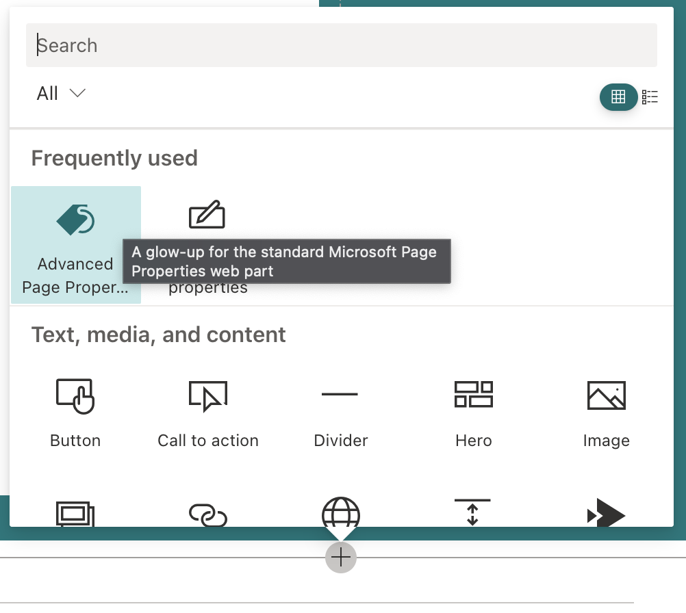

# Advanced Page Properties

## Summary

Attempts to replicate the functionality of Page Properties with the following improvements:

- Support for theme variants
- Updated to standard capsule look for list options
- Support for image fields
- Support for hyperlink fields
- Support for currency
- Improved support for dates

## Compatibility

-Incompatible-red.svg "SharePoint Server 2016 Feature Pack 2 requires SPFx 1.1")

## Applies to

- [SharePoint Framework](https://aka.ms/spfx)
- [Microsoft 365 tenant](https://docs.microsoft.com/en-us/sharepoint/dev/spfx/set-up-your-developer-tenant)

> Get your own free development tenant by subscribing to [Microsoft 365 developer program](http://aka.ms/o365devprogram)

## Prerequisites

None

## Solution

Solution|Author(s)
--------|---------
src/react-advanced-page-properties | [Mike Homol](https://homol.work), Principal Consultant, [ThreeWill](https://threewill.com/)
react-advanced-page-properties | Abderahman Moujahid

## Version history

Version|Date|Comments
-------|----|--------
1.0.0|March 30, 2021|Initial release
1.0.1|September 22, 2021|Added support for multi-language sites
1.0.2|December 24, 2021|Fix retrieving fields from SitePages
1.0.3|January 12, 2022|Fix formatting of date, number and currency values

## Minimal Path to Awesome

- Clone this repository
- Ensure that you are at the solution folder
- in the command-line run:
  - `npm install`
  - `gulp serve`

>  This sample can also be opened with [VS Code Remote Development](https://code.visualstudio.com/docs/remote/remote-overview). Visit https://aka.ms/spfx-devcontainer for further instructions.

## Features

### Add the part

Once the solution is installed in the app catalog and the app has been added to the site, you should see it available to a page.

### Familiarity is key

This web part tries to mimic the original Page Properties web part as much as possible.  You should recognize the functionality of the property setup.  

Basically add and remove properties until you are satisfied and you're good to go!

## Help

We do not support samples, but this community is always willing to help, and we want to improve these samples. We use GitHub to track issues, which makes it easy for  community members to volunteer their time and help resolve issues.

If you're having issues building the solution, please run [spfx doctor](https://pnp.github.io/cli-microsoft365/cmd/spfx/spfx-doctor/) from within the solution folder to diagnose incompatibility issues with your environment.

You can try looking at [issues related to this sample](https://github.com/pnp/sp-dev-fx-webparts/issues?q=label%3A%22sample%3A%20react-advanced-page-properties%22) to see if anybody else is having the same issues.

You can also try looking at [discussions related to this sample](https://github.com/pnp/sp-dev-fx-webparts/discussions?discussions_q=react-advanced-page-properties) and see what the community is saying.

If you encounter any issues while using this sample, [create a new issue](https://github.com/pnp/sp-dev-fx-webparts/issues/new?assignees=&labels=Needs%3A+Triage+%3Amag%3A%2Ctype%3Abug-suspected%2Csample%3A%20react-advanced-page-properties&template=bug-report.yml&sample=react-advanced-page-properties&authors=@Abderahman88%20@mhomol&title=react-advanced-page-properties%20-%20).

For questions regarding this sample, [create a new question](https://github.com/pnp/sp-dev-fx-webparts/issues/new?assignees=&labels=Needs%3A+Triage+%3Amag%3A%2Ctype%3Aquestion%2Csample%3A%20react-advanced-page-properties&template=question.yml&sample=react-advanced-page-properties&authors=@Abderahman88%20@mhomol&title=react-advanced-page-properties%20-%20).

Finally, if you have an idea for improvement, [make a suggestion](https://github.com/pnp/sp-dev-fx-webparts/issues/new?assignees=&labels=Needs%3A+Triage+%3Amag%3A%2Ctype%3Aenhancement%2Csample%3A%20react-advanced-page-properties&template=suggestion.yml&sample=react-advanced-page-properties&authors=@Abderahman88%20@mhomol&title=react-advanced-page-properties%20-%20).

## Disclaimer

**THIS CODE IS PROVIDED *AS IS* WITHOUT WARRANTY OF ANY KIND, EITHER EXPRESS OR IMPLIED, INCLUDING ANY IMPLIED WARRANTIES OF FITNESS FOR A PARTICULAR PURPOSE, MERCHANTABILITY, OR NON-INFRINGEMENT.**

