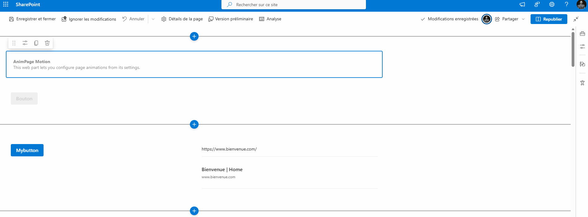

# AnimPage Motion - Page Scroll Animations for Web Parts

## Summary

This is a sample web part that illustrates how to use **PnPjs**, the **IntersectionObserver API**, and CSS animations to build a SharePoint Framework client-side web part that adds **reveal-on-scroll animations** to other web parts on a modern SharePoint page.

Sample web part built using SPFx with the React that:

- Scans the current page for existing web parts
- Lets editors configure animations per web part from the property pane
- Applies smooth reveal-on-scroll effects (fade, slide, scale, etc.)

## Compatibility

| :warning: Important          |
|:---------------------------|
| Every SPFx version is optimally compatible with specific versions of Node.js. In order to be able to Toolchain this sample, you need to ensure that the version of Node on your workstation matches one of the versions listed in this section. This sample will not work on a different version of Node.|
|Refer to <https://aka.ms/spfx-matrix> for more information on SPFx compatibility.   |

This sample is optimally compatible with the following environment configuration:

-Incompatible-red.svg "SharePoint Server 2016 Feature Pack 2 requires SPFx 1.1")

## Applies to

- [SharePoint Framework](https://aka.ms/spfx)
- [Microsoft 365 tenant](https://docs.microsoft.com/sharepoint/dev/spfx/set-up-your-developer-tenant)

## Contributors

- [dhiabedoui](https://github.com/dhiabedoui)

## Version history

| Version | Date             | Comments        |
| ------- | ---------------- | --------------- |
| 1.0.0     | Feb 17, 2026 | Initial release |

## Minimal Path to Awesome

- Clone this repository
- Ensure that you are at the solution folder
- in the command-line run:
  - `npm install -g @rushstack/heft`
  - `npm install`
  - `heft start`

Other build commands can be listed using `heft --help`.

## Features

This project contains a sample client-side web part built on the SharePoint Framework illustrating how to apply scroll-triggered animations to existing web parts using React and PnPjs.

This sample illustrates the following concepts on top of the SharePoint Framework:

General
Scanning a modern SharePoint client-side page using PnPjs:
Loading the page via getFileByServerRelativePath
Parsing sections, columns, and controls via ClientsidePageFromFile
Identifying web parts on the page via data-sp-feature-instance-id
Building a configuration web part that:
Displays a list of web parts found on the page
Provides per-web-part settings in the property pane (toggle, preset, mode, delay)
Includes "scroll to web part" buttons with a temporary highlight effect

UX & Animations
Using the IntersectionObserver API to detect when web parts enter or leave the viewport.
Applying CSS-based animation presets with reusable classes:
apm-fade, apm-slide, apm-scale, apm-fade-soft, apm-fade-strong, apm-card-pop
Using data-* attributes to store configuration (data-apm-mode, data-apm-delay).
Implementing a highlight animation (apm-highlight) when navigating from the property pane to a web part.

## Help

We do not support samples, but this community is always willing to help, and we want to improve these samples. We use GitHub to track issues, which makes it easy for  community members to volunteer their time and help resolve issues.

If you're having issues building the solution, please run [spfx doctor](https://pnp.github.io/cli-microsoft365/cmd/spfx/spfx-doctor/) from within the solution folder to diagnose incompatibility issues with your environment.

You can try looking at [issues related to this sample](https://github.com/pnp/sp-dev-fx-webparts/issues?q=label%3A%22sample%3A%20react-animpage%22) to see if anybody else is having the same issues.

You can also try looking at [discussions related to this sample](https://github.com/pnp/sp-dev-fx-webparts/discussions?discussions_q=react-animpage) and see what the community is saying.

If you encounter any issues using this sample, [create a new issue](https://github.com/pnp/sp-dev-fx-webparts/issues/new?assignees=&labels=Needs%3A+Triage+%3Amag%3A%2Ctype%3Abug-suspected%2Csample%3A%20react-animpage&template=bug-report.yml&sample=react-animpage&authors=@dhiabedoui&title=react-animpage%20-%20).

For questions regarding this sample, [create a new question](https://github.com/pnp/sp-dev-fx-webparts/issues/new?assignees=&labels=Needs%3A+Triage+%3Amag%3A%2Ctype%3Aquestion%2Csample%3A%20react-animpage&template=question.yml&sample=react-animpage&authors=@dhiabedoui&title=react-animpage%20-%20).

Finally, if you have an idea for improvement, [make a suggestion](https://github.com/pnp/sp-dev-fx-webparts/issues/new?assignees=&labels=Needs%3A+Triage+%3Amag%3A%2Ctype%3Aenhancement%2Csample%3A%20react-animpage&template=suggestion.yml&sample=react-animpage&authors=@dhiabedoui&title=react-animpage%20-%20).

## Disclaimer

**THIS CODE IS PROVIDED *AS IS* WITHOUT WARRANTY OF ANY KIND, EITHER EXPRESS OR IMPLIED, INCLUDING ANY IMPLIED WARRANTIES OF FITNESS FOR A PARTICULAR PURPOSE, MERCHANTABILITY, OR NON-INFRINGEMENT.**

